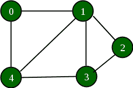

# 在图的邻接表表示中添加和移除边

> 原文:[https://www . geesforgeks . org/邻接表中添加和删除边-图的表示/](https://www.geeksforgeeks.org/add-and-remove-edge-in-adjacency-list-representation-of-a-graph/)

**先决条件:** [图及其表示](https://www.geeksforgeeks.org/graph-and-its-representations/)
本文讨论了在给定的邻接表表示中添加和移除边。
一个[向量](https://www.geeksforgeeks.org/vector-in-cpp-stl/)已经被用来实现使用邻接表表示的图。它用于存储所有顶点的邻接表。顶点编号被用作这个向量的索引。
**例:**

> 下面是一个图及其邻接表表示:
> 
>  
> 
> 如果 **1** 和 **4** 之间的边必须被移除，那么上面的图和邻接表转换为:
> 
>  

**方法:**想法是将图表示为向量的[阵列](https://www.geeksforgeeks.org/2d-vector-in-cpp-with-user-defined-size/)，使得每个向量表示顶点的邻接表。

*   **添加边:**添加边是通过将由该边连接的两个顶点插入到彼此的列表中来完成的。例如，如果必须添加 **(u，v)** 之间的边，则 **u** 存储在 **v 的向量列表**中，而 **v** 存储在 **u 的向量列表**中。([推回](https://www.geeksforgeeks.org/vectorpush_back-vectorpop_back-c-stl/))
*   **删除边:**删除 **(u，v)** 之间的边，遍历 **u 的邻接表**，直到找到 **v** 并将其从其中删除。对 **v** 执行相同的操作。([擦除](https://www.geeksforgeeks.org/vectorclear-vectorerase-c-stl/))

以下是实施办法:

## C++

```
// C++ implementation of the above approach

#include <bits/stdc++.h>
using namespace std;

// A utility function to add an edge in an
// undirected graph.
void addEdge(vector<int> adj[], int u, int v)
{
    adj[u].push_back(v);
    adj[v].push_back(u);
}

// A utility function to delete an edge in an
// undirected graph.
void delEdge(vector<int> adj[], int u, int v)
{
    // Traversing through the first vector list
    // and removing the second element from it
    for (int i = 0; i < adj[u].size(); i++) {
        if (adj[u][i] == v) {
            adj[u].erase(adj[u].begin() + i);
            break;
        }
    }

    // Traversing through the second vector list
    // and removing the first element from it
    for (int i = 0; i < adj[v].size(); i++) {
        if (adj[v][i] == u) {
            adj[v].erase(adj[v].begin() + i);
            break;
        }
    }
}

// A utility function to print the adjacency list
// representation of graph
void printGraph(vector<int> adj[], int V)
{
    for (int v = 0; v < V; ++v) {
        cout << "vertex " << v << " ";
        for (auto x : adj[v])
            cout << "-> " << x;
        printf("\n");
    }
    printf("\n");
}

// Driver code
int main()
{
    int V = 5;
    vector<int> adj[V];

    // Adding edge as shown in the example figure
    addEdge(adj, 0, 1);
    addEdge(adj, 0, 4);
    addEdge(adj, 1, 2);
    addEdge(adj, 1, 3);
    addEdge(adj, 1, 4);
    addEdge(adj, 2, 3);
    addEdge(adj, 3, 4);

    // Printing adjacency matrix
    printGraph(adj, V);

    // Deleting edge (1, 4)
    // as shown in the example figure
    delEdge(adj, 1, 4);

    // Printing adjacency matrix
    printGraph(adj, V);

    return 0;
}
```

## Java 语言(一种计算机语言，尤用于创建网站)

```
// Java implementation of the above approach
import java.util.*;

class GFG
{

// A utility function to add an edge in an
// undirected graph.
static void addEdge(Vector<Integer> adj[],
                    int u, int v)
{
    adj[u].add(v);
    adj[v].add(u);
}

// A utility function to delete an edge in an
// undirected graph.
static void delEdge(Vector<Integer> adj[],
                    int u, int v)
{
    // Traversing through the first vector list
    // and removing the second element from it
    for (int i = 0; i < adj[u].size(); i++)
    {
        if (adj[u].get(i) == v)
        {
            adj[u].remove(i);
            break;
        }
    }

    // Traversing through the second vector list
    // and removing the first element from it
    for (int i = 0; i < adj[v].size(); i++)
    {
        if (adj[v].get(i) == u)
        {
            adj[v].remove(i);
            break;
        }
    }
}

// A utility function to print the adjacency list
// representation of graph
static void printGraph(Vector<Integer> adj[], int V)
{
    for (int v = 0; v < V; ++v)
    {
        System.out.print("vertex " + v+ " ");
        for (Integer x : adj[v])
            System.out.print("-> " + x);
        System.out.printf("\n");
    }
    System.out.printf("\n");
}

// Driver code
public static void main(String[] args)
{
    int V = 5;
    Vector<Integer> []adj = new Vector[V];
        for (int i = 0; i < V; i++)
            adj[i] = new Vector<Integer>();

    // Adding edge as shown in the example figure
    addEdge(adj, 0, 1);
    addEdge(adj, 0, 4);
    addEdge(adj, 1, 2);
    addEdge(adj, 1, 3);
    addEdge(adj, 1, 4);
    addEdge(adj, 2, 3);
    addEdge(adj, 3, 4);

    // Printing adjacency matrix
    printGraph(adj, V);

    // Deleting edge (1, 4)
    // as shown in the example figure
    delEdge(adj, 1, 4);

    // Printing adjacency matrix
    printGraph(adj, V);
}
}

// This code is contributed by 29AjayKumar
```

## 蟒蛇 3

```
# Python3 implementation of the above approach

# A utility function to add an edge in an
# undirected graph.
def addEdge(adj, u, v):

    adj[u].append(v);
    adj[v].append(u);

# A utility function to delete an edge in an
# undirected graph.
def delEdge(adj,  u,  v):

    # Traversing through the first vector list
    # and removing the second element from it
    for i in range(len(adj[u])):

        if (adj[u][i] == v):

            adj[u].pop(i);
            break;

    # Traversing through the second vector list
    # and removing the first element from it
    for i in range(len(adj[v])):

        if (adj[v][i] == u):

            adj[v].pop(i);
            break;

# A utility function to pr the adjacency list
# representation of graph
def prGraph(adj,  V):

    for v in range(V):

        print("vertex " + str(v), end = ' ')

        for x in adj[v]:
            print("-> " + str(x), end = '')

        print()
    print()

# Driver code
if __name__=='__main__':

    V = 5;
    adj = [[] for i in range(V)]

    # Adding edge as shown in the example figure
    addEdge(adj, 0, 1);
    addEdge(adj, 0, 4);
    addEdge(adj, 1, 2);
    addEdge(adj, 1, 3);
    addEdge(adj, 1, 4);
    addEdge(adj, 2, 3);
    addEdge(adj, 3, 4);

    # Pring adjacency matrix
    prGraph(adj, V);

    # Deleting edge (1, 4)
    # as shown in the example figure
    delEdge(adj, 1, 4);

    # Pring adjacency matrix
    prGraph(adj, V);

# This code is contributed by rutvik_56   
```

## C#

```
// C# implementation of the above approach
using System;
using System.Collections.Generic;

class GFG
{

// A utility function to add an edge in an
// undirected graph.
static void addEdge(List<int> []adj,
                    int u, int v)
{
    adj[u].Add(v);
    adj[v].Add(u);
}

// A utility function to delete an edge in an
// undirected graph.
static void delEdge(List<int> []adj,
                    int u, int v)
{
    // Traversing through the first vector list
    // and removing the second element from it
    for (int i = 0; i < adj[u].Count; i++)
    {
        if (adj[u][i] == v)
        {
            adj[u].RemoveAt(i);
            break;
        }
    }

    // Traversing through the second vector list
    // and removing the first element from it
    for (int i = 0; i < adj[v].Count; i++)
    {
        if (adj[v][i] == u)
        {
            adj[v].RemoveAt(i);
            break;
        }
    }
}

// A utility function to print the adjacency list
// representation of graph
static void printGraph(List<int> []adj, int V)
{
    for (int v = 0; v < V; ++v)
    {
        Console.Write("vertex " + v + " ");
        foreach (int x in adj[v])
            Console.Write("-> " + x);
        Console.Write("\n");
    }
    Console.Write("\n");
}

// Driver code
public static void Main(String[] args)
{
    int V = 5;
    List<int> []adj = new List<int>[V];
        for (int i = 0; i < V; i++)
            adj[i] = new List<int>();

    // Adding edge as shown in the example figure
    addEdge(adj, 0, 1);
    addEdge(adj, 0, 4);
    addEdge(adj, 1, 2);
    addEdge(adj, 1, 3);
    addEdge(adj, 1, 4);
    addEdge(adj, 2, 3);
    addEdge(adj, 3, 4);

    // Printing adjacency matrix
    printGraph(adj, V);

    // Deleting edge (1, 4)
    // as shown in the example figure
    delEdge(adj, 1, 4);

    // Printing adjacency matrix
    printGraph(adj, V);
}
}

// This code is contributed by PrinciRaj1992
```

**Output:** 

```
vertex 0 -> 1-> 4
vertex 1 -> 0-> 2-> 3-> 4
vertex 2 -> 1-> 3
vertex 3 -> 1-> 2-> 4
vertex 4 -> 0-> 1-> 3

vertex 0 -> 1-> 4
vertex 1 -> 0-> 2-> 3
vertex 2 -> 1-> 3
vertex 3 -> 1-> 2-> 4
vertex 4 -> 0-> 3
```