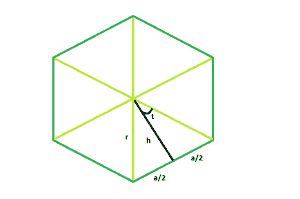

# 给定半径的正多边形的面积

> 原文:[https://www . geesforgeks . org/给定半径正多边形面积/](https://www.geeksforgeeks.org/area-of-a-n-sided-regular-polygon-with-given-radius/)

给定一个半径为 **N** 边的正多边形(从中心到任意顶点的距离) **R** 。任务是找到多边形的面积。
**例:**

```
Input : r = 9, N = 6
Output : 210.444

Input : r = 8, N = 7
Output : 232.571
```



在图中，我们看到多边形可以被分成 **N** 个相等的三角形。
看其中一个三角形，我们看到中心的整个角度可以分为=**360°/N**个部分。
所以，角度**t = 180°/N**。
看其中一个三角形，我们看到，

```
h = rcost
a = rsint
```

我们知道，

```
area of the triangle = (base * height)/2 
                     = r<sup>2sin(t)cos(t)</sup>
                     = r<sup>2*sin(2t)/2</sup>
```

所以，多边形的面积:

```
A = n * (area of one triangle) 
 = n*r<sup>2*sin(2t)/2</sup> 
 <sup>= n*r2*sin(360/n)/2</sup>
```

以下是上述方法的实现:

## C++

```
// C++ Program to find the area
// of a regular polygon with given radius

#include <bits/stdc++.h>
using namespace std;

// Function to find the area
// of a regular polygon
float polyarea(float n, float r)
{
    // Side and radius cannot be negative
    if (r < 0 && n < 0)
        return -1;

    // Area
    // degree converted to radians
    float A = ((r * r * n) * sin((360 / n) * 3.14159 / 180)) / 2;

    return A;
}

// Driver code
int main()
{
    float r = 9, n = 6;

    cout << polyarea(n, r) << endl;

    return 0;
}
```

## Java 语言(一种计算机语言，尤用于创建网站)

```
// Java Program to find the area
// of a regular polygon with given radius

import java.util.*;
class GFG
{
    // Function to find the area
    // of a regular polygon
    static double polyarea(double n, double r)
    {
        // Side and radius cannot be negative
        if (r < 0 && n < 0)
            return -1;

        // Area
        // degree converted to radians
        double A = ((r * r * n) * Math.sin((360 / n) * 3.14159 / 180)) / 2;

        return A;
    }

    // Driver code
    public static void main(String []args)
    {
        float r = 9, n = 6;

        System.out.println(polyarea(n, r));

    }
}

// This code is contributed
// By ihritik (Hritik Raj)
```

## 蟒蛇 3

```
# Python3 Program to find the area
# of a regular polygon with given radius

# form math lib import sin function
from math import sin

# Function to find the area
# of a regular polygon
def polyarea(n, r) :

    # Side and radius cannot be negative
    if (r < 0 and n < 0) :
        return -1

    # Area
    # degree converted to radians
    A = (((r * r * n) * sin((360 / n) *
                 3.14159 / 180)) / 2);

    return round(A, 3)

# Driver code
if __name__ == "__main__" :

    r, n = 9, 6
    print(polyarea(n, r))

# This code is contributed by Ryuga
```

## C#

```
// C# Program to find the area
// of a regular polygon with given radius

using System;
class GFG
{
    // Function to find the area
    // of a regular polygon
    static double polyarea(double n, double r)
    {
        // Side and radius cannot be negative
        if (r < 0 && n < 0)
            return -1;

        // Area
        // degree converted to radians
        double A = ((r * r * n) * Math.Sin((360 / n) * 3.14159 / 180)) / 2;

        return A;
    }

    // Driver code
    public static void Main()
    {
        float r = 9, n = 6;

        Console.WriteLine(polyarea(n, r));

    }
}

// This code is contributed
// By ihritik (Hritik Raj)
```

## 服务器端编程语言（Professional Hypertext Preprocessor 的缩写）

```
<?php
// PHP Program to find the area of a
// regular polygon with given radius

// Function to find the area
// of a regular polygon
function polyarea($n, $r)
{
    // Side and radius cannot be negative
    if ($r < 0 && $n < 0)
        return -1;

    // Area
    // degree converted to radians
    $A = (($r * $r * $n) * sin((360 / $n) *
                     3.14159 / 180)) / 2;

    return $A;
}

// Driver code
$r = 9;
$n = 6;
echo polyarea($n, $r)."\n";

// This code is contributed by ita_c
?>
```

## java 描述语言

```
<script>
// javascript Program to find the area
// of a regular polygon with given radius

// Function to find the area
// of a regular polygon
function polyarea(n , r)
{
    // Side and radius cannot be negative
    if (r < 0 && n < 0)
        return -1;

    // Area
    // degree converted to radians
    var A = ((r * r * n) * Math.sin((360 / n) * 3.14159 / 180)) / 2;

    return A;
}

// Driver code
var r = 9, n = 6;

document.write(polyarea(n, r).toFixed(5));

// This code contributed by Princi Singh
</script>
```

**Output:** 

```
210.444
```