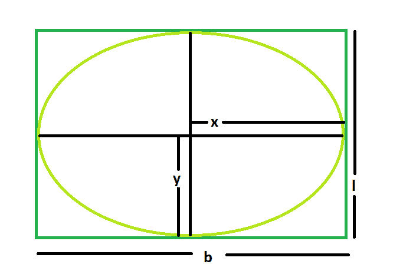

# 矩形内接最大椭圆的面积

> 原文:[https://www . geesforgeks . org/矩形内接最大椭圆面积/](https://www.geeksforgeeks.org/area-of-the-biggest-ellipse-inscribed-within-a-rectangle/)

这里给定的是一个长度为 **l** &宽度为 **b** 的矩形，任务是找出其中可内接的最大椭圆的面积。
**例:**

```
Input: l = 5, b = 3
Output: 11.775

Input: 7, b = 4
Output: 21.98
```



**接近** :

1.  设，椭圆长轴的长度= **2x** 和椭圆短轴的长度= **2y**
2.  从图中，很明显，
    **2x = l**
    **2y = b**

3.  所以， [**椭圆的面积**](https://www.geeksforgeeks.org/program-to-find-the-area-of-an-ellipse/)=**(π* x * y)**=**(π* l * b)/4**

以下是上述方法的实现:

## C++

```
// C++ Program to find the biggest ellipse
// which can be inscribed within the rectangle

#include <bits/stdc++.h>
using namespace std;

// Function to find the area
// of the ellipse
float ellipse(float l, float b)
{

    // The sides cannot be negative
    if (l < 0 || b < 0)
        return -1;

    // Area of the ellipse
    float x = (3.14 * l * b) / 4;

    return x;
}

// Driver code
int main()
{
    float l = 5, b = 3;
    cout << ellipse(l, b) << endl;

    return 0;
}
```

## Java 语言(一种计算机语言，尤用于创建网站)

```
// Java Program to find the biggest rectangle
// which can be inscribed within the ellipse
import java.util.*;
import java.lang.*;
import java.io.*;

class GFG
{

// Function to find the area
// of the rectangle
static float ellipse(float l, float b)
{

    // a and b cannot be negative
    if (l < 0 || b < 0)
        return -1;
    float x = (float)(3.14 * l * b) / 4;

    return x;

}

// Driver code
public static void main(String args[])
{
    float a = 5, b = 3;
    System.out.println(ellipse(a, b));
}
}

// This code is contributed
// by Mohit Kumar
```

## 蟒蛇 3

```
# Python3 Program to find the biggest ellipse
# which can be inscribed within the rectangle

# Function to find the area
# of the ellipse
def ellipse(l, b):

    # The sides cannot be negative
    if l < 0 or b < 0:
        return -1

    # Area of the ellipse
    x = (3.14 * l * b) / 4

    return x

# Driver code
if __name__ == "__main__":

    l, b = 5, 3
    print(ellipse(l, b))

# This code is contributed
# by Rituraj Jain
```

## C#

```
// C# Program to find the biggest rectangle
// which can be inscribed within the ellipse
using System;

class GFG
{

// Function to find the area
// of the rectangle
static float ellipse(float l, float b)
{

    // a and b cannot be negative
    if (l < 0 || b < 0)
        return -1;
    float x = (float)(3.14 * l * b) / 4;

    return x;

}

// Driver code
public static void Main()
{
    float a = 5, b = 3;
    Console.WriteLine(ellipse(a, b));
}
}

// This code is contributed
// by Code_Mech.
```

## 服务器端编程语言（Professional Hypertext Preprocessor 的缩写）

```
<?php
// PHP Program to find the biggest ellipse
// which can be inscribed within the rectangle

// Function to find the area
// of the ellipse
function ellipse($l, $b)
{

    // The sides cannot be negative
    if ($l < 0 || $b < 0)
        return -1;

    // Area of the ellipse
    $x = (3.14 * $l * $b) / 4;

    return $x;
}

// Driver code
$l = 5; $b = 3;
echo ellipse($l, $b) . "\n";

// This code is contributed
// by Akanksha Rai
?>
```

## java 描述语言

```
<script>

// javascript Program to find the biggest rectangle
// which can be inscribed within the ellipse

// Function to find the area
// of the rectangle
function ellipse(l , b)
{

    // a and b cannot be negative
    if (l < 0 || b < 0)
        return -1;
    var x = (3.14 * l * b) / 4;

    return x;

}

// Driver code

var a = 5, b = 3;
document.write(ellipse(a, b));

// This code is contributed by Amit Katiyar

</script>
```

**Output:** 

```
11.775
```