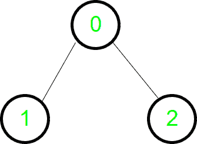

# 根据 CLRS 的算法，使用向量队列的 BFS

> 原文： [https://www.geeksforgeeks.org/bfs-using-vectors-queue-per-algorithm-clrs/](https://www.geeksforgeeks.org/bfs-using-vectors-queue-per-algorithm-clrs/)

[使用](https://www.geeksforgeeks.org/breadth-first-traversal-for-a-graph/) [CLRS 书](https://www.amazon.in/Introduction-Algorithms-Eastern-Economy-Thomas/dp/8120340078?tag=googinhydr18418-21)中给出的算法对图进行广度优先搜索遍历。

BFS 是遍历图形的方法之一。 之所以这样命名，是因为它在边界的宽度上均匀地扩展了已发现和未发现顶点之间的边界。 这意味着该算法首先在距离`u`的`k + 1`处发现顶点之前，先找到距离`k`的所有与`u`相连的顶点。 CLRS 中给出的算法使用“颜色”的概念来检查顶点是完全还是部分或未被发现。 它还跟踪顶点`u`与源`s`的距离。

```
BFS(G,s)
1  for each vertex u in G.V - {s}
2     u.color = white
3     u.d = INF
4     u.p = NIL
5  s.color = green
6  s.d = 0
7  s.p = NIL
8  Q = NULL
9  ENQUEUE(Q,s)
10 while Q != NULL
11    u = DEQUEUE(Q)
12    for each v in G.Adj[u]
13       if v.color == white
14          v.color = green
15          v.d = u.d + 1
16          v.p = u
17          ENQUEUE(Q,v)
18    u.color = dark_green

```

它产生一个以`s`为根并包含所有可到达顶点的“广度优先的树”。 让我们看一个简单的有向图，看看 BFS 如何遍历它。



图


遍历开始


第一次遍历


第一次遍历完成

## C++

```cpp

// CPP program to implement BFS as per CLRS  
// algorithm. 
#include <bits/stdc++.h> 
using namespace std; 

// Declaring the vectors to store color, distance 
// and parent 
vector<string> colour; 
vector<int> d; 
vector<int> p; 

/* This function adds an edge to the graph. 
It is an undirected graph. So edges are  
added for both the nodes. */
void addEdge(vector <int> g[], int u, int v) 
{ 
    g[u].push_back(v); 
    g[v].push_back(u); 
} 

/* This function does the Breadth First Search*/
void BFSSingleSource(vector <int> g[], int s) 
{ 
    // The Queue used for the BFS operation 
    queue<int> q; 

    // Pushing the root node inside the queue 
    q.push(s);  

    /* Distance of root node is 0 & colour 
    is gray as it is visited partially now */
    d[s] = 0; 
    colour[s] = "green"; 

    /* Loop to traverse the graph. Traversal 
    will happen traverse until the queue is  
    not empty.*/
    while (!q.empty()) 
    { 
        /* Extracting the front element(node)  
        and poping it out of queue. */
        int u = q.front(); 
        q.pop(); 

        cout << u << " "; 

        /* This loop traverses all the child nodes of u */
        for (auto i = g[u].begin(); i != g[u].end(); i++) 
        { 
            /* If the colour is white then the said node 
            is not traversed. */
            if (colour[*i] == "white") 
            { 
                colour[*i] = "green"; 
                d[*i] = d[u] + 1; 
                p[*i] = u; 

                /* Pushing the node inside queue 
                to traverse its children. */
                q.push(*i);  
            } 
        } 

        /* Now the node u is completely traversed 
        and colour is changed to black. */
        colour[u] = "dark_green"; 
    } 
} 

void BFSFull(vector <int> g[], int n) 
{ 
    /* Initially all nodes are not traversed. 
    Therefore, the colour is white. */
    colour.assign(n, "white"); 
    d.assign(n, 0); 
    p.assign(n, -1); 

    // Calling BFSSingleSource() for all white 
    // vertices. 
    for (int i = 0; i < n; i++)      
        if (colour[i] == "white") 
            BFSSingleSource(g, i);  
} 

// Driver Function 
int main() 
{ 
    // Graph with 7 nodes and 6 edges. 
    int n = 7; 

    // The Graph vector 
    vector <int> g[n]; 

    addEdge(g, 0, 1); 
    addEdge(g, 0, 2); 
    addEdge(g, 1, 3); 
    addEdge(g, 1, 4); 
    addEdge(g, 2, 5); 
    addEdge(g, 2, 6); 

    BFSFull(g, n); 

    return 0; 
} 

```

## Python

```py

# Python3 program to implement BFS as  
# per CLRS algorithm.  
import queue  

# This function adds an edge to the graph.  
# It is an undirected graph. So edges  
# are added for both the nodes.  
def addEdge(g, u, v): 
    g[u].append(v)  
    g[v].append(u) 

# This function does the Breadth 
# First Search 
def BFSSingleSource(g, s): 

    # The Queue used for the BFS operation  
    q = queue.Queue() 

    # Pushing the root node inside  
    # the queue  
    q.put(s)  

    # Distance of root node is 0 & colour is   
    # gray as it is visited partially now  
    d[s] = 0
    colour[s] = "green"

    # Loop to traverse the graph. Traversal  
    # will happen traverse until the queue  
    # is not empty. 
    while (not q.empty()): 

        # Extracting the front element(node)  
        # and poping it out of queue.  
        u = q.get()  

        print(u, end = " ") 

        # This loop traverses all the child 
        # nodes of u 
        i = 0
        while i < len(g[u]): 

            # If the colour is white then  
            # the said node is not traversed.  
            if (colour[g[u][i]] == "white"): 
                colour[g[u][i]] = "green"
                d[g[u][i]] = d[u] + 1
                p[g[u][i]] = u  

                # Pushing the node inside queue  
                # to traverse its children.  
                q.put(g[u][i]) 
            i += 1

        # Now the node u is completely traversed  
        # and colour is changed to black.  
        colour[u] = "dark_green"

def BFSFull(g, n): 

    # Initially all nodes are not traversed.  
    # Therefore, the colour is white.  
    colour = ["white"] * n  
    d = [0] * n  
    p = [-1] * n  

    # Calling BFSSingleSource() for all  
    # white vertices 
    for i in range(n): 
        if (colour[i] == "white"):  
            BFSSingleSource(g, i) 

# Driver Code 

# Graph with 7 nodes and 6 edges.  
n = 7

# Declaring the vectors to store color,  
# distance and parent  
colour = [None] * n 
d = [None] * n 
p = [None] * n 

# The Graph vector  
g = [[] for i in range(n)]  

addEdge(g, 0, 1)  
addEdge(g, 0, 2)  
addEdge(g, 1, 3)  
addEdge(g, 1, 4)  
addEdge(g, 2, 5)  
addEdge(g, 2, 6)  

BFSFull(g, n) 

# This code is contributed by Pranchalk 

```

**Output:**

```
0 1 2 3 4 5 6

```


* * *

* * *

如果您喜欢 GeeksforGeeks 并希望做出贡献，则还可以使用 [tribution.geeksforgeeks.org](https://contribute.geeksforgeeks.org/) 撰写文章，或将您的文章邮寄至 tribution@geeksforgeeks.org。 查看您的文章出现在 GeeksforGeeks 主页上，并帮助其他 Geeks。

如果您发现任何不正确的地方，请单击下面的“改进文章”按钮，以改进本文。