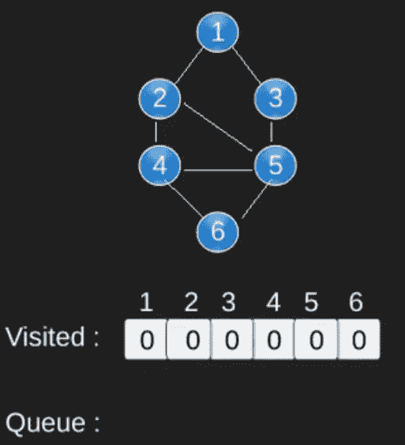
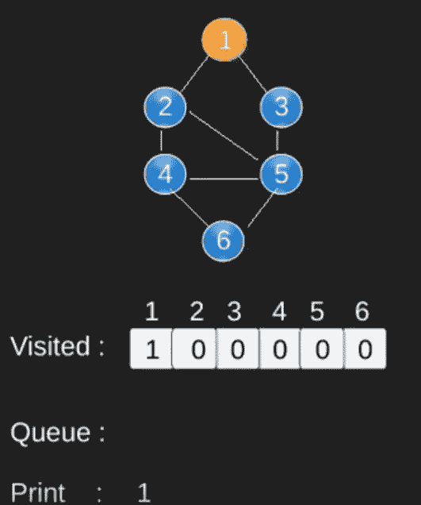
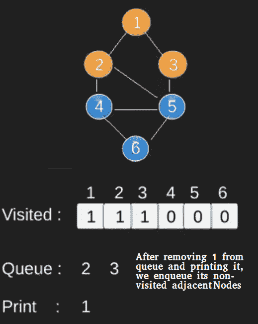
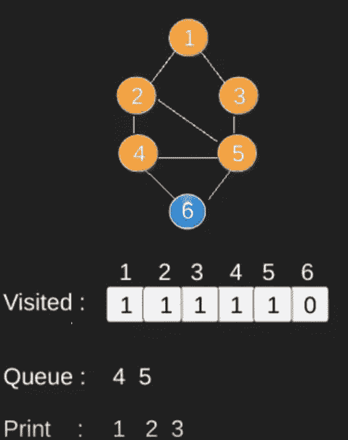
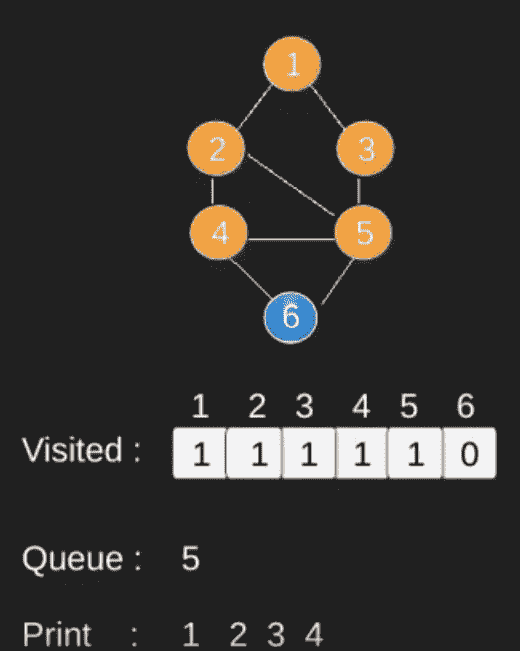
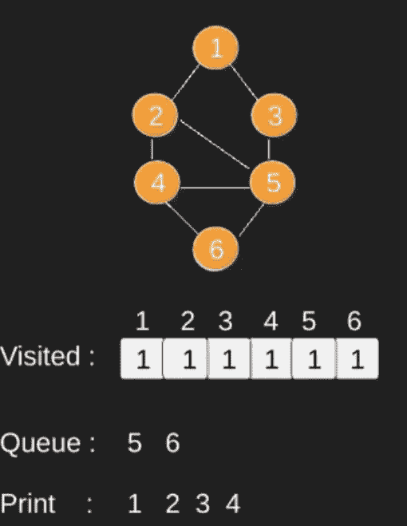
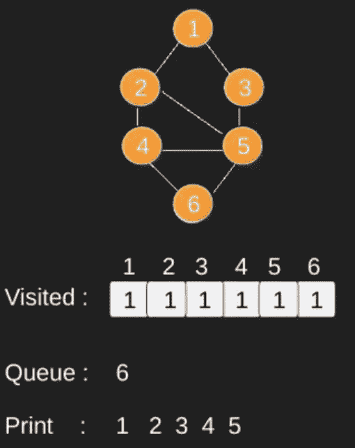
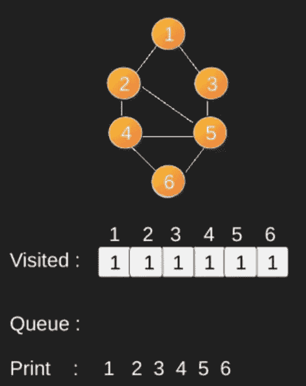

# 图的广度优先搜索或 BFS

> 原文:[https://www . geesforgeks . org/width-first-search-or-bfs-for-a-graph/](https://www.geeksforgeeks.org/breadth-first-search-or-bfs-for-a-graph/)

[图的广度优先遍历(或搜索)](http://en.wikipedia.org/wiki/Breadth-first_search)类似于树的广度优先遍历(见[本帖](https://www.geeksforgeeks.org/level-order-tree-traversal/)方法二)。这里唯一的问题是，与树不同，图可能包含循环，因此我们可能会再次来到同一个节点。为了避免多次处理一个节点，我们使用一个布尔访问数组。为简单起见，假设所有顶点都可以从起始顶点到达。

例如，在下图中，我们从顶点 2 开始遍历。当我们到达顶点 0 时，我们寻找它的所有相邻顶点。2 也是 0 的相邻顶点。如果我们不标记访问过的顶点，那么 2 将被再次处理，并且它将成为一个不终止的过程。下图的广度优先遍历是 2，0，3，1。


下面是来自给定源的简单广度优先遍历的实现。
该实现使用图的[邻接表表示](http://en.wikipedia.org/wiki/Adjacency_list)。 [STL](http://en.wikipedia.org/wiki/Standard_Template_Library) 的[列表容器](http://www.yolinux.com/TUTORIALS/LinuxTutorialC++STL.html#LIST)用于存储相邻节点的列表和 BFS 遍历所需的节点队列。

## C++

```
// Program to print BFS traversal from a given
// source vertex. BFS(int s) traverses vertices
// reachable from s.
#include<iostream>
#include <list>

using namespace std;

// This class represents a directed graph using
// adjacency list representation
class Graph
{
    int V;    // No. of vertices

    // Pointer to an array containing adjacency
    // lists
    list<int> *adj;  
public:
    Graph(int V);  // Constructor

    // function to add an edge to graph
    void addEdge(int v, int w);

    // prints BFS traversal from a given source s
    void BFS(int s); 
};

Graph::Graph(int V)
{
    this->V = V;
    adj = new list<int>[V];
}

void Graph::addEdge(int v, int w)
{
    adj[v].push_back(w); // Add w to v’s list.
}

void Graph::BFS(int s)
{
    // Mark all the vertices as not visited
    bool *visited = new bool[V];
    for(int i = 0; i < V; i++)
        visited[i] = false;

    // Create a queue for BFS
    list<int> queue;

    // Mark the current node as visited and enqueue it
    visited[s] = true;
    queue.push_back(s);

    // 'i' will be used to get all adjacent
    // vertices of a vertex
    list<int>::iterator i;

    while(!queue.empty())
    {
        // Dequeue a vertex from queue and print it
        s = queue.front();
        cout << s << " ";
        queue.pop_front();

        // Get all adjacent vertices of the dequeued
        // vertex s. If a adjacent has not been visited,
        // then mark it visited and enqueue it
        for (i = adj[s].begin(); i != adj[s].end(); ++i)
        {
            if (!visited[*i])
            {
                visited[*i] = true;
                queue.push_back(*i);
            }
        }
    }
}

// Driver program to test methods of graph class
int main()
{
    // Create a graph given in the above diagram
    Graph g(4);
    g.addEdge(0, 1);
    g.addEdge(0, 2);
    g.addEdge(1, 2);
    g.addEdge(2, 0);
    g.addEdge(2, 3);
    g.addEdge(3, 3);

    cout << "Following is Breadth First Traversal "
         << "(starting from vertex 2) \n";
    g.BFS(2);

    return 0;
}
```

## Java 语言(一种计算机语言，尤用于创建网站)

```
// Java program to print BFS traversal from a given source vertex.
// BFS(int s) traverses vertices reachable from s.
import java.io.*;
import java.util.*;

// This class represents a directed graph using adjacency list
// representation
class Graph
{
    private int V;   // No. of vertices
    private LinkedList<Integer> adj[]; //Adjacency Lists

    // Constructor
    Graph(int v)
    {
        V = v;
        adj = new LinkedList[v];
        for (int i=0; i<v; ++i)
            adj[i] = new LinkedList();
    }

    // Function to add an edge into the graph
    void addEdge(int v,int w)
    {
        adj[v].add(w);
    }

    // prints BFS traversal from a given source s
    void BFS(int s)
    {
        // Mark all the vertices as not visited(By default
        // set as false)
        boolean visited[] = new boolean[V];

        // Create a queue for BFS
        LinkedList<Integer> queue = new LinkedList<Integer>();

        // Mark the current node as visited and enqueue it
        visited[s]=true;
        queue.add(s);

        while (queue.size() != 0)
        {
            // Dequeue a vertex from queue and print it
            s = queue.poll();
            System.out.print(s+" ");

            // Get all adjacent vertices of the dequeued vertex s
            // If a adjacent has not been visited, then mark it
            // visited and enqueue it
            Iterator<Integer> i = adj[s].listIterator();
            while (i.hasNext())
            {
                int n = i.next();
                if (!visited[n])
                {
                    visited[n] = true;
                    queue.add(n);
                }
            }
        }
    }

    // Driver method to
    public static void main(String args[])
    {
        Graph g = new Graph(4);

        g.addEdge(0, 1);
        g.addEdge(0, 2);
        g.addEdge(1, 2);
        g.addEdge(2, 0);
        g.addEdge(2, 3);
        g.addEdge(3, 3);

        System.out.println("Following is Breadth First Traversal "+
                           "(starting from vertex 2)");

        g.BFS(2);
    }
}
// This code is contributed by Aakash Hasija
```

## 蟒蛇 3

```
# Python3 Program to print BFS traversal
# from a given source vertex. BFS(int s)
# traverses vertices reachable from s.
from collections import defaultdict

# This class represents a directed graph
# using adjacency list representation
class Graph:

    # Constructor
    def __init__(self):

        # default dictionary to store graph
        self.graph = defaultdict(list)

    # function to add an edge to graph
    def addEdge(self,u,v):
        self.graph[u].append(v)

    # Function to print a BFS of graph
    def BFS(self, s):

        # Mark all the vertices as not visited
        visited = [False] * (max(self.graph) + 1)

        # Create a queue for BFS
        queue = []

        # Mark the source node as
        # visited and enqueue it
        queue.append(s)
        visited[s] = True

        while queue:

            # Dequeue a vertex from
            # queue and print it
            s = queue.pop(0)
            print (s, end = " ")

            # Get all adjacent vertices of the
            # dequeued vertex s. If a adjacent
            # has not been visited, then mark it
            # visited and enqueue it
            for i in self.graph[s]:
                if visited[i] == False:
                    queue.append(i)
                    visited[i] = True

# Driver code

# Create a graph given in
# the above diagram
g = Graph()
g.addEdge(0, 1)
g.addEdge(0, 2)
g.addEdge(1, 2)
g.addEdge(2, 0)
g.addEdge(2, 3)
g.addEdge(3, 3)

print ("Following is Breadth First Traversal"
                  " (starting from vertex 2)")
g.BFS(2)

# This code is contributed by Neelam Yadav
```

## C#

```
// C# program to print BFS traversal
// from a given source vertex.
// BFS(int s) traverses vertices
// reachable from s.
using System;
using System.Collections.Generic;
using System.Linq;
using System.Text;

// This class represents a directed
// graph using adjacency list
// representation
class Graph{

// No. of vertices    
private int _V;

//Adjacency Lists
LinkedList<int>[] _adj;

public Graph(int V)
{
    _adj = new LinkedList<int>[V];
    for(int i = 0; i < _adj.Length; i++)
    {
        _adj[i] = new LinkedList<int>();
    }
    _V = V;
}

// Function to add an edge into the graph
public void AddEdge(int v, int w)
{        
    _adj[v].AddLast(w);

}

// Prints BFS traversal from a given source s
public void BFS(int s)
{

    // Mark all the vertices as not
    // visited(By default set as false)
    bool[] visited = new bool[_V];
    for(int i = 0; i < _V; i++)
        visited[i] = false;

    // Create a queue for BFS
    LinkedList<int> queue = new LinkedList<int>();

    // Mark the current node as
    // visited and enqueue it
    visited[s] = true;
    queue.AddLast(s);        

    while(queue.Any())
    {

        // Dequeue a vertex from queue
        // and print it
        s = queue.First();
        Console.Write(s + " " );
        queue.RemoveFirst();

        // Get all adjacent vertices of the
        // dequeued vertex s. If a adjacent
        // has not been visited, then mark it
        // visited and enqueue it
        LinkedList<int> list = _adj[s];

        foreach (var val in list)            
        {
            if (!visited[val])
            {
                visited[val] = true;
                queue.AddLast(val);
            }
        }
    }
}

// Driver code
static void Main(string[] args)
{
    Graph g = new Graph(4);

    g.AddEdge(0, 1);
    g.AddEdge(0, 2);
    g.AddEdge(1, 2);
    g.AddEdge(2, 0);
    g.AddEdge(2, 3);
    g.AddEdge(3, 3);

    Console.Write("Following is Breadth First " +
                  "Traversal(starting from " +
                  "vertex 2)\n");
    g.BFS(2);
}
}

// This code is contributed by anv89
```

**输出:**

```
Following is Breadth First Traversal (starting from vertex 2)
2 0 3 1
```

插图:

 

 

 

 

 

请注意，上述代码仅遍历从给定源顶点可到达的顶点。不是所有的顶点都可以从给定的顶点到达(例如断开图)。要打印所有顶点，我们可以修改 BFS 函数，从所有节点开始逐一遍历(像 [DFS 修改版](https://www.geeksforgeeks.org/depth-first-traversal-for-a-graph/))。

时间复杂度:O(V+E)，其中 V 是图中的顶点数，E 是图中的边数。

https://youtu.be/0u78hx-66Xk

**你可能还想看下面:**

*   [最近关于 BFS 的文章](https://www.geeksforgeeks.org/tag/bfs/)
*   [深度优先遍历](https://www.geeksforgeeks.org/depth-first-traversal-for-a-graph/)
*   [广度优先遍历的应用](https://www.geeksforgeeks.org/applications-of-breadth-first-traversal/)
*   [深度优先搜索的应用](https://www.geeksforgeeks.org/applications-of-depth-first-search/)

如果你发现任何不正确的地方，或者你想分享更多关于上面讨论的话题的信息，请写评论。