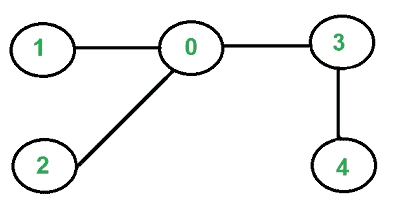
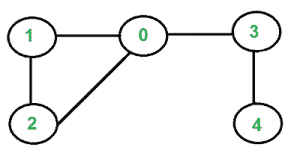

# 检查给定的图形是否是树

> 原文:[https://www.geeksforgeeks.org/check-given-graph-tree/](https://www.geeksforgeeks.org/check-given-graph-tree/)

写一个函数，如果给定的无向图是树，则返回 true，否则返回 false。例如，下图是一棵树。



但是下图不是树。



无向图是树，如果它有下列性质。
1)没有周期。
2)图是连通的。
对于无向图，我们可以使用 [BFS](https://www.geeksforgeeks.org/breadth-first-traversal-for-a-graph/) 或 [DFS](https://www.geeksforgeeks.org/depth-first-traversal-for-a-graph/) 来检测以上两个属性。
**如何检测无向图中的循环？**
我们可以用 BFS 或者 DFS。对于每个访问过的顶点“v”，如果有一个相邻的“u”，使得 u 已经被访问过，并且 u 不是 v 的父顶点，那么图中就有一个循环。如果我们没有为任何顶点找到这样的邻域，我们就说没有循环(详见[检测无向图中的循环](https://www.geeksforgeeks.org/detect-cycle-undirected-graph/))。
**如何检查连通性？**
由于图是无向的，我们可以从任意一个顶点开始 BFS 或 DFS，检查是否所有的顶点都是可达的。如果所有顶点都是可达的，那么图是连通的，否则不是。

## C++

```
// A C++ Program to check whether a graph is tree or not
#include<iostream>
#include <list>
#include <limits.h>
using namespace std;

// Class for an undirected graph
class Graph
{
    int V;    // No. of vertices
    list<int> *adj; // Pointer to an array for adjacency lists
    bool isCyclicUtil(int v, bool visited[], int parent);
public:
    Graph(int V);   // Constructor
    void addEdge(int v, int w);   // to add an edge to graph
    bool isTree();   // returns true if graph is tree
};

Graph::Graph(int V)
{
    this->V = V;
    adj = new list<int>[V];
}

void Graph::addEdge(int v, int w)
{
    adj[v].push_back(w); // Add w to v’s list.
    adj[w].push_back(v); // Add v to w’s list.
}

// A recursive function that uses visited[] and parent to
// detect cycle in subgraph reachable from vertex v.
bool Graph::isCyclicUtil(int v, bool visited[], int parent)
{
    // Mark the current node as visited
    visited[v] = true;

    // Recur for all the vertices adjacent to this vertex
    list<int>::iterator i;
    for (i = adj[v].begin(); i != adj[v].end(); ++i)
    {
        // If an adjacent is not visited, then recur for
        // that adjacent
        if (!visited[*i])
        {
           if (isCyclicUtil(*i, visited, v))
              return true;
        }

        // If an adjacent is visited and not parent of current
        // vertex, then there is a cycle.
        else if (*i != parent)
           return true;
    }
    return false;
}

// Returns true if the graph is a tree, else false.
bool Graph::isTree()
{
    // Mark all the vertices as not visited and not part of
    // recursion stack
    bool *visited = new bool[V];
    for (int i = 0; i < V; i++)
        visited[i] = false;

    // The call to isCyclicUtil serves multiple purposes.
    // It returns true if graph reachable from vertex 0
    // is cyclcic. It also marks all vertices reachable
    // from 0.
    if (isCyclicUtil(0, visited, -1))
             return false;

    // If we find a vertex which is not reachable from 0
    // (not marked by isCyclicUtil(), then we return false
    for (int u = 0; u < V; u++)
        if (!visited[u])
           return false;

    return true;
}

// Driver program to test above functions
int main()
{
    Graph g1(5);
    g1.addEdge(1, 0);
    g1.addEdge(0, 2);
    g1.addEdge(0, 3);
    g1.addEdge(3, 4);
    g1.isTree()? cout << "Graph is Tree\n":
                 cout << "Graph is not Tree\n";

    Graph g2(5);
    g2.addEdge(1, 0);
    g2.addEdge(0, 2);
    g2.addEdge(2, 1);
    g2.addEdge(0, 3);
    g2.addEdge(3, 4);
    g2.isTree()? cout << "Graph is Tree\n":
                 cout << "Graph is not Tree\n";

    return 0;
}
```

## Java 语言(一种计算机语言，尤用于创建网站)

```
// A Java Program to check whether a graph is tree or not
import java.io.*;
import java.util.*;

// This class represents a directed graph using adjacency
// list representation
class Graph
{
    private int V; // No. of vertices
    private LinkedList<Integer> adj[]; //Adjacency List

    // Constructor

    @SuppressWarnings("unchecked")
    Graph(int v)
    {
        V = v;
        adj = new LinkedList[V];
        for (int i=0; i<v; ++i)
            adj[i] = new LinkedList<Integer>();
    }

    // Function to add an edge into the graph
    void addEdge(int v,int w)
    {
        adj[v].add(w);
        adj[w].add(v);
    }

    // A recursive function that uses visited[] and parent
    // to detect cycle in subgraph reachable from vertex v.
    boolean isCyclicUtil(int v, boolean visited[], int parent)
    {
        // Mark the current node as visited
        visited[v] = true;
        Integer i;

        // Recur for all the vertices adjacent to this vertex
        Iterator<Integer> it = adj[v].iterator();
        while (it.hasNext())
        {
            i = it.next();

            // If an adjacent is not visited, then recur for
            // that adjacent
            if (!visited[i])
            {
                if (isCyclicUtil(i, visited, v))
                    return true;
            }

            // If an adjacent is visited and not parent of
            // current vertex, then there is a cycle.
            else if (i != parent)
            return true;
        }
        return false;
    }

    // Returns true if the graph is a tree, else false.
    boolean isTree()
    {
        // Mark all the vertices as not visited and not part
        // of recursion stack
        boolean visited[] = new boolean[V];
        for (int i = 0; i < V; i++)
            visited[i] = false;

        // The call to isCyclicUtil serves multiple purposes
        // It returns true if graph reachable from vertex 0
        // is cyclcic. It also marks all vertices reachable
        // from 0.
        if (isCyclicUtil(0, visited, -1))
            return false;

        // If we find a vertex which is not reachable from 0
        // (not marked by isCyclicUtil(), then we return false
        for (int u = 0; u < V; u++)
            if (!visited[u])
                return false;

        return true;
    }

    // Driver method
    public static void main(String args[])
    {
        // Create a graph given in the above diagram
        Graph g1 = new Graph(5);
        g1.addEdge(1, 0);
        g1.addEdge(0, 2);
        g1.addEdge(0, 3);
        g1.addEdge(3, 4);
        if (g1.isTree())
            System.out.println("Graph is Tree");
        else
            System.out.println("Graph is not Tree");

        Graph g2 = new Graph(5);
        g2.addEdge(1, 0);
        g2.addEdge(0, 2);
        g2.addEdge(2, 1);
        g2.addEdge(0, 3);
        g2.addEdge(3, 4);

        if (g2.isTree())
            System.out.println("Graph is Tree");
        else
            System.out.println("Graph is not Tree");

    }
}
// This code is contributed by Aakash Hasija
```

## 计算机编程语言

```
# Python Program to check whether
# a graph is tree or not

from collections import defaultdict

class Graph():

    def __init__(self, V):
        self.V = V
        self.graph  = defaultdict(list)

    def addEdge(self, v, w):
        # Add w to v ist.
        self.graph[v].append(w)
        # Add v to w list.
        self.graph[w].append(v)

    # A recursive function that uses visited[]
    # and parent to detect cycle in subgraph
    # reachable from vertex v.
    def isCyclicUtil(self, v, visited, parent):

        # Mark current node as visited
        visited[v] = True

        # Recur for all the vertices adjacent
        # for this vertex
        for i in self.graph[v]:
            # If an adjacent is not visited,
            # then recur for that adjacent
            if visited[i] == False:
                if self.isCyclicUtil(i, visited, v) == True:
                    return True

            # If an adjacent is visited and not
            # parent of current vertex, then there
            # is a cycle.
            elif i != parent:
                return True

        return False

    # Returns true if the graph is a tree,
    # else false.
    def isTree(self):
        # Mark all the vertices as not visited
        # and not part of recursion stack
        visited = [False] * self.V

        # The call to isCyclicUtil serves multiple
        # purposes. It returns true if graph reachable
        # from vertex 0 is cyclcic. It also marks
        # all vertices reachable from 0.
        if self.isCyclicUtil(0, visited, -1) == True:
            return False

        # If we find a vertex which is not reachable
        # from 0 (not marked by isCyclicUtil(),
        # then we return false
        for i in range(self.V):
            if visited[i] == False:
                return False

        return True

# Driver program to test above functions
g1 = Graph(5)
g1.addEdge(1, 0)
g1.addEdge(0, 2)
g1.addEdge(0, 3)
g1.addEdge(3, 4)
print "Graph is a Tree" if g1.isTree() == True \
                          else "Graph is a not a Tree"

g2 = Graph(5)
g2.addEdge(1, 0)
g2.addEdge(0, 2)
g2.addEdge(2, 1)
g2.addEdge(0, 3)
g2.addEdge(3, 4)
print "Graph is a Tree" if g2.isTree() == True \
                          else "Graph is a not a Tree"

# This code is contributed by Divyanshu Mehta     
```

## C#

```
// A C# Program to check whether
// a graph is tree or not
using System;
using System.Collections.Generic;

// This class represents a directed graph
// using adjacency list representation
class Graph
{
    private int V; // No. of vertices
    private List<int> []adj; // Adjacency List

    // Constructor
    Graph(int v)
    {
        V = v;
        adj = new List<int>[v];
        for (int i = 0; i < v; ++i)
            adj[i] = new List<int>();
    }

    // Function to add an edge
    // into the graph
    void addEdge(int v, int w)
    {
        adj[v].Add(w);
        adj[w].Add(v);
    }

    // A recursive function that uses visited[]
    // and parent to detect cycle in subgraph
    // reachable from vertex v.
    Boolean isCyclicUtil(int v, Boolean []visited,
                         int parent)
    {
        // Mark the current node as visited
        visited[v] = true;
        int i;

        // Recur for all the vertices
        // adjacent to this vertex
        foreach(int it in adj[v])
        {
            i = it;

            // If an adjacent is not visited,
            // then recur for that adjacent
            if (!visited[i])
            {
                if (isCyclicUtil(i, visited, v))
                    return true;
            }

            // If an adjacent is visited and
            // not parent of current vertex,
            // then there is a cycle.
            else if (i != parent)
            return true;
        }
        return false;
    }

    // Returns true if the graph
    // is a tree, else false.
    Boolean isTree()
    {
        // Mark all the vertices as not visited
        // and not part of recursion stack
        Boolean []visited = new Boolean[V];
        for (int i = 0; i < V; i++)
            visited[i] = false;

        // The call to isCyclicUtil serves
        // multiple purposes. It returns true if
        // graph reachable from vertex 0 is cyclcic.
        // It also marks all vertices reachable from 0.
        if (isCyclicUtil(0, visited, -1))
            return false;

        // If we find a vertex which is not reachable
        // from 0 (not marked by isCyclicUtil(),
        // then we return false
        for (int u = 0; u < V; u++)
            if (!visited[u])
                return false;

        return true;
    }

    // Driver Code
    public static void Main(String []args)
    {
        // Create a graph given
        // in the above diagram
        Graph g1 = new Graph(5);
        g1.addEdge(1, 0);
        g1.addEdge(0, 2);
        g1.addEdge(0, 3);
        g1.addEdge(3, 4);
        if (g1.isTree())
            Console.WriteLine("Graph is Tree");
        else
            Console.WriteLine("Graph is not Tree");

        Graph g2 = new Graph(5);
        g2.addEdge(1, 0);
        g2.addEdge(0, 2);
        g2.addEdge(2, 1);
        g2.addEdge(0, 3);
        g2.addEdge(3, 4);

        if (g2.isTree())
            Console.WriteLine("Graph is Tree");
        else
            Console.WriteLine("Graph is not Tree");

    }
}

// This code is contributed by Rajput-Ji
```

## java 描述语言

```
<script>

// A JavaScript Program to check whether
// a graph is tree or not

// This class represents a directed graph
// using adjacency list representation
var V = 0; // No. of vertices
var adj; // Adjacency List
// Constructor
function initialize(v)
{
    V = v;
    adj = Array.from(Array(v), ()=>Array());
}
// Function to add an edge
// into the graph
function addEdge(v, w)
{
    adj[v].push(w);
    adj[w].push(v);
}
// A recursive function that uses visited[]
// and parent to detect cycle in subgraph
// reachable from vertex v.
function isCyclicUtil(v, visited, parent)
{
    // Mark the current node as visited
    visited[v] = true;
    var i;
    // Recur for all the vertices
    // adjacent to this vertex
    for(var it of adj[v])
    {
        i = it;
        // If an adjacent is not visited,
        // then recur for that adjacent
        if (!visited[i])
        {
            if (isCyclicUtil(i, visited, v))
                return true;
        }
        // If an adjacent is visited and
        // not parent of current vertex,
        // then there is a cycle.
        else if (i != parent)
        return true;
    }
    return false;
}
// Returns true if the graph
// is a tree, else false.
function isTree()
{
    // Mark all the vertices as not visited
    // and not part of recursion stack
    var visited = Array(V).fill(false);

    // The call to isCyclicUtil serves
    // multiple purposes. It returns true if
    // graph reachable from vertex 0 is cyclcic.
    // It also marks all vertices reachable from 0.
    if (isCyclicUtil(0, visited, -1))
        return false;
    // If we find a vertex which is not reachable
    // from 0 (not marked by isCyclicUtil(),
    // then we return false
    for (var u = 0; u < V; u++)
        if (!visited[u])
            return false;
    return true;
}
// Driver Code
// Create a graph given
// in the above diagram
initialize(5)
addEdge(1, 0);
addEdge(0, 2);
addEdge(0, 3);
addEdge(3, 4);
if (isTree())
    document.write("Graph is Tree<br>");
else
    document.write("Graph is not Tree<br>");
initialize(5)
addEdge(1, 0);
addEdge(0, 2);
addEdge(2, 1);
addEdge(0, 3);
addEdge(3, 4);
if (isTree())
    document.write("Graph is Tree<br>");
else
    document.write("Graph is not Tree<br>");

</script>
```

**输出:**

```
Graph is Tree
Graph is not Tree
```

感谢**维尼特维尔马**提出这个问题和初步解决方案。如果你发现任何不正确的地方，请写评论，或者你想分享更多关于上面讨论的话题的信息