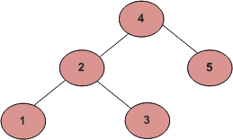

# 检查二叉树是否是 BST:简单有效的方法

> 原文:[https://www . geesforgeks . org/check-if-a-binary-tree-is-BST-simple-and-efficient-approach/](https://www.geeksforgeeks.org/check-if-a-binary-tree-is-bst-simple-and-efficient-approach/)

给定一棵二叉树，任务是检查给定的二叉树是否是二叉查找树树。
二叉查找树树(BST)是一种基于节点的二叉树数据结构，具有以下特性。

*   节点的左子树只包含键小于该节点键的节点。
*   节点的右子树只包含键大于节点键的节点。
*   左右子树都必须是二分搜索法树。

从上述特性中自然可以得出以下结论:

*   每个节点(树中的项目)都有一个不同的键。



在[之前的文章](https://www.geeksforgeeks.org/a-program-to-check-if-a-binary-tree-is-bst-or-not/)中，我们已经讨论了解决这个问题的不同方法。
在本文中，我们将讨论一种简单而有效的方法来解决上述问题。
想法是使用 Inorder 遍历并跟踪先前访问过的节点的值。因为有序遍历一个 BST 会生成一个排序数组作为输出，所以，前一个元素应该总是小于或等于当前元素。
在进行 In-Order 遍历时，我们可以跟踪以前访问过的 node 的值，如果当前访问过的 Node 的值小于以前的值，则该树不是 BST。

下面是上述方法的实现:

## C++

```
// C++ program to check if a given tree is BST.
#include <bits/stdc++.h>
using namespace std;

/* A binary tree node has data, pointer to
left child and a pointer to right child */
struct Node {
    int data;
    struct Node *left, *right;

    Node(int data)
    {
        this->data = data;
        left = right = NULL;
    }
};

// Utility function to check if Binary Tree is BST
bool isBSTUtil(struct Node* root, int& prev)
{
    // traverse the tree in inorder fashion and
    // keep track of prev node
    if (root) {
        if (!isBSTUtil(root->left, prev))
            return false;

        // Allows only distinct valued nodes
        if (root->data <= prev)
            return false;

        // Initialize prev to current
        prev = root->data;

        return isBSTUtil(root->right, prev);
    }

    return true;
}

// Function to check if Binary Tree is BST
bool isBST(Node* root)
{
    int prev = INT_MIN;
    return isBSTUtil(root, prev);
}

/* Driver code*/
int main()
{
    struct Node* root = new Node(5);
    root->left = new Node(2);
    root->right = new Node(15);
    root->left->left = new Node(1);
    root->left->right = new Node(4);

    if (isBST(root))
        cout << "Is BST";
    else
        cout << "Not a BST";

    return 0;
}
```

## Java 语言(一种计算机语言，尤用于创建网站)

```
// Java program to check if a given tree is BST.
class GFG {

    static int prev = Integer.MIN_VALUE;
    /* A binary tree node has data, pointer to
    left child and a pointer to right child */
    static class Node {
        int data;
        Node left, right;

        Node(int data)
        {
            this.data = data;
            left = right = null;
        }
    };

    // Utility function to check if Binary Tree is BST
    static boolean isBSTUtil(Node root)
    {
        // traverse the tree in inorder fashion and
        // keep track of prev node
        if (root != null) {
            if (!isBSTUtil(root.left))
                return false;

            // Allows only distinct valued nodes
            if (root.data <= prev)
                return false;

            // Initialize prev to current
            prev = root.data;

            return isBSTUtil(root.right);
        }

        return true;
    }

    // Function to check if Binary Tree is BST
    static boolean isBST(Node root)
    {
        return isBSTUtil(root);
    }

    /* Driver code*/
    public static void main(String[] args)
    {
        Node root = new Node(5);
        root.left = new Node(2);
        root.right = new Node(15);
        root.left.left = new Node(1);
        root.left.right = new Node(4);

        if (isBST(root))
            System.out.print("Is BST");
        else
            System.out.print("Not a BST");
    }
}

// This code is contributed by PrinciRaj1992
```

## 蟒蛇 3

```
# Python3 program to check if a given tree is BST.

import math
prev = -math.inf

class Node:
    """
    Creates a Binary tree node that has data,
    a pointer to it's left and right child
    """

    def __init__(self, data):
        self.left = None
        self.right = None
        self.data = data

def checkBST(root):
    """
    Function to check if Binary Tree is
    a Binary Search Tree
    :param root: current root node
    :return: Boolean value
    """
    # traverse the tree in inorder
    # fashion and update the prev node
    global prev

    if root:
        if not checkBST(root.left):
            return False

        # Handles same valued nodes
        if root.data < prev:
            return False

        # Set value of prev to current node
        prev = root.data

        return checkBST(root.right)
    return True

# Driver Code
def main():
    root = Node(1)
    root.left = Node(2)
    root.right = Node(15)
    root.left.left = Node(1)
    root.left.right = Node(4)

    if checkBST(root):
        print("Is BST")
    else:
        print("Not a BST")

if __name__ == '__main__':
    main()

# This code is contributed by priyankapunjabi94
```

## C#

```
// C# program to check if a given tree is BST.
using System;

class GFG {

    /* A binary tree node has data, pointer to
    left child and a pointer to right child */
    class Node {
        public int data;
        public Node left, right;

        public Node(int data)
        {
            this.data = data;
            left = right = null;
        }
    };

    // Utility function to check if Binary Tree is BST
    static bool isBSTUtil(Node root, int prev)
    {
        // traverse the tree in inorder fashion and
        // keep track of prev node
        if (root != null) {
            if (!isBSTUtil(root.left, prev))
                return false;

            // Allows only distinct valued nodes
            if (root.data <= prev)
                return false;

            // Initialize prev to current
            prev = root.data;

            return isBSTUtil(root.right, prev);
        }

        return true;
    }

    // Function to check if Binary Tree is BST
    static bool isBST(Node root)
    {
        int prev = int.MinValue;
        return isBSTUtil(root, prev);
    }

    /* Driver code*/
    public static void Main(String[] args)
    {
        Node root = new Node(5);
        root.left = new Node(2);
        root.right = new Node(15);
        root.left.left = new Node(1);
        root.left.right = new Node(4);

        if (isBST(root))
            Console.Write("Is BST");
        else
            Console.Write("Not a BST");
    }
}

// This code is contributed by PrinciRaj1992
```

## java 描述语言

```
<script>

// JavaScript program to check if a given tree is BST.
/* A binary tree node has data, pointer to
left child and a pointer to right child */
class Node {

    constructor(data)
    {
        this.data = data;
        this.left = null;
        this.right = null;
    }
};
// Utility function to check if Binary Tree is BST
function isBSTUtil(root, prev)
{
    // traverse the tree in inorder fashion and
    // keep track of prev node
    if (root != null) {
        if (!isBSTUtil(root.left, prev))
            return false;
        // Allows only distinct valued nodes
        if (root.data <= prev)
            return false;
        // Initialize prev to current
        prev = root.data;
        return isBSTUtil(root.right, prev);
    }
    return true;
}
// Function to check if Binary Tree is BST
function isBST(root)
{
    var prev = -1000000000;
    return isBSTUtil(root, prev);
}
/* Driver code*/
var root = new Node(5);
root.left = new Node(2);
root.right = new Node(15);
root.left.left = new Node(1);
root.left.right = new Node(4);
if (isBST(root))
    document.write("Is BST");
else
    document.write("Not a BST");

</script>
```

**Output**

```
Is BST
```

**时间复杂度:**O(N)
T3】辅助空间: O(1)