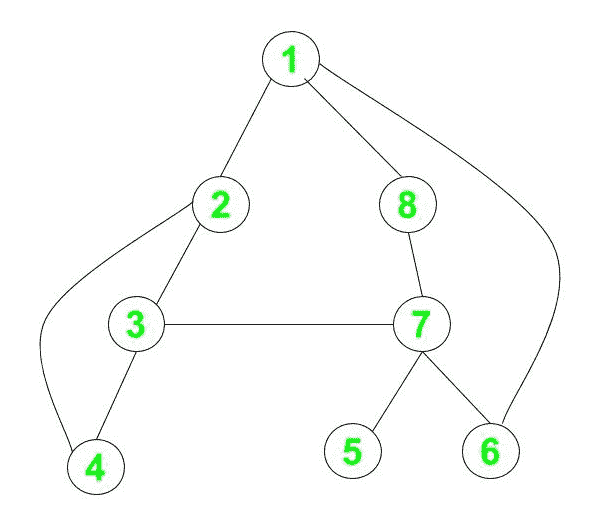
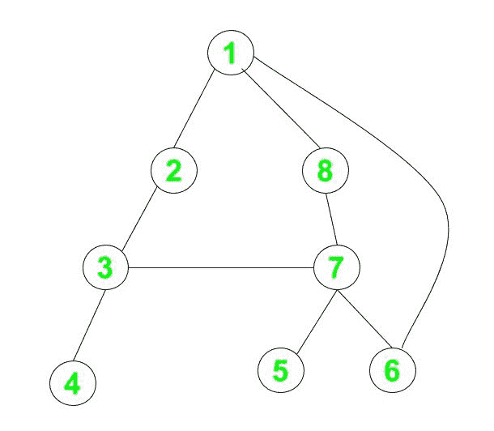

# 检查给定的图形是否为 2 边连接

> 原文:[https://www . geeksforgeeks . org/check-如果给定的图形是 2 边连通或不连通的/](https://www.geeksforgeeks.org/check-if-a-given-graph-is-2-edge-connected-or-not/)

给定一个无向图**【G】**，具有 **V** 顶点和 **E** 边，任务是检查该图是否是 2 边连通的。

> 如果在移除图的任何边时，图仍然保持连通，即它不包含[桥](https://www.geeksforgeeks.org/bridge-in-a-graph/?ref=rp)，则称该图为 **2 边连通**。

**示例:**

> **输入:** V = 8，E = 10
> 
> 
> 
> **输出:**是
> **说明:**
> 给定图中的任意一个顶点，我们可以到达图中的任意其他顶点。此外，从图中移除任何边都不会影响其连通性。所以，这个图被称为 2 边连通。
> 
> **输入:** V = 8，E = 9
> 
> 
> 
> **输出:**否
> **说明:**
> 移除顶点 3 和顶点 4 之间的边后，图不再连接。所以，图不是 2 边连通的。

**天真方法:**天真方法是检查在移除任何边缘时 **X** ，如果剩余的图形**G–X**是否连接。如果图在逐个移除每条边时保持连通，那么它是一个 2 边连通图。为了实现上述想法，移除一条边并从任意顶点执行[深度优先搜索(DFS)](https://www.geeksforgeeks.org/depth-first-search-or-dfs-for-a-graph/) 或[宽度优先搜索(BFS)](https://www.geeksforgeeks.org/breadth-first-search-or-bfs-for-a-graph/) ，并检查是否覆盖了所有顶点。对所有 **E** 边重复此过程。如果任何边不能遍历所有顶点，打印**否**。否则，打印**是**。

***时间复杂度:** O(E * ( V + E))*
***辅助空间:** O(1)*

**高效方法:**由于给定的图是无向图，因此只能通过计算连接到节点的边的数量来解决问题。如果对于任何一个节点，连接到它的边的数量是 1，这意味着在移除这个边时，该节点变得断开，并且它不能从任何其他节点到达。因此，该图不是 2 边连通的。以下是步骤:

1.  创建一个大小为 **V** 的数组**节点[]** ，该数组将存储连接到一个节点的边的数量。
2.  对于每条边 **(u，v)** 增加节点 **u** 和 **v** 的边数。
3.  现在迭代数组 **noOfEdges[]** ，检查是否有任何边只有一条边与之相连。如果是，则**图不是 2 边连接的**。
4.  否则，图是 2 边连通的。

下面是上述方法的实现:

## C++14

```
// C++14 program for the above approach

#include <bits/stdc++.h>
using namespace std;

// Definition of a graph
class Graph {

    // No. of vertices
    int V;

    // To create adjacency list
    list<int>* adj;

public:
    // Constructor
    Graph(int V);

    // Function to add an edge to graph
    void addEdge(int v, int w);

    // Function to check 2-edge
    // 2-edge connectivity
    void twoEdge(int v);
};

// Initialize the graph
Graph::Graph(int V)
{
    this->V = V;
    adj = new list<int>[V];
}

// Adding edges to adjacency list
void Graph::addEdge(int v, int w)
{
    adj[v - 1].push_back(w - 1);
    adj[w - 1].push_back(v - 1);
}

// Function to find if the graph is
// 2 edge connected or not
void Graph::twoEdge(int v)
{
    // To store number of edges for
    // each node
    int noOfEdges[v];

    for (int i = 0; i < v; i++) {
        noOfEdges[i] = adj[i].size();
    }

    bool flag = true;

    // Check the number of edges
    // connected to each node
    for (int i = 0; i < v; i++) {

        if (noOfEdges[i] < 2) {
            flag = false;
            break;
        }
    }

    // Print the result
    if (flag)
        cout << "Yes";
    else
        cout << "No";
}

// Driver Code
int main()
{
    // Number of nodes and edges
    int V = 8;
    int E = 10;

    // Given Edges
    int edges[E][2] = { { 1, 2 }, { 1, 8 }, { 1, 6 },
                        { 2, 3 }, { 2, 4 }, { 3, 7 },
                        { 3, 4 }, { 7, 5 }, { 7, 6 },
                        { 7, 8 } };

    // Initialize the graph
    Graph g(V);

    // Adding the edges to graph
    for (int i = 0; i < E; i++) {
        g.addEdge(edges[i][0], edges[i][1]);
    }

    // Function call
    g.twoEdge(V);

    return 0;
}
```

## Java 语言(一种计算机语言，尤用于创建网站)

```
// Java program for the above approach
import java.util.*;

class Graph{

// No. of vertices    
private int V;

// Array of lists for Adjacency
// List Representation
private LinkedList<Integer> adj[];

// Constructor
@SuppressWarnings("unchecked")
Graph(int v)
{
    V = v;
    adj = new LinkedList[v];

    for(int i = 0; i < v; ++i)
        adj[i] = new LinkedList();
}

// Function to add an edge into the graph
void addEdge(int v, int w)
{
    adj[v - 1].add(w - 1); // Add w to v's list.
    adj[w - 1].add(v - 1);
}

// Function to find if the graph is
// 2 edge connected or not
void twoEdge(int v)
{

    // To store number of edges for
    // each node
    int[] noOfEdges = new int[v];
    for(int i = 0; i < v; i++)
    {
        noOfEdges[i] = adj[i].size();
    }

    boolean flag = true;

    // Check the number of edges
    // connected to each node
    for(int i = 0; i < v; i++)
    {
        if (noOfEdges[i] < 2)
        {
            flag = false;
            break;
        }
    }

    // Print the result
    if (flag)
        System.out.print("Yes");
    else
        System.out.print("No");
}

// Driver code
public static void main (String[] args)
{

    // Number of nodes and edges
    int V = 8;
    int E = 10;

    // Given Edges
    int edges[][] = { { 1, 2 }, { 1, 8 },
                      { 1, 6 }, { 2, 3 },
                      { 2, 4 }, { 3, 7 },
                      { 3, 4 }, { 7, 5 },
                      { 7, 6 }, { 7, 8 } };

    Graph g = new Graph(V);

    // Adding the edges to graph
    for(int i = 0; i < E; i++)
    {
        g.addEdge(edges[i][0], edges[i][1]);
    }

    // Function call
    g.twoEdge(V);
}
}

// This code is contributed by offbeat
```

## 蟒蛇 3

```
# Python3 program for the above approach

# Definition of a graph
class Graph:

    # No. of vertices
    V = 0

    # Array of lists for Adjacency
    # List Representation
    adj = [[]]

    # Constructor
    def __init__(self, v):

        self.V = v
        self.adj = [[] for i in range(v)]

    # Function to add an edge into the graph
    def addEdge(self, v, w):

        self.adj[v - 1].append(w - 1)

        # Add w to v's list.
        self.adj[w - 1].append(v - 1)

    # Function to find if the graph is
    # 2 edge connected or not
    def twoEdge(self, v):

        # To store number of edges for
        # each node
        noOfEdges = [len(self.adj[i]) for i in range(v)]

        flag = True

        # Check the number of edges
        # connected to each node
        for i in range(v):
            if (noOfEdges[i] < 2):
                flag = False
                break

        # Print the result
        if (flag):
            print("Yes")
        else:
            print("No")

# Driver code
if __name__=="__main__":

    # Number of nodes and edges
    V = 8
    E = 10

    # Given Edges
    edges = [ [ 1, 2 ], [ 1, 8 ],
              [ 1, 6 ], [ 2, 3 ],
              [ 2, 4 ], [ 3, 7 ],
              [ 3, 4 ], [ 7, 5 ],
              [ 7, 6 ], [ 7, 8 ] ]

    g = Graph(V)

    # Adding the edges to graph
    for i in range(E):
        g.addEdge(edges[i][0],
                  edges[i][1])

    # Function call
    g.twoEdge(V)

# This code is contributed by rutvik_56
```

## C#

```
// C# program for the above approach
using System;
using System.Collections.Generic;

class Graph{

// No. of vertices    
private int V;

// Array of lists for Adjacency
// List Representation
private List<int> []adj;

// Constructor
Graph(int v)
{
    V = v;
    adj = new List<int>[v];

    for(int i = 0; i < v; ++i)
        adj[i] = new List<int>();
}

// Function to add an edge into the graph
void addEdge(int v, int w)
{

    // Add w to v's list.
    adj[v - 1].Add(w - 1);
    adj[w - 1].Add(v - 1);
}

// Function to find if the graph is
// 2 edge connected or not
void twoEdge(int v)
{

    // To store number of edges for
    // each node
    int[] noOfEdges = new int[v];
    for(int i = 0; i < v; i++)
    {
        noOfEdges[i] = adj[i].Count;
    }

    bool flag = true;

    // Check the number of edges
    // connected to each node
    for(int i = 0; i < v; i++)
    {
        if (noOfEdges[i] < 2)
        {
            flag = false;
            break;
        }
    }

    // Print the result
    if (flag)
        Console.Write("Yes");
    else
        Console.Write("No");
}

// Driver code
public static void Main(String[] args)
{

    // Number of nodes and edges
    int V = 8;
    int E = 10;

    // Given Edges
    int [,]edges = { { 1, 2 }, { 1, 8 },
                     { 1, 6 }, { 2, 3 },
                     { 2, 4 }, { 3, 7 },
                     { 3, 4 }, { 7, 5 },
                     { 7, 6 }, { 7, 8 } };

    Graph g = new Graph(V);

    // Adding the edges to graph
    for(int i = 0; i < E; i++)
    {
        g.addEdge(edges[i, 0], edges[i, 1]);
    }

    // Function call
    g.twoEdge(V);
}
}

// This code is contributed by Amit Katiyar
```

## java 描述语言

```
<script>
// Javascript program for the above approach

// No. of vertices    
var V;

// Array of lists for Adjacency
// List Representation
var adj;

// Constructor
function initialize(v)
{
    V = v;
    adj = Array.from(Array(v), ()=>Array());
}

// Function to add an edge into the graph
function addEdge(v, w)
{

    // push w to v's list.
    adj[v - 1].push(w - 1);
    adj[w - 1].push(v - 1);
}

// Function to find if the graph is
// 2 edge connected or not
function twoEdge( v)
{

    // To store number of edges for
    // each node
    var noOfEdges = Array(v)
    for(var i = 0; i < v; i++)
    {
        noOfEdges[i] = adj[i].length;
    }

    var flag = true;

    // Check the number of edges
    // connected to each node
    for(var i = 0; i < v; i++)
    {
        if (noOfEdges[i] < 2)
        {
            flag = false;
            break;
        }
    }

    // Print the result
    if (flag)
        document.write("Yes");
    else
        document.write("No");
}

// Driver code
// Number of nodes and edges
var V = 8;
var E = 10;

// Given Edges
var edges = [ [ 1, 2 ], [ 1, 8 ],
                 [ 1, 6 ], [ 2, 3 ],
                 [ 2, 4 ], [ 3, 7 ],
                 [ 3, 4 ], [ 7, 5 ],
                 [ 7, 6 ], [ 7, 8 ] ];

initialize(V);

// Adding the edges to graph
for(var i = 0; i < E; i++)
{
    addEdge(edges[i][0], edges[i][1]);
}

// Function call
twoEdge(V);

</script>
```

**Output:** 

```
No
```

***时间复杂度:** O(V + E)*
***辅助空间:** O(V)*