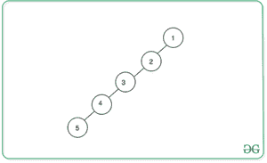

# 检查由基于给定条件的数组构建的图形是否包含循环

> 原文:[https://www . geesforgeks . org/check-if-a-graph-construct-from-from-a-array-based-on-conditions-complete-a-cycle-or-not/](https://www.geeksforgeeks.org/check-if-a-graph-constructed-from-an-array-based-on-given-conditions-consists-of-a-cycle-or-not/)

给定一个由第一个 **N** 个自然数组成的[数组](https://www.geeksforgeeks.org/array-data-structure/) **arr[]** ，使用数组元素构造一个无向图，这样对于任何数组元素，连接一条边与左边和右边的下一个更大的元素。

**示例:**

> **输入:** arr = {1，2，3，4，5}
> **输出:**否
> **说明:**
> 从下图可以明显看出，最终的图形将是一棵树。
> 
> 
> 
> **输入:** arr[] = {1，4，2，5，3}
> **输出:**是

**朴素方法:**最简单的方法是利用上述条件构造所需的图，并检查是否存在长度至少为 3 的循环。如果存在周期，则打印“**是**”。否则，打印“ **No** ”。
***时间复杂度:** O(N + E)，其中 E 为边数。*
***辅助空间:** O(N)*

**有效途径:**最优思路是检查给定的排列是[单峰还是非单峰](https://www.geeksforgeeks.org/count-unimodal-and-non-unimodal-permutations-of-first-n-natural-numbers/)，即简单检查是否存在两边相邻元素较多的数组元素。如果发现是真的，打印“是”。否则，打印“否”。
以下是上述办法的实施情况:

## C++

```
// C++ program for the above approach

#include <bits/stdc++.h>
using namespace std;

// Function to check if the graph
// constructed from given array
// contains a cycle or not
void isCycleExists(int arr[], int N)
{
    bool valley = 0;

    // Traverse the array
    for (int i = 1; i < N; i++) {

        // If arr[i] is less than
        // arr[i - 1] and arr[i]
        if (arr[i] < arr[i - 1]
            && arr[i] < arr[i + 1]) {

            cout << "Yes" << endl;
            return;
        }
    }

    cout << "No";
}

// Driver Code
int main()
{
    // Given array
    int arr[] = { 1, 3, 2, 4, 5 };

    // Size of the array
    int N = sizeof(arr)
            / sizeof(arr[0]);

    isCycleExists(arr, N);

    return 0;
}
```

## Java 语言(一种计算机语言，尤用于创建网站)

```
// Java program for the above approach
import java.io.*;
class GFG
{

  // Function to check if the graph
  // constructed from given array
  // contains a cycle or not
  static void isCycleExists(int[] arr, int N)
  {

    // Traverse the array
    for (int i = 1; i < N; i++)
    {

      // If arr[i] is less than
      // arr[i - 1] and arr[i]
      if (arr[i] < arr[i - 1]
          && arr[i] < arr[i + 1])
      {
        System.out.println("Yes");
        return;
      }
    }
    System.out.println("No");
  }

  // Driver Code
  public static void main(String[] args)
  {

    // Given array
    int[] arr = { 1, 3, 2, 4, 5 };

    // Size of the array
    int N = arr.length;
    isCycleExists(arr, N);
  }
}

// This code is contributed by Dharanendra L V.
```

## 蟒蛇 3

```
# Python3 program for the above approach

# Function to check if the graph
# constructed from given array
# contains a cycle or not
def isCycleExists(arr, N):
    valley = 0

    # Traverse the array
    for i in range(1, N):

        # If arr[i] is less than
        # arr[i - 1] and arr[i]
        if (arr[i] < arr[i - 1] and arr[i] < arr[i + 1]):
            print("Yes")
            return
    print("No")

# Driver Code
if __name__ == '__main__':

    # Given array
    arr = [1, 3, 2, 4, 5]

    # Size of the array
    N = len(arr)
    isCycleExists(arr, N)

# This code is contributed by mohit kumar 29
```

## C#

```
// C# program for the above approach
using System;
class GFG
{

  // Function to check if the graph
  // constructed from given array
  // contains a cycle or not
  static void isCycleExists(int[] arr, int N)
  {

    // Traverse the array
    for (int i = 1; i < N; i++)
    {

      // If arr[i] is less than
      // arr[i - 1] and arr[i]
      if (arr[i] < arr[i - 1]
          && arr[i] < arr[i + 1])
      {
        Console.WriteLine("Yes");
        return;
      }
    }
    Console.WriteLine("No");
  }

  // Driver Code
  public static void Main()
  {

    // Given array
    int[] arr = { 1, 3, 2, 4, 5 };

    // Size of the array
    int N = arr.Length;
    isCycleExists(arr, N);
  }
}

// This code is contributed by chitranayal.
```

## java 描述语言

```
<script>
// Javascript program for the above approach

// Function to check if the graph
// constructed from given array
// contains a cycle or not
function isCycleExists(arr,N)
{
    // Traverse the array
    for (let i = 1; i < N; i++)
    {

      // If arr[i] is less than
      // arr[i - 1] and arr[i]
      if (arr[i] < arr[i - 1]
          && arr[i] < arr[i + 1])
      {
        document.write("Yes");
        return;
      }
    }
    document.write("No");
}

// Driver Code
let arr=[1, 3, 2, 4, 5 ];
// Size of the array
let N = arr.length;
isCycleExists(arr, N);

// This code is contributed by avanitrachhadiya2155
</script>
```

**Output:** 

```
Yes
```

***时间复杂度:**O(N)*
T5**辅助空间:** O(1)