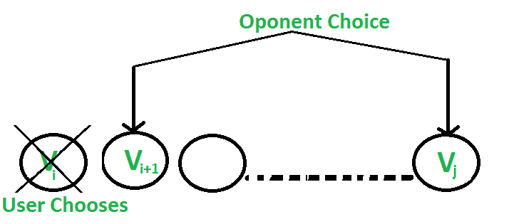
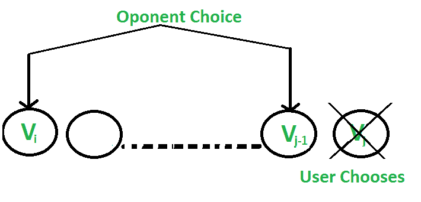

# 两角硬币游戏(贪婪进场)

> 原文:[https://www . geeksforgeeks . org/硬币-两角游戏-贪婪-进场/](https://www.geeksforgeeks.org/coin-game-of-two-corners-greedy-approach/)

考虑一个两人硬币游戏，其中每个玩家一个接一个地轮到自己。有一排偶数的硬币，轮到他/她时，玩家可以从这排硬币的两个角中的任何一个中挑选一枚硬币。收集更有价值的硬币的玩家赢得游戏。为第一个转弯的玩家制定一个策略，这样他/她就不会输掉比赛。





请注意，选择最大两个角的策略可能不起作用。在下面的例子中，当第一个玩家使用策略选择最多两个角时，他/她输掉了比赛。

**示例:**

```
  18 20 15 30 10 14
First Player picks 18, now row of coins is
  20 15 30 10 14
Second player picks 20, now row of coins is
  15 30 10 14
First Player picks 15, now row of coins is
  30 10 14
Second player picks 30, now row of coins is
  10 14
First Player picks 14, now row of coins is
  10 
Second player picks 10, game over.

The total value collected by second player is more (20 + 
30 + 10) compared to first player (18 + 15 + 14).
So the second player wins. 
```

注意这个问题不同于[一局最优策略| DP-31](https://www.geeksforgeeks.org/optimal-strategy-for-a-game-dp-31/) 。目标是获得最大值。这里的目标是不松。我们有一个贪婪策略。这个想法是计算所有偶数硬币和奇数硬币的值的总和，比较两个值。如果偶数硬币的总和较高，第一个行动的玩家总是可以确保另一个玩家永远无法选择偶数硬币。同样，如果奇数硬币的总和较高，他/她可以确保另一个玩家永远无法选择奇数硬币。

**示例:**

```
  18 20 15 30 10 14
Sum of odd coins = 18 + 15 + 10 = 43
Sum of even coins = 20 + 30 + 14 = 64\. 
Since the sum of even coins is more, the first 
player decides to collect all even coins. He first
picks 14, now the other player can only pick a coin 
(10 or 18). Whichever is picked the other player, 
the first player again gets an opportunity to pick 
an even coin and block all even coins. 
```

## C++

```
// CPP program to find coins to be picked to make sure
// that we never loose.
#include <iostream>
using namespace std;

// Returns optimal value possible that a player can collect
// from an array of coins of size n. Note than n must be even
void printCoins(int arr[], int n)
{
    // Find sum of odd positioned coins
    int oddSum = 0;
    for (int i = 0; i < n; i += 2)
        oddSum += arr[i];

    // Find sum of even positioned coins
    int evenSum = 0;
    for (int i = 1; i < n; i += 2)
        evenSum += arr[i];

    // Print even or odd coins depending upon
    // which sum is greater.
    int start = ((oddSum > evenSum) ? 0 : 1);
    for (int i = start; i < n; i += 2)
        cout << arr[i] << " ";
}

// Driver program to test above function
int main()
{
    int arr1[] = { 8, 15, 3, 7 };
    int n = sizeof(arr1) / sizeof(arr1[0]);
    printCoins(arr1, n);
    cout << endl;

    int arr2[] = { 2, 2, 2, 2 };
    n = sizeof(arr2) / sizeof(arr2[0]);
    printCoins(arr2, n);
    cout << endl;

    int arr3[] = { 20, 30, 2, 2, 2, 10 };
    n = sizeof(arr3) / sizeof(arr3[0]);
    printCoins(arr3, n);

    return 0;
}
```

## Java 语言(一种计算机语言，尤用于创建网站)

```
// Java program to find coins to be
// picked to make sure that we never loose.
class GFG
{

// Returns optimal value possible
// that a player can collect from
// an array of coins of size n.
// Note than n must be even
static void printCoins(int arr[], int n)
{
// Find sum of odd positioned coins
int oddSum = 0;
for (int i = 0; i < n; i += 2)
    oddSum += arr[i];

// Find sum of even positioned coins
int evenSum = 0;
for (int i = 1; i < n; i += 2)
    evenSum += arr[i];

// Print even or odd coins depending
// upon which sum is greater.
int start = ((oddSum > evenSum) ? 0 : 1);
for (int i = start; i < n; i += 2)
    System.out.print(arr[i]+" ");
}

// Driver Code
public static void main(String[] args)
{
    int arr1[] = { 8, 15, 3, 7 };
    int n = arr1.length;
    printCoins(arr1, n);
    System.out.println();

    int arr2[] = { 2, 2, 2, 2 };
    n = arr2.length;
    printCoins(arr2, n);
    System.out.println();

    int arr3[] = { 20, 30, 2, 2, 2, 10 };
    n = arr3.length;
    printCoins(arr3, n);
}
}

// This code is contributed by ChitraNayal
```

## 蟒蛇 3

```
# Python3 program to find coins
# to be picked to make sure that
# we never loose

# Returns optimal value possible
# that a player can collect from
# an array of coins of size n.
# Note than n must be even
def printCoins(arr, n) :

    oddSum = 0

    # Find sum of odd positioned coins
    for i in range(0, n, 2) :
        oddSum += arr[i]

    evenSum = 0

    # Find sum of even
    # positioned coins
    for i in range(1, n, 2) :
        evenSum += arr[i]

    # Print even or odd
    # coins depending upon
    # which sum is greater.
    if oddSum > evenSum :
        start = 0
    else :
        start = 1

    for i in range(start, n, 2) :
        print(arr[i], end = " ")

# Driver code
if __name__ == "__main__" :

    arr1 = [8, 15, 3, 7]
    n = len(arr1)
    printCoins(arr1, n)
    print()

    arr2 = [2, 2, 2, 2]
    n = len(arr2)
    printCoins(arr2, n)
    print()

    arr3 = [20, 30, 2, 2, 2, 10]
    n = len(arr3)
    printCoins(arr3, n)

# This code is contributed by ANKITRAI1
```

## C#

```
// C# program to find coins to be
// picked to make sure that we never loose.
using System;

class GFG
{

// Returns optimal value possible
// that a player can collect from
// an array of coins of size n.
// Note than n must be even
static void printCoins(int[] arr, int n)
{

// Find sum of odd positioned coins
int oddSum = 0;
for (int i = 0; i < n; i += 2)
    oddSum += arr[i];

// Find sum of even positioned coins
int evenSum = 0;
for (int i = 1; i < n; i += 2)
    evenSum += arr[i];

// Print even or odd coins depending
// upon which sum is greater.
int start = ((oddSum > evenSum) ? 0 : 1);
for (int i = start; i < n; i += 2)
    Console.Write(arr[i]+" ");
}

// Driver Code
public static void Main()
{
    int[] arr1 = { 8, 15, 3, 7 };
    int n = arr1.Length;
    printCoins(arr1, n);
    Console.Write("\n");

    int[] arr2 = { 2, 2, 2, 2 };
    n = arr2.Length;
    printCoins(arr2, n);
    Console.Write("\n");

    int[] arr3 = { 20, 30, 2, 2, 2, 10 };
    n = arr3.Length;
    printCoins(arr3, n);
}
}

// This code is contributed by ChitraNayal
```

## 服务器端编程语言（Professional Hypertext Preprocessor 的缩写）

```
<?php
// PHP program to find coins to be
// picked to make sure that we never loose.

// Returns optimal value possible
// that a player can collect from
// an array of coins of size n.
// Note than n must be even
function printCoins(&$arr, $n)
{
    // Find sum of odd positioned coins
    $oddSum = 0;
    for ($i = 0; $i < $n; $i += 2)
        $oddSum += $arr[$i];

    // Find sum of even positioned coins
    $evenSum = 0;
    for ($i = 1; $i < $n; $i += 2)
        $evenSum += $arr[$i];

    // Print even or odd coins depending
    // upon which sum is greater.
    $start = (($oddSum > $evenSum) ? 0 : 1);
    for ($i = $start; $i < $n; $i += 2)
        echo $arr[$i]." ";
}

// Driver Code
$arr1 = array( 8, 15, 3, 7 );
$n = sizeof($arr1);
printCoins($arr1, $n);
echo "\n";

$arr2 = array( 2, 2, 2, 2 );
$n = sizeof($arr2);
printCoins($arr2, $n);
echo "\n";

$arr3 = array( 20, 30, 2, 2, 2, 10 );
$n = sizeof($arr3);
printCoins($arr3, $n);

// This code is contributed by ChitraNayal
?>
```

## java 描述语言

```
<script>

// Javascript program to find coins to
// be picked to make sure that we never
// loose.

// Returns optimal value possible that
// a player can collect from an array
// of coins of size n. Note than n must be even
function printCoins(arr, n)
{

    // Find sum of odd positioned coins
    var oddSum = 0;
    for(var i = 0; i < n; i += 2)
        oddSum += arr[i];

    // Find sum of even positioned coins
    var evenSum = 0;
    for(var i = 1; i < n; i += 2)
        evenSum += arr[i];

    // Print even or odd coins depending upon
    // which sum is greater.
    var start = ((oddSum > evenSum) ? 0 : 1);
    for(var i = start; i < n; i += 2)
        document.write(arr[i] + " ");
}

// Driver code
var arr1 = [ 8, 15, 3, 7 ]
var n = arr1.length;
printCoins(arr1, n);
document.write("<br>");

var arr2 = [ 2, 2, 2, 2 ]
var n = arr2.length;
printCoins(arr2, n);
document.write("<br>");

var arr3 = [ 20, 30, 2, 2, 2, 10 ]
n = arr3.length;
printCoins(arr3, n);

// This code is contributed by noob2000

</script>
```

**Output:** 

```
15 7 
2 2 
30 2 10
```