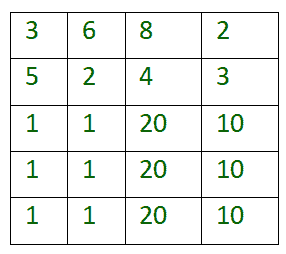

# 使用两次遍历收集网格中的最大点

> 原文： [https://www.geeksforgeeks.org/collect-maximum-points-in-a-grid-using-two-traversals/](https://www.geeksforgeeks.org/collect-maximum-points-in-a-grid-using-two-traversals/)

给定一个矩阵，其中每个单元格代表点。 在以下条件下如何使用两次遍历来收集最大点？

令给定网格的尺寸为`R x C`。

1.  第一个遍历从左上角即`(0, 0)`开始并应到达左下角即`(R-1, 0)`。 第二次遍历从右上角开始，即`(0, C-1)`，并且应该到达右下角，即`(R-1, C-1)`。

2.  从点`(i, j)`，我们可以移至`(i + 1, j + 1)`或`(i + 1, j-1)`或`(i + 1, j)`。

3.  遍历获取特定单元格通过的所有点。 如果一个遍历已经收集了一个单元格的点，则另一遍历如果再次通过该单元格则得不到任何点。

```
Input :
    int arr[R][C] = {{3, 6, 8, 2},
                     {5, 2, 4, 3},
                     {1, 1, 20, 10},
                     {1, 1, 20, 10},
                     {1, 1, 20, 10},
                    };

     Output: 73
```

Explanation :



First traversal collects total points of value 3 + 2 + 20 + 1 + 1 = 27

Second traversal collects total points of value 2 + 4 + 10 + 20 + 10 = 46.

Total Points collected = 27 + 46 = 73.

**我们强烈建议您最小化浏览器，然后自己尝试。**

这个想法是同时进行两个遍历。 我们首先从`(0, 0)`开始，第二次从`(0, c-1)`开始遍历。 需要注意的重要一点是，在任何特定步骤中，两个遍历都将在同一行中，而在所有可能的三步中，行数都会增加。 令`(x1, y1)`和`(x2, y2)`分别表示第一和第二遍历的当前位置。 因此，由于`x1`和`x2`都向前移动，因此在任何时候`x1`都等于`x2`，但是沿`y`可能会发生变化。 由于`y`的变化可能以 3 种不变的方式发生（`y`），因此请向左（`y – 1`），向右（`y + 1`）。 因此，`y1`，`y2`之间总共有 9 种组合是可能的。 基本案例之后的以下 9 个案例。

```
Both traversals always move forward along x
Base Cases:
// If destinations reached
if (x == R-1 && y1 == 0 && y2 == C-1)
maxPoints(arr, x, y1, y2) = arr[x][y1] + arr[x][y2];

// If any of the two locations is invalid (going out of grid)
if input is not valid
maxPoints(arr, x, y1, y2) = -INF  (minus infinite)

// If both traversals are at same cell, then we count the value of cell
// only once.
If y1 and y2 are same
    result = arr[x][y1]
Else
    result = arr[x][y1] + arr[x][y2] 

result  +=  max { // Max of 9 cases
                  maxPoints(arr, x+1, y1+1, y2),    
                  maxPoints(arr, x+1, y1+1, y2+1),
                  maxPoints(arr, x+1, y1+1, y2-1),
                  maxPoints(arr, x+1, y1-1, y2),    
                  maxPoints(arr, x+1, y1-1, y2+1),
                  maxPoints(arr, x+1, y1-1, y2-1),
                  maxPoints(arr, x+1, y1, y2),
                  maxPoints(arr, x+1, y1, y2+1),
                  maxPoints(arr, x+1, y1, y2-1) 
                }

```

上面的递归解决方案有很多子问题，这些子问题一次又一次地得到解决。 因此，我们可以使用动态规划更有效地解决上述问题。 以下是[记忆](https://www.geeksforgeeks.org/dynamic-programming-set-1/)（在动态规划中记忆可替代基于表的迭代解决方案）。 在下面的实现中，我们使用备忘录表`mem`来跟踪已经解决的问题。

## C++ 

```cpp

// A Memoization based program to find maximum collection 
// using two traversals of a grid 
#include<bits/stdc++.h> 
using namespace std; 
#define R 5 
#define C 4 

// checks whether a given input is valid or not 
bool isValid(int x, int y1, int y2) 
{ 
    return (x >= 0 && x < R && y1 >=0 && 
            y1 < C && y2 >=0 && y2 < C); 
} 

// Driver function to collect max value 
int getMaxUtil(int arr[R][C], int mem[R][C][C], int x, int y1, int y2) 
{ 
    /*---------- BASE CASES -----------*/
    // if P1 or P2 is at an invalid cell 
    if (!isValid(x, y1, y2)) return INT_MIN; 

    // if both traversals reach their destinations 
    if (x == R-1 && y1 == 0 && y2 == C-1) 
       return (y1 == y2)? arr[x][y1]: arr[x][y1] + arr[x][y2]; 

    // If both traversals are at last row but not at their destination 
    if (x == R-1) return INT_MIN; 

    // If subproblem is already solved 
    if (mem[x][y1][y2] != -1) return mem[x][y1][y2]; 

    // Initialize answer for this subproblem 
    int ans = INT_MIN; 

    // this variable is used to store gain of current cell(s) 
    int temp = (y1 == y2)? arr[x][y1]: arr[x][y1] + arr[x][y2]; 

    /* Recur for all possible cases, then store and return the 
       one with max value */
    ans = max(ans, temp + getMaxUtil(arr, mem, x+1, y1, y2-1)); 
    ans = max(ans, temp + getMaxUtil(arr, mem, x+1, y1, y2+1)); 
    ans = max(ans, temp + getMaxUtil(arr, mem, x+1, y1, y2)); 

    ans = max(ans, temp + getMaxUtil(arr, mem, x+1, y1-1, y2)); 
    ans = max(ans, temp + getMaxUtil(arr, mem, x+1, y1-1, y2-1)); 
    ans = max(ans, temp + getMaxUtil(arr, mem, x+1, y1-1, y2+1)); 

    ans = max(ans, temp + getMaxUtil(arr, mem, x+1, y1+1, y2)); 
    ans = max(ans, temp + getMaxUtil(arr, mem, x+1, y1+1, y2-1)); 
    ans = max(ans, temp + getMaxUtil(arr, mem, x+1, y1+1, y2+1)); 

    return (mem[x][y1][y2] = ans); 
} 

// This is mainly a wrapper over recursive function getMaxUtil(). 
// This function creates a table for memoization and calls 
// getMaxUtil() 
int geMaxCollection(int arr[R][C]) 
{ 
    // Create a memoization table and initialize all entries as -1 
    int mem[R][C][C]; 
    memset(mem, -1, sizeof(mem)); 

    // Calculation maximum value using memoization based function 
    // getMaxUtil() 
    return getMaxUtil(arr, mem, 0, 0, C-1); 
} 

// Driver program to test above functions 
int main() 
{ 
    int arr[R][C] = {{3, 6, 8, 2}, 
                     {5, 2, 4, 3}, 
                     {1, 1, 20, 10}, 
                     {1, 1, 20, 10}, 
                     {1, 1, 20, 10}, 
                    }; 
    cout << "Maximum collection is " << geMaxCollection(arr); 
    return 0; 
} 

```