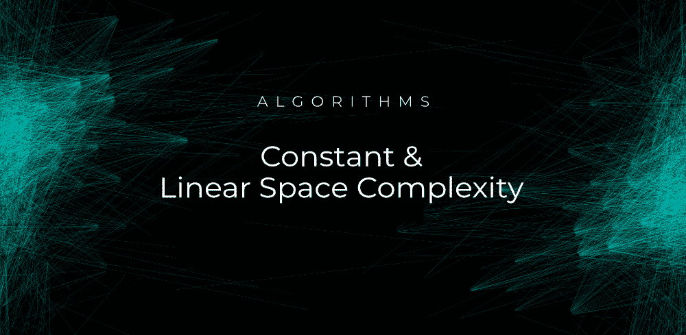

# 常数&算法中的线性空间复杂度

> 原文:[https://www . geeksforgeeks . org/constant-linear-space-in-complex-in-algorithms/](https://www.geeksforgeeks.org/constant-linear-space-complexity-in-algorithms/)

作为一名程序员，你可能已经解决了很多编程难题。在编程中，当我们需要执行一个程序时，空间和时间的复杂性非常重要。我们的算法应该是高效的，并且应该花费更少的时间。每当你为一个程序编写一个解决方案时，需要一些内存来完成，对于我们的程序来说，占用更少的内存并在给定的时间范围内执行是很重要的。



对于任何程序，内存可用于以下用途…

1.  变量(包括常数值、临时值)
2.  程序指令
3.  执行

[空间复杂度](https://www.geeksforgeeks.org/g-fact-86/)是算法执行并产生结果所需的程序内存总量。很多时候程序员会对**辅助空间**和**空间复杂度感到困惑。**两者不同。在任何算法中，我们使用的额外空间或临时空间被称为辅助空间。

```
Space Complexity = Auxiliary Space + Input space
```

在本文中，我们将了解执行时的内存使用情况，并了解空间复杂性的分类。该算法使用内存空间有三个原因…

**1。指令空间:**在编写算法时，指令的编译版本会占用一些内存，这就是所谓的指令空间。

**2。环境栈:**需要存储恢复暂停功能所需的环境信息。当一个算法在另一个算法内部被调用时，使用这个。在这些情况下，我们将当前变量推入系统堆栈，等待进一步的执行。之后，我们称之为算法内部

让我们以两个函数为例。函数 X()和函数 Y()。函数 X()的变量将临时存储在系统堆栈上，而函数 Y()在函数 X()内部调用和执行。

**3。数据空间:**在程序执行期间，存储常量和变量值所需的任何空间都被视为数据空间。

**注意:**写算法的时候只需要考虑数据空间。不需要计算*指令空间*和*环境栈* **。**

现在让我们理解空间复杂性的分类。空间复杂度可以用两种方法计算。这取决于程序。该程序可以是常数程序或线性程序。

### 如何计算空间复杂度？

在算法中，首先需要计算内存总量来评估空间复杂度。你需要知道不同数据类型的变量所使用的内存值。适用于不同的操作系统或不同的机器。对于每台机器，该值可以不同，但方法保持不变。

让我们举一个计算空间复杂度的例子…

```
{
   int x = a * b * c;
   return(x);
}
```

在上面的表达式中，a、b、c 和 x 都是整数类型。每个都需要 4 个字节。现在我们可以计算总内存。这将是…

(4(4) + 4) = 20 字节。另外 4 个字节用于返回值。在这里，我们需要固定数量的内存用于所有输入。所以这种类型的复杂性被称为**恒定空间复杂性**。

让我们转到另一个例子…

```
// n is the length of array a[]
int sum(int arr[], int n)
{
int sum = 0;  // 4 bytes for sum
for(int i = 0; i < n; i++) // 4 bytes for i
{  
    sum  = sum + arr[i];  
}
return(sum);
}
```

*   在上面的例子中，我们需要为数组的每个元素分配 4*n 字节的空间。
*   sum、n、I 和返回值各 4 个字节。

所以内存总量将是(4n+12)，随着输入值 n 的增加而线性增加，这称为**线性空间复杂度。**如果你有一个循环变量 I，那么需要的空间复杂度就是 1 个字。

如果你已经从上面的例子中理解了计算空间复杂度的概念，那么按照类似的方法，随着算法复杂度的增加，你可以计算二次和其他空间复杂度。始终尽量减少算法的空间复杂度。较小的空间使您的算法更好、更高效。

### 摘要

*   **O(1)复杂性:**当程序不包含任何循环、递归函数或对任何其他函数的调用时，我们考虑恒定的空间复杂性。
*   **O(n)复杂度:**我们考虑程序包含任意循环时的线性空间复杂度。

### **算法的空间复杂度备忘单**

*   **气泡排序:** O(1)
*   **选择排序:** O(1)
*   **插入排序:**或(1)
*   **合并排序:** O(n)
*   **快速排序:** O(n)
*   **堆排序:** O(1)
*   **基数排序:** O(n+k)，其中 k —数组元素的范围。

### 最终想法

空间复杂度在决定算法效率方面起着至关重要的作用。总是尝试实现一个耗时更少的算法。如果一个程序占用大量内存空间，编译器不会让你运行它。在空间复杂度中永远记住下面的公式

```
Space Complexity = Auxiliary space + Space use by input values
```