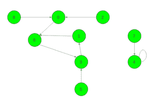

# 将有向图转换为树

> 原文： [https://www.geeksforgeeks.org/convert-directed-graph-into-a-tree/](https://www.geeksforgeeks.org/convert-directed-graph-into-a-tree/)

给定大小为`N`的数组 **arr []** 。 从`i`到 **arr [i]** 有一个优势。 任务是通过更改某些边将该有向图转换为树。 如果对于某些`i`， **arr [i] = i** ，则`i`代表树的根。 如果有多个答案，请打印其中的任何一个。

**示例**：

> **输入**：arr [] = {6，6，0，1，4，3，3，4，0}
> **输出**：{6，6，0，1 ，4，3，4，4，0}
> 
> 
> **输入**：arr [] = {1、2、0}；
> **输出**：{0，2，0}。

**方法**：考虑上面的第二个示例图像，其中显示了功能图的示例。 它由两个循环 1、6、3 和 4 组成。我们的目标是使图形由正好一个循环到其自身的正好一个循环组成。

变更操作等效于删除一些传出边并添加一个新边，从而到达其他顶点。 首先，让我们的图表仅包含一个周期。 为此，您可以选择任何一个最初显示的周期，并说它将是唯一的周期。 然后，应该考虑每隔一个周期，删除其任何周期内边，然后将其替换为到达所选周期任一顶点的边。 因此，该循环将被破坏，其顶点（以及树的顶点）将连接到唯一选择的循环。 需要精确执行 **cycleCount – 1** 这样的操作。 请注意，删除任何非循环边没有意义，因为它不会破坏任何循环。

接下来的事情是使循环长度等于 1。如果选择一个最小长度的循环且该长度等于 1，则可能已经满足。因此，如果初始图包含任何长度为 1 的循环，则 通过 **cycleCount – 1** 个操作完成。 否则，循环包含多个顶点。 它可以通过一个操作来固定-一个操作只需打破周期中的任何一条边（例如，从 u 到 arr [u]），然后从 u 到 u 添加一条边。 该图将保持由一个周期组成，但由一个自环顶点组成。 在那种情况下，我们完成了 cycleCount 操作。

要完成上述所有操作，可以使用 DSU 结构，也可以使用一系列 DFS。 注意，不需要实现边去除和创建，只需要分析初始图即可。

下面是上述方法的实现：

## C++

```cpp

// CPP program to convert directed graph into tree 
#include <bits/stdc++.h> 
using namespace std; 

// Function to find root of the vertex 
int find(int x, int a[], int vis[], int root[]) 
{ 
    if (vis[x]) 
        return root[x]; 

    vis[x] = 1; 
    root[x] = x; 
    root[x] = find(a[x], a, vis, root); 
    return root[x]; 
} 

// Function to convert directed graph into tree 
void Graph_to_tree(int a[], int n) 
{ 
    // Vis array to check if an index is visited or not 
    // root[] array is to store parent of each vertex 
    int vis[n] = { 0 }, root[n] = { 0 }; 

    // Find parent of each parent 
    for (int i = 0; i < n; i++) 
        find(a[i], a, vis, root); 

    // par stores the root of the resulting tree 
    int par = -1; 
    for (int i = 0; i < n; i++) 
        if (i == a[i]) 
            par = i; 

    // If no self loop exists 
    if (par == -1) { 
        for (int i = 0; i < n; i++) { 

            // Make vertex in a cycle as root of the tree 
            if (i == find(a[i], a, vis, root)) { 
                par = i; 
                a[i] = i; 
                break; 
            } 
        } 
    } 

    // Remove all cycles 
    for (int i = 0; i < n; i++) { 
        if (i == find(a[i], a, vis, root)) { 
            a[i] = par; 
        } 
    } 

    // Print the resulting array 
    for (int i = 0; i < n; i++) 
        cout << a[i] << " "; 
} 

// Driver code to test above functions 
int main() 
{ 
    int a[] = { 6, 6, 0, 1, 4, 3, 3, 4, 0 }; 

    int n = sizeof(a) / sizeof(a[0]); 

    // Function call 
    Graph_to_tree(a, n); 
} 

```