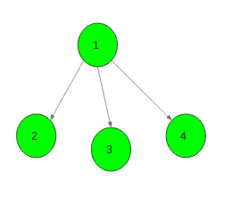
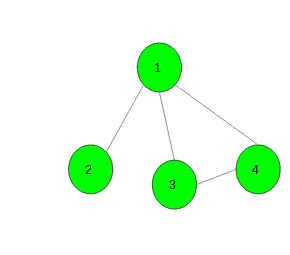

# 将无向图转换为有向图，使得没有长度大于 1 的路径

> 原文:[https://www . geeksforgeeks . org/convert-the-the-undirected-graph-to-directed-graph-to-be-no-path-of-length-大于-1/](https://www.geeksforgeeks.org/convert-the-undirected-graph-into-directed-graph-such-that-there-is-no-path-of-length-greater-than-1/)

给定一个无向图，它有 **N** 个顶点和 **M** 条边，没有自环或多条边。任务是将给定的无向图转换成有向图，使得没有长度大于 1 的路径。如果可以制作这样的图形，那么在 **M** 行中打印两个用空格分隔的整数 u 和 v，其中 u、v 分别表示源顶点和目的顶点。如果不可能，则打印-1。

**示例:**

> **输入:**
> 
> **输出:**
> 1 2
> 1 3
> 1 4
> 
> 
> **输入:**
> 
> **输出:** -1
> 对于给定的图，不可能得到长度不大于 1 的有向图

**逼近:**假设图中包含一个奇数长度的循环。这意味着这个循环的两个连续的边将以相同的方式定向，并形成长度为 2 的路径。那么答案是-1。

如果图不包含奇数长度的循环。然后是[二分](https://www.geeksforgeeks.org/bipartite-graph/)。让我们给它上色，看看我们得到了什么。我们得到了左边部分的一些顶点，右边部分的一些顶点，以及连接不同部分顶点的所有边。让我们确定所有边的方向，使它们从左边到右边。

下面是上述方法的实现:

## C++

```
// C++ implementation of the approach
#include <bits/stdc++.h>
using namespace std;
#define N 100005

// To store the graph
vector<int> gr[N];

// To store colour of each vertex
int colour[N];

// To store edges
vector<pair<int, int> > edges;

// To check graph is bipartite or not
bool bip;

// Function to add edges
void add_edge(int x, int y)
{
    gr[x].push_back(y);
    gr[y].push_back(x);
    edges.push_back(make_pair(x, y));
}

// Function to check given graph
// is bipartite or not
void dfs(int x, int col)
{
    // colour the vertex x
    colour[x] = col;

    // For all it's child vertices
    for (auto i : gr[x]) {
        // If still not visited
        if (colour[i] == -1)
            dfs(i, col ^ 1);

        // If visited and having
        // same colour as parent
        else if (colour[i] == col)
            bip = false;
    }
}

// Function to convert the undirected
// graph into the directed graph such that
// there is no path of length greater than 1
void Directed_Graph(int n, int m)
{

    // Initially each vertex has no colour
    memset(colour, -1, sizeof colour);

    // Suppose bipartite is possible
    bip = true;

    // Call bipartite function
    dfs(1, 1);

    // If bipartite is not possible
    if (!bip) {
        cout << -1;
        return;
    }

    // If bipartite is possible
    for (int i = 0; i < m; i++) {

        // Make an edge from vertex having
        // colour 1 to colour 0
        if (colour[edges[i].first] == 0)
            swap(edges[i].first, edges[i].second);

        cout << edges[i].first << " "
             << edges[i].second << endl;
    }
}

// Driver code
int main()
{
    int n = 4, m = 3;

    // Add edges
    add_edge(1, 2);
    add_edge(1, 3);
    add_edge(1, 4);

    // Function call
    Directed_Graph(n, m);

    return 0;
}
```

## Java 语言(一种计算机语言，尤用于创建网站)

```
// Java implementation of the approach
import java.util.*;

class GFG
{
static class pair
{ 
    int first, second; 
    public pair(int first, int second) 
    { 
        this.first = first; 
        this.second = second; 
    } 
} 

static int N = 100005;

// To store the graph
static Vector<Integer> []gr = new Vector[N];

// To store colour of each vertex
static int []colour = new int[N];

// To store edges
static Vector<pair> edges = new Vector<>();

// To check graph is bipartite or not
static boolean bip;

// Function to add edges
static void add_edge(int x, int y)
{
    gr[x].add(y);
    gr[y].add(x);
    edges.add(new pair(x, y));
}

// Function to check given graph
// is bipartite or not
static void dfs(int x, int col)
{
    // colour the vertex x
    colour[x] = col;

    // For all it's child vertices
    for (Integer i : gr[x])
    {
        // If still not visited
        if (colour[i] == -1)
            dfs(i, col ^ 1);

        // If visited and having
        // same colour as parent
        else if (colour[i] == col)
            bip = false;
    }
}

// Function to convert the undirected
// graph into the directed graph such that
// there is no path of length greater than 1
static void Directed_Graph(int n, int m)
{

    // Initially each vertex has no colour
    for (int i = 0; i < N; i++)
        colour[i] = -1;

    // Suppose bipartite is possible
    bip = true;

    // Call bipartite function
    dfs(1, 1);

    // If bipartite is not possible
    if (!bip) 
    {
        System.out.print(-1);
        return;
    }

    // If bipartite is possible
    for (int i = 0; i < m; i++) 
    {

        // Make an edge from vertex having
        // colour 1 to colour 0
        if (colour[edges.get(i).first] == 0)
        {
            Collections.swap(edges, edges.get(i).first, 
                                    edges.get(i).second);
        }

        System.out.println(edges.get(i).first + " " + 
                           edges.get(i).second);
    }
}

// Driver code
public static void main(String[] args)
{
    int n = 4, m = 3;
    for (int i = 0; i < N; i++)
        gr[i] = new Vector<>();

    // Add edges
    add_edge(1, 2);
    add_edge(1, 3);
    add_edge(1, 4);

    // Function call
    Directed_Graph(n, m);
}
}

// This code is contributed by PrinciRaj1992
```

## 蟒蛇 3

```
# Python3 implementation of the approach

N = 100005

# To store the graph
gr = [[] for i in range(N)]

# To store colour of each vertex
colour = [-1] * N

# To store edges
edges = []

# To check graph is bipartite or not
bip = True

# Function to add edges
def add_edge(x, y):

    gr[x].append(y)
    gr[y].append(x)
    edges.append((x, y))

# Function to check given graph
# is bipartite or not
def dfs(x, col):

    # colour the vertex x
    colour[x] = col
    global bip

    # For all it's child vertices
    for i in gr[x]: 
        # If still not visited
        if colour[i] == -1:
            dfs(i, col ^ 1)

        # If visited and having
        # same colour as parent
        elif colour[i] == col:
            bip = False

# Function to convert the undirected
# graph into the directed graph such that
# there is no path of length greater than 1
def Directed_Graph(n, m):

    # Call bipartite function
    dfs(1, 1)

    # If bipartite is not possible
    if not bip:
        print(-1)
        return

    # If bipartite is possible
    for i in range(0, m): 

        # Make an edge from vertex
        # having colour 1 to colour 0
        if colour[edges[i][0]] == 0:
            edges[i][0], edges[i][1] = edges[i][1], edges[i][0]

        print(edges[i][0], edges[i][1])

# Driver code
if __name__ == "__main__":

    n, m = 4, 3

    # Add edges
    add_edge(1, 2)
    add_edge(1, 3)
    add_edge(1, 4)

    # Function call
    Directed_Graph(n, m)

# This code is contributed by Rituraj Jain
```

## C#

```
// C# implementation of the approach
using System;
using System.Collections.Generic;

class GFG
{

class pair
{ 
    public int first, second; 
    public pair(int first, int second) 
    { 
        this.first = first; 
        this.second = second; 
    } 
} 

static int N = 100005;

// To store the graph
static List<int> []gr = new List<int>[N];

// To store colour of each vertex
static int []colour = new int[N];

// To store edges
static List<pair> edges = new List<pair>();

// To check graph is bipartite or not
static Boolean bip;

// Function to add edges
static void add_edge(int x, int y)
{
    gr[x].Add(y);
    gr[y].Add(x);
    edges.Add(new pair(x, y));
}

// Function to check given graph
// is bipartite or not
static void dfs(int x, int col)
{
    // colour the vertex x
    colour[x] = col;

    // For all it's child vertices
    foreach (int i in gr[x])
    {
        // If still not visited
        if (colour[i] == -1)
            dfs(i, col ^ 1);

        // If visited and having
        // same colour as parent
        else if (colour[i] == col)
            bip = false;
    }
}

// Function to convert the undirected
// graph into the directed graph such that
// there is no path of length greater than 1
static void Directed_Graph(int n, int m)
{

    // Initially each vertex has no colour
    for (int i = 0; i < N; i++)
        colour[i] = -1;

    // Suppose bipartite is possible
    bip = true;

    // Call bipartite function
    dfs(1, 1);

    // If bipartite is not possible
    if (!bip) 
    {
        Console.Write(-1);
        return;
    }

    // If bipartite is possible
    for (int i = 0; i < m; i++) 
    {

        // Make an edge from vertex having
        // colour 1 to colour 0
        if (colour[edges[i].first] == 0)
        {
            var v = edges[i].first;
            edges[i].first = edges[i].second;
            edges[i].second = v;
        }

        Console.WriteLine(edges[i].first + " " + 
                          edges[i].second);
    }
}

// Driver code
public static void Main(String[] args)
{
    int n = 4, m = 3;
    for (int i = 0; i < N; i++)
        gr[i] = new List<int>();

    // Add edges
    add_edge(1, 2);
    add_edge(1, 3);
    add_edge(1, 4);

    // Function call
    Directed_Graph(n, m);
}
}

// This code is contributed by Rajput-Ji
```

**Output:**

```
1 2
1 3
1 4

```