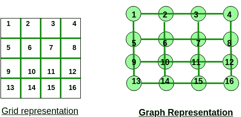

# 绘制 n * m 网格的成本

> 原文:[https://www.geeksforgeeks.org/cost-of-painting-n-m-grid/](https://www.geeksforgeeks.org/cost-of-painting-n-m-grid/)

给定两个整数 **n** 和 **m** ，它们是一个网格的尺寸。任务是逐个单元格地计算绘制网格的成本，其中绘制一个单元格的成本等于与其相邻的已绘制单元格的数量。任何单元格都可以在任何时候绘制，如果它还没有绘制，尽量减少绘制网格的成本。
**例:**

> **输入:** n = 1，m = 1
> **输出:** 0
> 没有相邻单元格的单个单元格可以免费绘制
> **输入:** n = 1，m = 2
> **输出:** 1
> 第一个单元格将免费绘制，但绘制第二个单元格的成本将为 1，因为有一个相邻单元格与其绘制

一个**简单的解决方案**就是用 **n * m** 个单元格生成所有可能的绘制网格的方法，那就是 **n * m！**计算每一个的成本。
**时间复杂度:** O(n * m！)
**高效方法:**理解这个图而不是网格中的着色过程。因此，单元的着色等于图的顶点的着色。绘制一个单元的成本等于该单元的彩色邻居的数量。这意味着获得的成本将是当前单元格和相邻彩色单元格之间的边数。



关键是要注意，在所有单元格的着色结束后，图的所有边都将被标记。
一个有趣的事实是，图的边只标记一次。这是因为一条边连接了两个细胞。当两个单元格都被涂上颜色时，我们标记单元格。一个单元格我们不允许画一次以上，这样可以保证每个单元格只标记一次。
因此，无论你给单元格着色的顺序如何，标记边的数量保持不变，因此成本也是一样的。
对于给定的网格，边的数量将是**n *(m–1)+m *(n–1)**。这是因为每行由**m–1**条边组成，每列由**n–1**条边组成。
以下是上述方法的实施:

## C++

```
// C++ implementation of the approach
#include <bits/stdc++.h>
using namespace std;

// Function to return the minimum cost
int getMinCost(int n, int m)
{
    int cost = (n - 1) * m + (m - 1) * n;
    return cost;
}

// Driver code
int main()
{
    int n = 4, m = 5;
    cout << getMinCost(n, m);

    return 0;
}
```

## Java 语言(一种计算机语言，尤用于创建网站)

```
// Java implementation of the approach
class gfg
{

// Function to return the minimum cost
static int getMinCost(int n, int m)
{
    int cost = (n - 1) * m + (m - 1) * n;
    return cost;
}

// Driver code
public static void main(String[] args)
{
    int n = 4, m = 5;
    System.out.println(getMinCost(n, m));
}
}

// This code is contributed by Code_Mech.
```

## 蟒蛇 3

```
# Python3 implementation of the approach

# Function to return the minimum cost
def getMinCost(n, m):

    cost = (n - 1) * m + (m - 1) * n
    return cost

# Driver code
if __name__ == "__main__":

    n, m = 4, 5
    print(getMinCost(n, m))

# This code is contributed by
# Rituraj Jain
```

## C#

```
// C# implementation of the approach
using System;

class GFG
{

// Function to return the minimum cost
static int getMinCost(int n, int m)
{
    int cost = (n - 1) * m + (m - 1) * n;
    return cost;
}

// Driver code
public static void Main()
{
    int n = 4, m = 5;
    Console.WriteLine(getMinCost(n, m));
}
}

// This code is contributed
// by Akanksha Rai
```

## 服务器端编程语言（Professional Hypertext Preprocessor 的缩写）

```
<?php
// PHP implementation of the approach

// Function to return the minimum cost
function getMinCost($n, $m)
{
    $cost = ($n - 1) * $m + ($m - 1) * $n;
    return $cost;
}

// Driver code
$n = 4;
$m = 5;
echo getMinCost($n, $m);

// This code is contributed by Ryuga
?>
```

## java 描述语言

```
<script>

// Javascript implementation of the approach

// Function to return the minimum cost
function getMinCost( n, m)
{
    let cost = (n - 1) * m + (m - 1) * n;
    return cost;
}

    // Driver Code

    let n = 4, m = 5;
    document.write(getMinCost(n, m));

</script>
```

**Output:** 

```
31
```