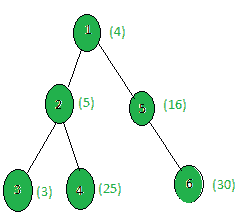

# 计算权重为完美平方的节点

> 原文： [https://www.geeksforgeeks.org/count-the-nodes-whose-weight-is-a-perfect-square/](https://www.geeksforgeeks.org/count-the-nodes-whose-weight-is-a-perfect-square/)

给定一棵树，以及所有节点的权重，任务是计算权重为完美 Square 的节点数。

**示例**：

> **输入**：
> 
> **输出**：3
> 仅节点 1、4 和 5 的权重是完美平方。

**方法**：在树上执行 [dfs](http://www.geeksforgeeks.org/depth-first-traversal-for-a-graph/) ，对于每个节点，检查其权重是否为理想平方。

下面是上述方法的实现：

## C++

```cpp

// C++ implementation of the approach 
#include <bits/stdc++.h> 
using namespace std; 

int ans = 0; 

vector<int> graph[100]; 
vector<int> weight(100); 

// Function that returns true 
// if n is a perfect square 
bool isPerfectSquare(int n) 
{ 
    double x = sqrt(n); 
    if (floor(x) != ceil(x)) 
        return false; 
    return true; 
} 

// Function to perform dfs 
void dfs(int node, int parent) 
{ 
    // If weight of the current node 
    // is a perfect square 
    if (isPerfectSquare(weight[node])) 
        ans += 1; 

    for (int to : graph[node]) { 
        if (to == parent) 
            continue; 
        dfs(to, node); 
    } 
} 

// Driver code 
int main() 
{ 
    int x = 15; 

    // Weights of the node 
    weight[1] = 4; 
    weight[2] = 5; 
    weight[3] = 3; 
    weight[4] = 25; 
    weight[5] = 16; 
    weight[6] = 30; 

    // Edges of the tree 
    graph[1].push_back(2); 
    graph[2].push_back(3); 
    graph[2].push_back(4); 
    graph[1].push_back(5); 
    graph[5].push_back(6); 

    dfs(1, 1); 

    cout << ans; 

    return 0; 
} 

```