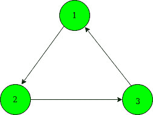
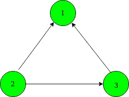
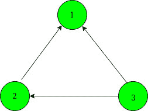
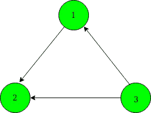
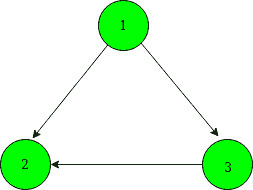
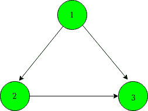
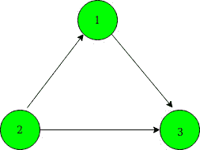

# 计算改变边的方向以使图形变为非循环的方式

> 原文： [https://www.geeksforgeeks.org/count-ways-to-change-direction-of-edges-such-that-graph-becomes-acyclic/](https://www.geeksforgeeks.org/count-ways-to-change-direction-of-edges-such-that-graph-becomes-acyclic/)

给定一个有向非加权图，该图由 **N 个**顶点和[数组](https://www.geeksforgeeks.org/introduction-to-arrays/) **arr []** 组成，其中**第一个**顶点与**的有向边 ] arr [i]** 。 任务是找到多种改变边的方向的方法，以使给定的图成为非循环的。

**示例**：

> **输入**：N = 3，arr [] = {2，3，1}
> 给定信息的有向图形式为：
> 
> 
> 
> **输出**：6
> **说明**：
> 有 6 种可能的方法可以更改边的方向以使 grpah 非循环：
> 
> 
> 
> 
> 
> 
> 
> 
> 
> 
> 
> 

**方法**：的想法是检查[连通组件](https://www.geeksforgeeks.org/program-to-count-number-of-connected-components-in-an-undirected-graph/)是否形成循环。

*   如果组件是路径，那么我们将边定向，就不会形成循环。

*   如果组件具有一个具有 N 个边的循环，则有 **2 <sup>N</sup>** 种方式可以排列所有边，其中只有两种方式可以形成一个循环。 因此，存在**（2 <sup>N</sup> – 2）**种方法来更改边，以使图形变为非循环。

**步骤**：

1.  使用[深度优先搜索（DFS）](https://www.geeksforgeeks.org/depth-first-search-or-dfs-for-a-graph/)遍历找到给定图中的循环以及与每个循环关联的顶点数。

2.  [DFS 遍历](https://www.geeksforgeeks.org/depth-first-search-or-dfs-for-a-graph/)之后，更改边方向的方法总数为以下乘积：

    *   **（2 <sup>X</sup> – 2）**给出每个`X`顶点的循环形成的路数。

    *  `Y`顶点的每个路径形成的路数由**（2 <sup>Y</sup> ）**给出。

下面是上述方法的实现：

## C++

```cpp

// C++ program to count the
// number of ways to change
// the direction of edges
// such that no cycle is
// present in the graph
#include <bits/stdc++.h>
using namespace std;

// Vector cycles[] to store
// the cycle with vertices
// associated with each cycle
vector<int> cycles;

// Count of cycle
int cyclecnt;

// Function to count the
// number of vertices in the
// current cycle
void DFSUtil(int u, int arr[], int vis[])
{
    cycles[cyclecnt]++;
    vis[u] = 3;

    // Returns when the same
    // initial vertex is found
    if (vis[arr[u]] == 3) {
        return;
    }

    // Recurr for next vertex
    DFSUtil(arr[u], arr, vis);
}

// DFS traversal to detect
// the cycle in graph
void DFS(int u, int arr[], int vis[])
{
    // Marke vis[u] to 2 to
    // check for any cycle form
    vis[u] = 2;

    // If the vertex arr[u]
    // is not visited
    if (vis[arr[u]] == 0) {
        // Call DFS
        DFS(arr[u], arr, vis);
    }

    // If current node is
    // processed
    else if (vis[arr[u]] == 1) {
        vis[u] = 1;
        return;
    }

    // Cycle found, call DFSUtil
    // to count the number of
    // vertices in the current
    // cycle
    else {
        cycles.push_back(0);

        // Count number of
        // vertices in cycle
        DFSUtil(u, arr, vis);
        cyclecnt++;
    }

    // Current Node is processed
    vis[u] = 1;
}

// Function to count the
// number of ways
int countWays(int arr[], int N)
{

    int i, ans = 1;

    // To precompute the power
    // of 2
    int dp[N + 1];
    dp[0] = 1;

    // Storing power of 2
    for (int i = 1; i <= N; i++) {
        dp[i] = (dp[i - 1] * 2);
    }

    // Array vis[] created for
    // DFS traversal
    int vis[N + 1] = { 0 };

    // DFS traversal from Node 1
    for (int i = 1; i <= N; i++) {
        if (vis[i] == 0) {

            // Calling DFS
            DFS(i, arr, vis);
        }
    }

    int cnt = N;

    // Traverse the cycles array
    for (i = 0; i < cycles.size(); i++) {

        // Remove the vertices
        // which are part of a
        // cycle
        cnt -= cycles[i];

        // Count form by number
        // vertices form cycle
        ans *= dp[cycles[i]] - 2;
    }

    // Count form by number of
    // vertices not forming
    // cycle
    ans = (ans * dp[cnt]);

    return ans;
}

// Driver's Code
int main()
{
    int N = 3;
    int arr[] = { 0, 2, 3, 1 };

    // Function to count ways
    cout << countWays(arr, N);
    return 0;
}

```

## Java

```java

// Java program to count the number
// of ways to change the direction
// of edges such that no cycle is 
// present in the graph
import java.util.*;
import java.lang.*;
import java.io.*;

class GFG{

// Vector cycles[] to store 
// the cycle with vertices 
// associated with each cycle 
static ArrayList<Integer> cycles; 

// Count of cycle 
static int cyclecnt; 

// Function to count the 
// number of vertices in the 
// current cycle 
static void DFSUtil(int u, int arr[], 
                           int vis[]) 
{ 
    cycles.set(cyclecnt, 
    cycles.get(cyclecnt) + 1); 
    vis[u] = 3; 

    // Returns when the same 
    // initial vertex is found 
    if (vis[arr[u]] == 3) 
    { 
        return; 
    } 

    // Recurr for next vertex 
    DFSUtil(arr[u], arr, vis); 
} 

// DFS traversal to detect 
// the cycle in graph 
static void DFS(int u, int arr[], int vis[]) 
{ 

    // Marke vis[u] to 2 to 
    // check for any cycle form 
    vis[u] = 2; 

    // If the vertex arr[u] 
    // is not visited 
    if (vis[arr[u]] == 0)
    {

        // Call DFS 
        DFS(arr[u], arr, vis); 
    } 

    // If current node is 
    // processed 
    else if (vis[arr[u]] == 1) 
    { 
        vis[u] = 1; 
        return; 
    } 

    // Cycle found, call DFSUtil 
    // to count the number of 
    // vertices in the current 
    // cycle 
    else
    { 
        cycles.add(0); 

        // Count number of 
        // vertices in cycle 
        DFSUtil(u, arr, vis); 
        cyclecnt++; 
    } 

    // Current Node is processed 
    vis[u] = 1; 
} 

// Function to count the 
// number of ways 
static int countWays(int arr[], int N) 
{ 
    int i, ans = 1; 

    // To precompute the power 
    // of 2 
    int[] dp = new int[N + 1]; 
    dp[0] = 1; 

    // Storing power of 2 
    for(i = 1; i <= N; i++) 
    {
        dp[i] = (dp[i - 1] * 2); 
    } 

    // Array vis[] created for 
    // DFS traversal 
    int[] vis = new int[N + 1]; 

    // DFS traversal from Node 1 
    for(i = 1; i <= N; i++)
    { 
        if (vis[i] == 0)
        { 

            // Calling DFS 
            DFS(i, arr, vis); 
        } 
    } 

    int cnt = N; 

    // Traverse the cycles array 
    for(i = 0; i < cycles.size(); i++)
    { 

        // Remove the vertices 
        // which are part of a 
        // cycle 
        cnt -= cycles.get(i); 

        // Count form by number 
        // vertices form cycle 
        ans *= dp[cycles.get(i)] - 2; 
    } 

    // Count form by number of 
    // vertices not forming 
    // cycle 
    ans = (ans * dp[cnt]); 

    return ans; 
} 

// Driver code
public static void main(String[] args)
{
    int N = 3; 
    int arr[] = { 0, 2, 3, 1 }; 

    cycles = new ArrayList<>();

    // Function to count ways 
    System.out.println(countWays(arr, N)); 
}
}

// This code is contributed by offbeat

```

## Python

```py

# Python 3 program to count the
# number of ways to change
# the direction of edges
# such that no cycle is
# present in the graph

# List cycles[] to store
# the cycle with vertices
# associated with each cycle
cycles = []

# Function to count the
# number of vertices in the
# current cycle
def DFSUtil(u, arr, vis, cyclecnt):

    cycles[cyclecnt] += 1
    vis[u] = 3

    # Returns when the same
    # initial vertex is found
    if (vis[arr[u]] == 3) :
        return

    # Recurr for next vertex
    DFSUtil(arr[u], arr, vis, cyclecnt)

# DFS traversal to detect
# the cycle in graph
def DFS( u, arr, vis, cyclecnt):

    # Marke vis[u] to 2 to
    # check for any cycle form
    vis[u] = 2

    # If the vertex arr[u]
    # is not visited
    if (vis[arr[u]] == 0) :

        # Call DFS
        DFS(arr[u], arr, vis, cyclecnt)

    # If current node is
    # processed
    elif (vis[arr[u]] == 1):
        vis[u] = 1
        return

    # Cycle found, call DFSUtil
    # to count the number of
    # vertices in the current
    # cycle
    else :
        cycles.append(0)

        # Count number of
        # vertices in cycle
        DFSUtil(u, arr, vis,cyclecnt)
        cyclecnt += 1

    # Current Node is processed
    vis[u] = 1

# Function to count the
# number of ways
def countWays(arr, N,cyclecnt):

    ans = 1

    # To precompute the power
    # of 2
    dp = [0]*(N + 1)
    dp[0] = 1

    # Storing power of 2
    for i in range(1, N + 1):
        dp[i] = (dp[i - 1] * 2)

    # Array vis[] created for
    # DFS traversal
    vis = [0]*(N + 1)

    # DFS traversal from Node 1
    for i in range(1, N + 1) :
        if (vis[i] == 0) :

            # Calling DFS
            DFS(i, arr, vis, cyclecnt)

    cnt = N

    # Traverse the cycles array
    for i in range(len(cycles)) :

        # Remove the vertices
        # which are part of a
        # cycle
        cnt -= cycles[i]

        # Count form by number
        # vertices form cycle
        ans *= dp[cycles[i]] - 2

    # Count form by number of
    # vertices not forming
    # cycle
    ans = (ans * dp[cnt])

    return ans

# Driver's Code
if __name__ == "__main__":

    N = 3
    cyclecnt = 0
    arr = [ 0, 2, 3, 1 ]

    # Function to count ways
    print(countWays(arr, N,cyclecnt))

# This code is contributed by chitranayal

```

**Output:** 

```
6

```

**时间复杂度**：`O(V + E)`


* * *

* * *

如果您喜欢 GeeksforGeeks 并希望做出贡献，则还可以使用 [tribution.geeksforgeeks.org](https://contribute.geeksforgeeks.org/) 撰写文章，或将您的文章邮寄至 tribution@geeksforgeeks.org。 查看您的文章出现在 GeeksforGeeks 主页上，并帮助其他 Geeks。

如果您发现任何不正确的地方，请单击下面的“改进文章”按钮，以改进本文。