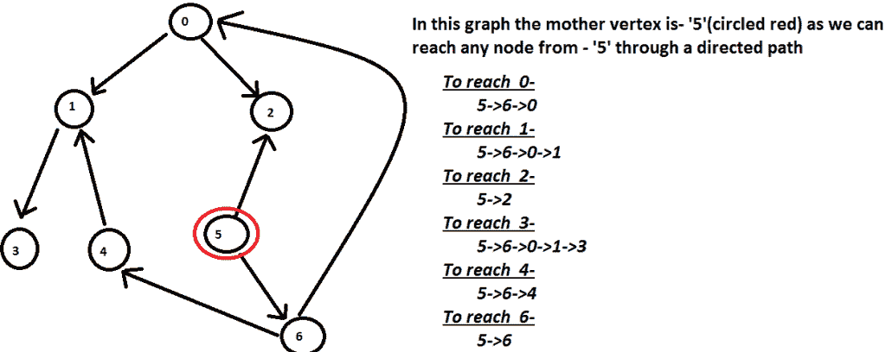

# 在图形中查找母顶点

> 原文： [https://www.geeksforgeeks.org/find-a-mother-vertex-in-a-graph/](https://www.geeksforgeeks.org/find-a-mother-vertex-in-a-graph/)

**什么是母顶点？**

图 G =（V，E）中的母顶点是顶点 v，因此 G 中的所有其他顶点都可以通过 v 的路径到达。

示例：

```
Input  : Below Graph
Output : 5

```



一个图形中可以有多个母顶点。 我们需要输出其中的任何一个。 例如，在下图中，顶点 0、1 和 2 是母顶点。


**我们强烈建议您最小化浏览器，然后自己尝试。**

**如何找到母顶点？**

*   ***情况 1：-无向连通图**：* 在这种情况下，所有顶点都是母顶点，因为我们可以到达图中的所有其他节点。

*   ***情况 2：-无向/有向断开图*** ：在这种情况下，没有母顶点，因为我们无法到达图中的所有其他节点。

*   ***情况 3：-有向连通图*** ：在这种情况下，我们必须在图中找到一个顶点-v，以便我们可以通过 a 到达图中的所有其他节点。 定向路径。

**一个朴素的方法**：

一个简单的方法是在所有顶点上执行 DFS / BFS，并确定我们是否可以从该顶点到达所有顶点。 这种方法需要 O（V（E + V））时间，这对于大型图形而言效率非常低。

**我们可以做得更好吗？**

我们可以在`O(V + E)`时间找到母顶点。 这个想法是基于 [Kosaraju 的强连通组件算法](https://www.geeksforgeeks.org/strongly-connected-components/)的。 在强连接的零部件图中，母顶点始终是零部件图中源零部件的顶点。 这个想法是基于以下事实。

如果存在母顶点（或多个顶点），则母顶点之一是 DFS 中最后完成的顶点。 （或者母顶点在 DFS 遍历中具有最大的完成时间）。

如果对 DFS 的递归调用结束，即已经访问了该顶点的所有后代，则可以说该顶点已在 DFS 中完成。

**以上想法如何运作？**

让最后一个完成的顶点为 v。基本上，我们需要证明如果 u 不是另一个母顶点，则另一个顶点 u 到 v 之间将不存在边（否则就不能存在一个非母顶点 u 这样 u-→v 是边）。 可能有两种可能性。

1.  在 v 之前对 u 进行递归 DFS 调用。如果存在边 u-→v，则 v 必须在 u 之前完成，因为 v 可以通过 u 到达，并且顶点在其所有后代之后完成。

2.  在 u 之前先对 v 进行递归 DFS 调用。 同样在这种情况下，如果存在边 u-→v，则 v 必须在 u 之前完成（这与我们认为 v 在末尾完成的假设相反），或者 u 应该可以从 v 到达（这意味着 u 是另一个母顶点） 。

**算法**：

1.  对指定图形进行 DFS 遍历。 在遍历时，请跟踪最后完成的顶点“ v”。 此步骤需要`O(V + E)`时间。

2.  如果存在母顶点（或多个顶点），则 v 必须为一个（或其中之一）。 通过从 v 执行 DFS / BFS 来检查 v 是否为母顶点。此步骤还需要`O(V + E)`时间。

下面是上述算法的实现。

## C++

```cpp

// C++ program to find a mother vertex in O(V+E) time 
#include <bits/stdc++.h> 
using namespace std; 

class Graph 
{ 
    int V;    // No. of vertices 
    list<int> *adj;    // adjacency lists 

    // A recursive function to print DFS starting from v 
    void DFSUtil(int v, vector<bool> &visited); 
public: 
    Graph(int V); 
    void addEdge(int v, int w); 
    int findMother(); 
}; 

Graph::Graph(int V) 
{ 
    this->V = V; 
    adj = new list<int>[V]; 
} 

// A recursive function to print DFS starting from v 
void Graph::DFSUtil(int v, vector<bool> &visited) 
{ 
    // Mark the current node as visited and print it 
    visited[v] = true; 

    // Recur for all the vertices adjacent to this vertex 
    list<int>::iterator i; 
    for (i = adj[v].begin(); i != adj[v].end(); ++i) 
        if (!visited[*i]) 
            DFSUtil(*i, visited); 
} 

void Graph::addEdge(int v, int w) 
{ 
    adj[v].push_back(w); // Add w to v’s list. 
} 

// Returns a mother vertex if exists. Otherwise returns -1 
int Graph::findMother() 
{ 
    // visited[] is used for DFS. Initially all are 
    // initialized as not visited 
    vector <bool> visited(V, false); 

    // To store last finished vertex (or mother vertex) 
    int v = 0; 

    // Do a DFS traversal and find the last finished 
    // vertex   
    for (int i = 0; i < V; i++) 
    { 
        if (visited[i] == false) 
        { 
            DFSUtil(i, visited); 
            v = i; 
        } 
    } 

    // If there exist mother vertex (or vetices) in given 
    // graph, then v must be one (or one of them) 

    // Now check if v is actually a mother vertex (or graph 
    // has a mother vertex).  We basically check if every vertex 
    // is reachable from v or not. 

    // Reset all values in visited[] as false and do  
    // DFS beginning from v to check if all vertices are 
    // reachable from it or not. 
    fill(visited.begin(), visited.end(), false); 
    DFSUtil(v, visited);  
    for (int i=0; i<V; i++) 
        if (visited[i] == false) 
            return -1; 

    return v; 
} 

// Driver program to test above functions 
int main() 
{ 
    // Create a graph given in the above diagram 
    Graph g(7); 
    g.addEdge(0, 1); 
    g.addEdge(0, 2); 
    g.addEdge(1, 3); 
    g.addEdge(4, 1); 
    g.addEdge(6, 4); 
    g.addEdge(5, 6); 
    g.addEdge(5, 2); 
    g.addEdge(6, 0); 

    cout << "A mother vertex is " << g.findMother(); 

    return 0; 
} 

```

## Java

```java

// Java program to find a mother  
// vertex in O(V+E) time  
import java.util.*; 

class GFG{ 

static void addEdge(int u, int v, 
 ArrayList<ArrayList<Integer>> adj) 
{ 
    adj.get(u).add(v); 
} 

// A recursive function to print DFS starting from v  
static void DFSUtil(ArrayList<ArrayList<Integer>> g, 
                    int v, boolean[] visited) 
{ 
    // Mark the current node as  
    // visited and print it  
    visited[v] = true; 

    // Recur for all the vertices  
    // adjacent to this vertex  
    for(int x : g.get(v)) 
    { 
        if (!visited[x]) 
        { 
            DFSUtil(g, x, visited); 
        } 
    } 
} 

// Returns a mother vertex if exists.  
// Otherwise returns -1  
static int motherVertex(ArrayList<ArrayList<Integer>>g, 
                        int V) 
{ 

    // visited[] is used for DFS. Initially 
    // all are initialized as not visited  
    boolean[] visited = new boolean[V]; 

    // To store last finished vertex  
    // (or mother vertex)  
    int v = -1; 

    for(int i = 0; i < V; i++) 
    { 
        if (!visited[i]) 
        { 
            DFSUtil(g, i, visited); 
            v = i; 
        } 
    } 

    // If there exist mother vertex (or vetices) 
    // in given graph, then v must be one  
    // (or one of them)  

    // Now check if v is actually a mother  
    // vertex (or graph has a mother vertex).  
    // We basically check if every vertex  
    // is reachable from v or not.  

    // Reset all values in visited[] as false 
    // and do DFS beginning from v to check 
    // if all vertices are reachable from  
    // it or not.  
    boolean[] check = new boolean[V]; 
    DFSUtil(g, v, check); 
    for(boolean val : check) 
    { 
        if (!val) 
        { 
            return -1; 
        } 
    } 
    return v; 
} 

// Driver code 
 public static void main(String[] args) 
 { 
    int V = 7; 
    int E = 8; 

    ArrayList< 
    ArrayList<Integer>> adj = new ArrayList< 
                                  ArrayList<Integer>>(); 
    for(int i = 0; i < V; i++) 
    { 
        adj.add(new ArrayList<Integer>()); 
    } 
    addEdge(0, 1,adj); 
    addEdge(0, 2,adj); 
    addEdge(1, 3,adj); 
    addEdge(4, 1,adj); 
    addEdge(6, 4,adj); 
    addEdge(5, 6,adj); 
    addEdge(5, 2,adj); 
    addEdge(6, 0,adj); 

    System.out.println("The mother vertex is " +  
                        motherVertex(adj, V)); 
} 
} 

// This code is contributed by Tanay Shah

```

## Python

```py

# program to find a mother vertex in O(V+E) time 
from collections import defaultdict 

# This class represents a directed graph using adjacency list 
# representation 
class Graph: 

    def __init__(self,vertices): 
        self.V = vertices #No. of vertices 
        self.graph = defaultdict(list) # default dictionary 

    # A recursive function to print DFS starting from v 
    def DFSUtil(self, v, visited): 

        # Mark the current node as visited and print it 
        visited[v] = True

        # Recur for all the vertices adjacent to this vertex 
        for i in self.graph[v]: 
            if visited[i] == False: 
                self.DFSUtil(i, visited) 

    # Add w to the list of v 
    def addEdge(self, v, w): 
        self.graph[v].append(w) 

    # Returns a mother vertex if exists. Otherwise returns -1 
    def findMother(self): 

        # visited[] is used for DFS. Initially all are 
        # initialized as not visited 
        visited =[False]*(self.V) 

        # To store last finished vertex (or mother vertex) 
        v=0

        # Do a DFS traversal and find the last finished 
        # vertex 
        for i in range(self.V): 
            if visited[i]==False: 
                self.DFSUtil(i,visited) 
                v = i 

        # If there exist mother vertex (or vetices) in given 
        # graph, then v must be one (or one of them) 

        # Now check if v is actually a mother vertex (or graph 
        # has a mother vertex). We basically check if every vertex 
        # is reachable from v or not. 

        # Reset all values in visited[] as false and do 
        # DFS beginning from v to check if all vertices are 
        # reachable from it or not. 
        visited = [False]*(self.V) 
        self.DFSUtil(v, visited) 
        if any(i == False for i in visited): 
            return -1
        else: 
            return v 

# Create a graph given in the above diagram 
g = Graph(7) 
g.addEdge(0, 1) 
g.addEdge(0, 2) 
g.addEdge(1, 3) 
g.addEdge(4, 1) 
g.addEdge(6, 4) 
g.addEdge(5, 6) 
g.addEdge(5, 2) 
g.addEdge(6, 0) 
print "A mother vertex is " + str(g.findMother()) 

# This code is contributed by Neelam Yadav 

```

**输出**：

```
A mother vertex is 5

```

**时间复杂度**：`O(V + E)`

本文由 **Rachit Belwariar** 提供。 如果发现任何不正确的地方，或者想分享有关上述主题的更多信息，请写评论。

