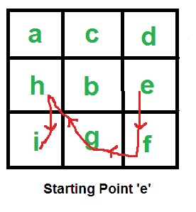

# 查找从给定起始字符开始的最长连续路径的长度

> 原文： [https://www.geeksforgeeks.org/find-length-of-the-longest-consecutive-path-in-a-character-matrix/](https://www.geeksforgeeks.org/find-length-of-the-longest-consecutive-path-in-a-character-matrix/)

给定字符矩阵。 查找给定字符中最长路径的长度，以使路径中的所有字符彼此连续，即，路径中的每个字符都按字母顺序紧挨着前一个。 允许从一个单元沿所有 8 个方向移动。



例

```
Input: mat[][] = { {a, c, d},
                   {h, b, e},
                   {i, g, f}}
      Starting Point = 'e'

Output: 5
If starting point is 'e', then longest path with consecutive 
characters is "e f g h i".

Input: mat[R][C] = { {b, e, f},
                     {h, d, a},
                     {i, c, a}};
      Starting Point = 'b'

Output: 1
'c' is not present in all adjacent cells of 'b'

```


这个想法是首先在给定的矩阵中搜索给定的起始字符。 对所有事件进行深度优先搜索（DFS）以查找所有连续路径。 在执行 DFS 时，我们可能会一次又一次遇到许多子问题。 因此，我们使用动态规划来存储子问题的结果。

以下是上述想法的实现。

## C++ 

```cpp

// C++ program to find the longest consecutive path 
#include<bits/stdc++.h> 
#define R 3 
#define C 3 
using namespace std; 

// tool matrices to recur for adjacent cells. 
int x[] = {0, 1, 1, -1, 1, 0, -1, -1}; 
int y[] = {1, 0, 1, 1, -1, -1, 0, -1}; 

// dp[i][j] Stores length of longest consecutive path 
// starting at arr[i][j]. 
int dp[R][C]; 

// check whether mat[i][j] is a valid cell or not. 
bool isvalid(int i, int j) 
{ 
    if (i < 0 || j < 0 || i >= R || j >= C) 
      return false; 
    return true; 
} 

// Check whether current character is adjacent to previous 
// character (character processed in parent call) or not. 
bool isadjacent(char prev, char curr) 
{ 
    return ((curr - prev) == 1); 
} 

// i, j are the indices of the current cell and prev is the 
// character processed in the parent call.. also mat[i][j] 
// is our current character. 
int getLenUtil(char mat[R][C], int i, int j, char prev) 
{ 
     // If this cell is not valid or current character is not 
     // adjacent to previous one (e.g. d is not adjacent to b ) 
     // or if this cell is already included in the path than return 0\. 
    if (!isvalid(i, j) || !isadjacent(prev, mat[i][j])) 
         return 0; 

    // If this subproblem is already solved , return the answer 
    if (dp[i][j] != -1) 
        return dp[i][j]; 

    int ans = 0;  // Initialize answer 

    // recur for paths with different adjacent cells and store 
    // the length of longest path. 
    for (int k=0; k<8; k++) 
      ans = max(ans, 1 + getLenUtil(mat, i + x[k], 
                                   j + y[k], mat[i][j])); 

    // save the answer and return 
    return dp[i][j] = ans; 
} 

// Returns length of the longest path with all characters consecutive 
// to each other.  This function first initializes dp array that 
// is used to store results of subproblems, then it calls 
// recursive DFS based function getLenUtil() to find max length path 
int getLen(char mat[R][C], char s) 
{ 
    memset(dp, -1, sizeof dp); 
    int ans = 0; 

    for (int i=0; i<R; i++) 
    { 
        for (int j=0; j<C; j++) 
        { 
            // check for each possible starting point 
            if (mat[i][j] == s) { 

                // recur for all eight adjacent cells 
                for (int k=0; k<8; k++) 
                  ans = max(ans, 1 + getLenUtil(mat, 
                                    i + x[k], j + y[k], s)); 
            } 
        } 
    } 
    return ans; 
} 

// Driver program 
int main() { 

    char mat[R][C] = { {'a','c','d'}, 
                     { 'h','b','a'}, 
                     { 'i','g','f'}}; 

    cout << getLen(mat, 'a') << endl; 
    cout << getLen(mat, 'e') << endl; 
    cout << getLen(mat, 'b') << endl; 
    cout << getLen(mat, 'f') << endl; 
    return 0; 
} 

```