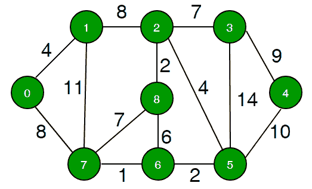
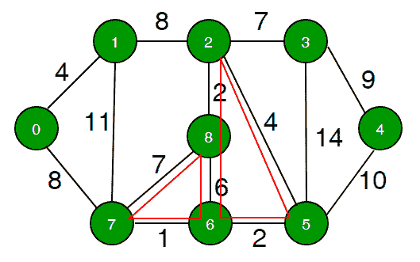

# 在无向图中求最小重量循环

> 原文:[https://www . geesforgeks . org/find-最小重量-循环-无向图/](https://www.geeksforgeeks.org/find-minimum-weight-cycle-undirected-graph/)

给定一个正加权无向图，求其中的最小权环。

示例:



```
Minimum weighted cycle is :
```



```
Minimum weighed cycle : 7 + 1 + 6 = 14 or 
                        2 + 6 + 2 + 4 = 14 
```

思路是用[最短路径算法](http://www.geeksforgeeks.org/dijkstras-shortest-path-algorithm-using-set-in-stl/)。我们一个接一个地从图中移除每条边，然后我们找到它的两个角点之间的最短路径。我们在处理下一条边之前，先添加一条边。

```
1). create an empty vector 'edge' of size 'E'
   ( E total number of edge). Every element of 
   this vector is used to store information of 
   all the edge in graph info 

2) Traverse every edge edge[i] one - by - one 
    a). First remove 'edge[i]' from graph 'G'
    b). get current edge vertices which we just 
         removed from graph 
    c). Find the shortest path between them 
        "Using Dijkstra’s shortest path algorithm "
    d). To make a cycle we add the weight of the 
        removed edge to the shortest path.
    e). update min_weight_cycle  if needed 
3). return minimum weighted cycle
```

下面是上述想法的实现

## C++

```
// c++ program to find shortest weighted
// cycle in undirected graph
#include<bits/stdc++.h>
using namespace std;
# define INF 0x3f3f3f3f
struct Edge
{
    int u;
    int v;
    int weight;
};

// weighted undirected Graph
class Graph
{
    int V ;
    list < pair <int, int > >*adj;

    // used to store all edge information
    vector < Edge > edge;

public :
    Graph( int V )
    {
        this->V = V ;
        adj = new list < pair <int, int > >[V];
    }

    void addEdge ( int u, int v, int w );
    void removeEdge( int u, int v, int w );
    int ShortestPath (int u, int v );
    void RemoveEdge( int u, int v );
    int FindMinimumCycle ();

};

//function add edge to graph
void Graph :: addEdge ( int u, int v, int w )
{
    adj[u].push_back( make_pair( v, w ));
    adj[v].push_back( make_pair( u, w ));

    // add Edge to edge list
    Edge e { u, v, w };
    edge.push_back ( e );
}

// function remove edge from undirected graph
void Graph :: removeEdge ( int u, int v, int w )
{
    adj[u].remove(make_pair( v, w ));
    adj[v].remove(make_pair(u, w ));
}

// find the shortest path from source to sink using
// Dijkstra’s shortest path algorithm [ Time complexity
// O(E logV )]
int Graph :: ShortestPath ( int u, int v )
{
    // Create a set to store vertices that are being
    // preprocessed
    set< pair<int, int> > setds;

    // Create a vector for distances and initialize all
    // distances as infinite (INF)
    vector<int> dist(V, INF);

    // Insert source itself in Set and initialize its
    // distance as 0.
    setds.insert(make_pair(0, u));
    dist[u] = 0;

    /* Looping till all shortest distance are finalized
    then setds will become empty */
    while (!setds.empty())
    {
        // The first vertex in Set is the minimum distance
        // vertex, extract it from set.
        pair<int, int> tmp = *(setds.begin());
        setds.erase(setds.begin());

        // vertex label is stored in second of pair (it
        // has to be done this way to keep the vertices
        // sorted distance (distance must be first item
        // in pair)
        int u = tmp.second;

        // 'i' is used to get all adjacent vertices of
        // a vertex
        list< pair<int, int> >::iterator i;
        for (i = adj[u].begin(); i != adj[u].end(); ++i)
        {
            // Get vertex label and weight of current adjacent
            // of u.
            int v = (*i).first;
            int weight = (*i).second;

            // If there is shorter path to v through u.
            if (dist[v] > dist[u] + weight)
            {
                /* If the distance of v is not INF then it must be in
                    our set, so removing it and inserting again
                    with updated less distance.
                    Note : We extract only those vertices from Set
                    for which distance is finalized. So for them,
                    we would never reach here. */
                if (dist[v] != INF)
                    setds.erase(setds.find(make_pair(dist[v], v)));

                // Updating distance of v
                dist[v] = dist[u] + weight;
                setds.insert(make_pair(dist[v], v));
            }
        }
    }

    // return shortest path from current source to sink
    return dist[v] ;
}

// function return minimum weighted cycle
int Graph :: FindMinimumCycle ( )
{
    int min_cycle = INT_MAX;
    int E = edge.size();
    for ( int i = 0 ; i < E ; i++ )
    {
        // current Edge information
        Edge e = edge[i];

        // get current edge vertices which we currently
        // remove from graph and then find shortest path
        // between these two vertex using Dijkstra’s
        // shortest path algorithm .
        removeEdge( e.u, e.v, e.weight ) ;

        // minimum distance between these two vertices
        int distance = ShortestPath( e.u, e.v );

        // to make a cycle we have to add weight of
        // currently removed edge if this is the shortest
        // cycle then update min_cycle
        min_cycle = min( min_cycle, distance + e.weight );

        // add current edge back to the graph
        addEdge( e.u, e.v, e.weight );
    }

    // return shortest cycle
    return min_cycle ;
}

// driver program to test above function
int main()
{
    int V = 9;
    Graph g(V);

    // making above shown graph
    g.addEdge(0, 1, 4);
    g.addEdge(0, 7, 8);
    g.addEdge(1, 2, 8);
    g.addEdge(1, 7, 11);
    g.addEdge(2, 3, 7);
    g.addEdge(2, 8, 2);
    g.addEdge(2, 5, 4);
    g.addEdge(3, 4, 9);
    g.addEdge(3, 5, 14);
    g.addEdge(4, 5, 10);
    g.addEdge(5, 6, 2);
    g.addEdge(6, 7, 1);
    g.addEdge(6, 8, 6);
    g.addEdge(7, 8, 7);

    cout << g.FindMinimumCycle() << endl;
    return 0;
}
```

## 蟒蛇 3

```
# Python3 program to find shortest weighted
# cycle in undirected graph
from sys import maxsize

INF = int(0x3f3f3f3f)

class Edge:

    def __init__(self, u: int,
                       v: int,
                  weight: int) -> None:

        self.u = u
        self.v = v
        self.weight = weight

# Weighted undirected Graph
class Graph:

    def __init__(self, V: int) -> None:

        self.V = V
        self.adj = [[] for _ in range(V)]

        # Used to store all edge information
        self.edge = []

    # Function add edge to graph
    def addEdge(self, u: int,
                      v: int,
                      w: int) -> None:

        self.adj[u].append((v, w))
        self.adj[v].append((u, w))

        # Add Edge to edge list
        e = Edge(u, v, w)
        self.edge.append(e)

    # Function remove edge from undirected graph
    def removeEdge(self, u: int,
                         v: int, w: int) -> None:

        self.adj[u].remove((v, w))
        self.adj[v].remove((u, w))

    # Find the shortest path from source
    # to sink using Dijkstra’s shortest
    # path algorithm [ Time complexity
    # O(E logV )]
    def ShortestPath(self, u: int, v: int) -> int:

        # Create a set to store vertices that
        # are being preprocessed
        setds = set()

        # Create a vector for distances and
        # initialize all distances as infinite (INF)
        dist = [INF] * self.V

        # Insert source itself in Set and
        # initialize its distance as 0.
        setds.add((0, u))
        dist[u] = 0

        # Looping till all shortest distance are
        # finalized then setds will become empty
        while (setds):

            # The first vertex in Set is the minimum
            # distance vertex, extract it from set.
            tmp = setds.pop()

            # Vertex label is stored in second of
            # pair (it has to be done this way to
            # keep the vertices sorted distance
            # (distance must be first item in pair)
            uu = tmp[1]

            # 'i' is used to get all adjacent
            # vertices of a vertex
            for i in self.adj[uu]:

                # Get vertex label and weight of
                # current adjacent of u.
                vv = i[0]
                weight = i[1]

                # If there is shorter path to v through u.
                if (dist[vv] > dist[uu] + weight):

                    # If the distance of v is not INF then
                    # it must be in our set, so removing it
                    # and inserting again with updated less
                    # distance. Note : We extract only those
                    # vertices from Set for which distance
                    # is finalized. So for them, we would
                    # never reach here.
                    if (dist[vv] != INF):
                        if ((dist[vv], vv) in setds):
                            setds.remove((dist[vv], vv))

                    # Updating distance of v
                    dist[vv] = dist[uu] + weight
                    setds.add((dist[vv], vv))

        # Return shortest path from
        # current source to sink
        return dist[v]

    # Function return minimum weighted cycle
    def FindMinimumCycle(self) -> int:

        min_cycle = maxsize
        E = len(self.edge)

        for i in range(E):

            # Current Edge information
            e = self.edge[i]

            # Get current edge vertices which we currently
            # remove from graph and then find shortest path
            # between these two vertex using Dijkstra’s
            # shortest path algorithm .
            self.removeEdge(e.u, e.v, e.weight)

            # Minimum distance between these two vertices
            distance = self.ShortestPath(e.u, e.v)

            # To make a cycle we have to add weight of
            # currently removed edge if this is the
            # shortest cycle then update min_cycle
            min_cycle = min(min_cycle,
                            distance + e.weight)

            # Add current edge back to the graph
            self.addEdge(e.u, e.v, e.weight)

        # Return shortest cycle
        return min_cycle

# Driver Code
if __name__ == "__main__":

    V = 9

    g = Graph(V)

    # Making above shown graph
    g.addEdge(0, 1, 4)
    g.addEdge(0, 7, 8)
    g.addEdge(1, 2, 8)
    g.addEdge(1, 7, 11)
    g.addEdge(2, 3, 7)
    g.addEdge(2, 8, 2)
    g.addEdge(2, 5, 4)
    g.addEdge(3, 4, 9)
    g.addEdge(3, 5, 14)
    g.addEdge(4, 5, 10)
    g.addEdge(5, 6, 2)
    g.addEdge(6, 7, 1)
    g.addEdge(6, 8, 6)
    g.addEdge(7, 8, 7)

    print(g.FindMinimumCycle())

# This code is contributed by sanjeev2552
```

**输出:**

```
14
```

**时间复杂度** y: O( E ( E log V ) )
对于每一条边，我们运行 Dijkstra 的最短路径算法，因此在所有时间复杂度 E <sup>2</sup> logV 上。
在集合 2 |中，我们将讨论优化算法以在无向图中找到最小权重循环。

本文由 [**尼尚·辛格**](https://practice.geeksforgeeks.org/user-profile.php?user=_code) 供稿。如果你喜欢 GeeksforGeeks 并想投稿，你也可以使用[contribute.geeksforgeeks.org](http://www.contribute.geeksforgeeks.org)写一篇文章或者把你的文章邮寄到 contribute@geeksforgeeks.org。看到你的文章出现在极客博客主页上，帮助其他极客。
如果发现有不正确的地方，或者想分享更多关于上述话题的信息，请写评论。