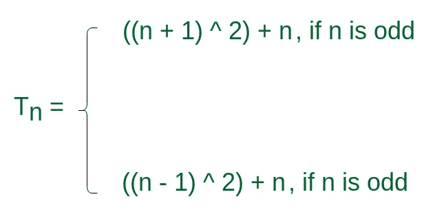

# 求数列 5 ^ 2 ^ 13 ^ 41 的第 n 项

> 原文:[https://www . geesforgeks . org/find-n 系列术语-5-2-13-41/](https://www.geeksforgeeks.org/find-nth-term-of-the-series-5-2-13-41/)

给定一个数字 N，任务是找到数列的第 N 项

> 5, 2, 19, 13, 41, 31, 71, 57….

假设 n 的值可以在 1 到 10000 之间。
**例:**

```
Input: N = 4
Output:13

Input: N = 15
Output:272
```

**方法:**问题看起来很难，但方法很简单。如果 n 的值是奇数，则第 n 项将是((n + 1 ) ^ 2 ) + n.
否则，它将是((n–1)^ 2)+n .



**执行:**

## C++

```
// C++ program to find nth term of
// the series 5 2 13 41
#include<bits/stdc++.h>
using namespace std;

// function to calculate nth term of the series
int nthTermOfTheSeries(int n)
{
    // to store the nth term of series
    int nthTerm;

    // if n is even number
    if (n % 2 == 0)
        nthTerm = pow(n - 1, 2) + n;

    // if n is odd number
    else
        nthTerm = pow(n + 1, 2) + n;

    // return nth term
    return nthTerm;
}

// Driver code
int main()
{
    int n;

    n = 8;
    cout << nthTermOfTheSeries(n) << endl;

    n = 12;
    cout << nthTermOfTheSeries(n) << endl;

    n = 102;
    cout << nthTermOfTheSeries(n) << endl;

    n = 999;
    cout << nthTermOfTheSeries(n) << endl;

    n = 9999;
    cout << nthTermOfTheSeries(n) << endl;

    return 0;
}

// This code is contributed
// by Akanksha Rai
```

## C

```
// C program to find nth term of
// the series 5 2 13 41
#include <math.h>
#include <stdio.h>

// function to calculate nth term of the series
int nthTermOfTheSeries(int n)
{
    // to store the nth term of series
    int nthTerm;

    // if n is even number
    if (n % 2 == 0)
        nthTerm = pow(n - 1, 2) + n;

    // if n is odd number
    else
        nthTerm = pow(n + 1, 2) + n;

    // return nth term
    return nthTerm;
}

// Driver code
int main()
{
    int n;

    n = 8;

    printf("%d\n", nthTermOfTheSeries(n));

    n = 12;
    printf("%d\n", nthTermOfTheSeries(n));

    n = 102;
    printf("%d\n", nthTermOfTheSeries(n));

    n = 999;
    printf("%d\n", nthTermOfTheSeries(n));

    n = 9999;
    printf("%d\n", nthTermOfTheSeries(n));

    return 0;
}
```

## Java 语言(一种计算机语言，尤用于创建网站)

```
// Java program to find nth term of the series 5 2 13 41

import java.lang.Math;
class GFG
{
// function to calculate nth term of the series
static long  nthTermOfTheSeries(int n)
{
    // to store the nth term of series
    long nthTerm;

    // if n is even number
    if (n % 2 == 0)
        nthTerm = (long)Math.pow(n - 1, 2) + n;

    // if n is odd number
    else
        nthTerm = (long)Math.pow(n + 1, 2) + n;

    // return nth term
    return nthTerm;
}

// Driver code
public static void main(String[] args)
{
    int n;

    n = 8;

    System.out.println( nthTermOfTheSeries(n));

    n = 12;
    System.out.println( nthTermOfTheSeries(n));

    n = 102;
    System.out.println( nthTermOfTheSeries(n));

    n = 999;
    System.out.println( nthTermOfTheSeries(n));

    n = 9999;
    System.out.println( nthTermOfTheSeries(n));
//This code is contributed by  29AjayKumar

}
}
```

## 蟒蛇 3

```
# Python3 program to find nth term
# of the series 5 2 13 41
from math import pow

# function to calculate nth term
# of the series
def nthTermOfTheSeries(n):

    # to store the nth term of series
    # if n is even number
    if (n % 2 == 0):
        nthTerm = pow(n - 1, 2) + n

    # if n is odd number
    else:
        nthTerm = pow(n + 1, 2) + n

    # return nth term
    return nthTerm

# Driver code
if __name__ == '__main__':

    n = 8
    print(int(nthTermOfTheSeries(n)))

    n = 12
    print(int(nthTermOfTheSeries(n)))

    n = 102
    print(int(nthTermOfTheSeries(n)))

    n = 999
    print(int(nthTermOfTheSeries(n)))

    n = 9999
    print(int(nthTermOfTheSeries(n)))

# This code is contributed by
# Shashank_Sharma
```

## C#

```
// C# program to find nth term
// of the series 5 2 13 41
using System;

class GFG
{
    // function to calculate
    // nth term of the series
    static long nthTermOfTheSeries(int n)
    {
        // to store the nth term of series
        long nthTerm;

        // if n is even number
        if (n % 2 == 0)
            nthTerm = (long)Math.Pow(n - 1, 2) + n;

        // if n is odd number
        else
            nthTerm = (long)Math.Pow(n + 1, 2) + n;

        // return nth term
        return nthTerm;
    }

    // Driver code
    public static void Main()
    {
        int n;

        n = 8;
        Console.WriteLine(nthTermOfTheSeries(n));

        n = 12;
        Console.WriteLine( nthTermOfTheSeries(n));

        n = 102;
        Console.WriteLine( nthTermOfTheSeries(n));

        n = 999;
        Console.WriteLine( nthTermOfTheSeries(n));

        n = 9999;
        Console.WriteLine( nthTermOfTheSeries(n));
    }
}

// This code is contributed by Ryuga
```

## 服务器端编程语言（Professional Hypertext Preprocessor 的缩写）

```
<?php
// Php program to find nth term of
// the series 5 2 13 41

// function to calculate nth term
// of the series
function nthTermOfTheSeries($n)
{

    // if n is even number
    if ($n % 2 == 0)
        $nthTerm = pow($n - 1, 2) + $n;

    // if n is odd number
    else
        $nthTerm = pow($n + 1, 2) + $n;

    // return nth term
    return $nthTerm;
}

// Driver code
$n = 8;
echo nthTermOfTheSeries($n) . "\n";

$n = 12;
echo nthTermOfTheSeries($n) . "\n";

$n = 102;
echo nthTermOfTheSeries($n) . "\n";

$n = 999;
echo nthTermOfTheSeries($n) . "\n";

$n = 9999;
echo nthTermOfTheSeries($n) . "\n";

// This code is contributed by ita_c
?>
```

## java 描述语言

```
<script>
// Javascript program to find nth term of
// the series 5 2 13 41

// function to calculate nth term of the series
function nthTermOfTheSeries(n)
{
    // to store the nth term of series
    let nthTerm;

    // if n is even number
    if (n % 2 == 0)
        nthTerm = Math.pow(n - 1, 2) + n;

    // if n is odd number
    else
        nthTerm = Math.pow(n + 1, 2) + n;

    // return nth term
    return nthTerm;
}

// Driver code
let n;

n = 8;
document.write(nthTermOfTheSeries(n) + "<br>");

n = 12;
document.write(nthTermOfTheSeries(n) + "<br>");

n = 102;
document.write(nthTermOfTheSeries(n) + "<br>");

n = 999;
document.write(nthTermOfTheSeries(n) + "<br>");

n = 9999;
document.write(nthTermOfTheSeries(n) + "<br>");

// This code is contributed by rishavmahato348.
</script>
```

**Output:** 

```
57
133
10303
1000999
100009999
```