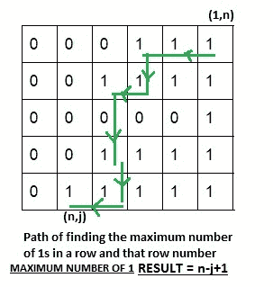

# 查找最大数为 1 的二进制矩阵的行号

> 原文： [https://www.geeksforgeeks.org/find-row-number-binary-matrix-maximum-number-1s/](https://www.geeksforgeeks.org/find-row-number-binary-matrix-maximum-number-1s/)

给定`n * n`阶的二进制矩阵（仅包含 0 和 1）。 所有行均已排序，我们需要找到最大为 1s 的行号。 还要在该行中找到数字 1。

注意：如果是平局，则打印较小的行号。

**示例**：

```
Input : mat[3][3] = {0, 0, 1,
                     0, 1, 1,
                     0, 0, 0}
Output : Row number = 2, MaxCount = 2

Input : mat[3][3] = {1, 1, 1,
                     1, 1, 1,
                     0, 0, 0}
Output : Row number = 1, MaxCount = 3

```


**基本方法**：遍历整个矩阵，并为每行找到 1 的数目，并在所有行中不断更新最大数目为 1 的行号。此方法将导致`O(n ^ 2)`时间复杂度 。

**更好的方法**：如果我们尝试应用二分搜索来查找每行中第一个 1 的位置，并且随着对每一行进行排序就可以从每行中找到 1 的数目，那么我们可以使用排序做得更好。 这将导致`O(nLogn)`时间复杂度。

**有效方法**：从索引`(1, n)`的左上角开始，尝试向左移动直到到达该行（第`j`列）的最后 1 个，现在如果我们向左移动到该行，我们将找到 0，因此切换到同一列的正下方。 现在，如果第`j`个元素（如果 1）尝试向左移动，则您的位置将再次位于第二行`(2, j)`，直到找到最后 1 个；否则，如果第`j`个元素为 0，则在第二行中转到下一行。 因此，最后要说的是，如果您位于第`i`行和第`j`列中的任何一个，即该行右边的最后 1 个索引，则递增`i`。 因此，现在如果`Aij = 0`再次增加`i`，否则继续减少`j`，直到在该特定行中找到最后 1 个为止。

示例图：



**算法**：

```
for (int i=0, j=n-1; i<n;i++)
{
    // find left most position of 1 in a row
    // find 1st zero in a row
    while (arr[i][j]==1) 
    {
        row = i;
        j--;
    }
}
cout << "Row number =" << row+1;
cout << "MaxCount =" << n-j;

```

## C++ 

```cpp

// CPP program to find row with maximum 1 
// in row sorted binary matrix 
#include<bits/stdc++.h> 
#define N 4 
using namespace std; 

// function for finding row with maximum 1 
void findMax (int arr[][N]) 
{ 
    int row = 0, i, j; 
    for (i=0, j=N-1; i<N;i++) 
    { 
        // find left most position of 1 in a row 
        // find 1st zero in a row 
        while (arr[i][j] == 1 && j >= 0)  
        { 
            row = i; 
            j--; 
        } 
    } 
    cout << "Row number = " << row+1; 
    cout << ", MaxCount = " << N-1-j; 
} 

// driver program 
int main() 
{ 
    int arr[N][N] = {0, 0, 0, 1, 
                     0, 0, 0, 1, 
                     0, 0, 0, 0, 
                     0, 1, 1, 1}; 
    findMax(arr); 
    return 0; 
} 

```

## Java

```java

// Java program to find row with maximum 1 
// in row sorted binary matrix 
class GFG { 

    static final int N = 4; 

    // function for finding row with maximum 1 
    static void findMax(int arr[][]) { 

        int row = 0, i, j; 

        for (i = 0, j = N - 1; i < N; i++) { 

            // find left most position of 1 in 
            // a row find 1st zero in a row 
            while (j >= 0 && arr[i][j] == 1) { 

                row = i; 
                j--; 
            } 
        } 

        System.out.print("Row number = " 
                                + (row + 1)); 
        System.out.print(", MaxCount = " 
                               + (N - 1 - j)); 
    } 

    // Driver code 
    public static void main(String[] args) { 
        int arr[][] = {{0, 0, 0, 1},  
                       {0, 0, 0, 1},  
                       {0, 0, 0, 0},  
                       {0, 1, 1, 1}}; 
        findMax(arr); 
    } 
} 

// This code is contributed by Anant Agarwal. 

```

## Python3

```py

# python program to find row with 
# maximum 1 in row sorted binary 
# matrix 

N = 4

# function for finding row with 
# maximum 1 
def findMax (arr): 
    row = 0
    j = N - 1
    for i in range(0, N): 
        # find left most position 
        # of 1 in a row find 1st 
        # zero in a row 
        while (arr[i][j] == 1 
                     and j >= 0): 
            row = i 
            j -= 1

    print("Row number = " , row + 1, 
         ", MaxCount = ", N - 1 - j) 

# driver program 
arr = [ [0, 0, 0, 1], 
        [0, 0, 0, 1], 
        [0, 0, 0, 0], 
        [0, 1, 1, 1] ] 

findMax(arr) 

# This code is contributed by Sam007 

```

## C# 

```cs

// C# program to find row with maximum 
// 1 in row sorted binary matrix 
using System; 

class GFG { 

    static int N = 4; 

    // function for finding row with maximum 1 
    static void findMax(int [,]arr) 
    { 
        int row = 0, i, j; 

        for (i = 0, j = N - 1; i < N; i++) { 

            // find left most position of 1 in 
            // a row find 1st zero in a row 
            while (arr[i,j] == 1 && j >= 0)  
            { 
                row = i; 
                j--; 
            } 
        } 

        Console.Write("Row number = " + (row + 1)); 
        Console.Write(", MaxCount = " + (N - 1 - j)); 
    } 

    // Driver code 
    public static void Main()  
    { 
        int [,]arr = {{0, 0, 0, 1},  
                      {0, 0, 0, 1},  
                      {0, 0, 0, 0},  
                      {0, 1, 1, 1}}; 
        findMax(arr); 
    } 
} 

// This code is contributed by nitin mittal 

```

## PHP

```php

<?php 
// PHP program to find  
// row with maximum 1 
// in row sorted  
// binary matrix 
$N = 4; 

// function for finding 
// row with maximum 1 
function findMax ($arr) 
{ 

    global $N; 
    $row = 0; $i;  
    $j=$N - 1; 
    for ($i = 0; $i < $N; $i++) 
    { 

        // find left most position 
        // of 1 in a row find 1st 
        // zero in a row 
        while ($arr[$i][$j] == 1 &&  
                           $j >= 0)  
        { 
            $row = $i; 
            $j--; 
        } 
    } 
    echo "Row number = " , $row + 1; 
    echo ", MaxCount = " , $N - 1 - $j; 
} 

    // Driver Code 
    $arr = array(array(0, 0, 0, 1), 
                 array(0, 0, 0, 1), 
                 array(0, 0, 0, 0), 
                 array(0, 1, 1, 1)); 
    findMax($arr); 

// This code is contributed by vt_m. 
?> 

```

Output:

```
Row number = 4, MaxCount = 3

```


