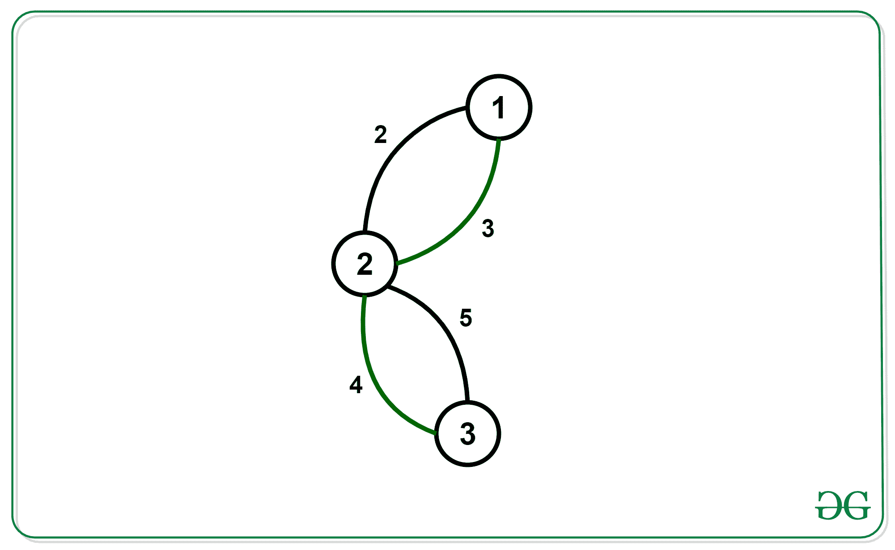

# 找到颜色边交替的最小生成树

> 原文:[https://www . geesforgeks . org/find-具有交替彩色边的最小生成树/](https://www.geeksforgeeks.org/find-the-minimum-spanning-tree-with-alternating-colored-edges/)

给定一个有 N 个节点和 M 条边的图，其中每条边都有一种颜色(黑色或绿色)和与之相关的成本。找到图的最小生成树，使得树中的每条路径都由交替的彩色边组成。

**示例:**

> **输入:** N = 3，M = 4
> 
> **输出:** 6
> 
> **输入:** N = 4，M = 6
> 
> **输出:** 4

**进场:**

*   我们在这里做的第一个观察是每一个这样的生成树都是一个链。为了证明这一点，假设我们有一棵树，它不是一条链，其中的每条路径都由交替的边组成。那么我们可以推导出至少有 1 个节点的度数为 3。在这 3 条边中，至少有两条会有相同的颜色。使用这两条边的路径永远不会符合条件，因此，这种树总是一条链。
*   现在，我们可以使用位掩码-dp，
    dp[mask(2^n)][node(n)][col_of_last_edge(2]找到一个具有最小成本和交替边的链，其中掩码是我们添加到链中的节点的位掩码。node 是我们添加到链中的最后一个节点。col_of_last_edge 是用于连接 Node 的边的颜色。
*   为了从一个状态转换到另一个状态，我们访问最后一个节点的邻接表，并使用那些有颜色的边！= col_of_last_edge。

以下是上述方法的实现:

## C++

```
// C++ program for the
// above approach
#include <bits/stdc++.h>
using namespace std;

int graph[18][18][2];

// Initializing dp of size =
// (2^18)*18*2.
long long dp[1 << 18][18][2];

// Recursive Function to calculate
// Minimum Cost with alternate 
// colour edges
long long minCost(int n, int m, int mask, int prev, int col)
{
    // Base case
    if (mask == ((1 << n) - 1)) {
        return 0;
    }
    // If already calculated
    if (dp[mask][prev][col == 1] != 0) {
        return dp[mask][prev][col == 1];
    }

    long long ans = 1e9;

    for (int i = 0; i < n; i++) {
        for (int j = 0; j < 2; j++) {
            // Masking previous edges
            // as explained in above formula.
            if (graph[prev][i][j] && !(mask & (1 << i)) 
                && (j != col)) {
                long long z = graph[prev][i][j] + 
                              minCost(n,m,mask|(1<<i),i,j);
                ans = min(z, ans);
            }
        }
    }

    return dp[mask][prev][col == 1] = ans;
}

// Function to Adjacency
// List Representation 
// of a Graph
void makeGraph(vector<pair<pair<int,int>,
                      pair<int,char>>>& vp,int m){

  for (int i = 0; i < m; i++) {
    int a = vp[i].first.first - 1;
    int b = vp[i].first.second - 1;
    int cost = vp[i].second.first;
    char color = vp[i].second.second;
    graph[a][b][color == 'W'] = cost;
    graph[b][a][color == 'W'] = cost;
  }
}

// Function to getCost
// for the Minimum Spanning
// Tree Formed
int getCost(int n,int m){

    // Assigning maximum
    // possible value.
    long long ans = 1e9;

    for (int i = 0; i < n; i++) {
        ans = min(ans, minCost(n, m, 1 << i, i, 2));
    }

    if (ans != 1e9) {
        return ans;
    }
    else {
        return -1;
    }
}

// Driver code
int main()
{
    int n = 3, m = 4;
    vector<pair<pair<int, int>, pair<int, char> > > vp = {
        { { 1, 2 }, { 2, 'B' } },
        { { 1, 2 }, { 3, 'W' } },
        { { 2, 3 }, { 4, 'W' } },
        { { 2, 3 }, { 5, 'B' } }
    };

    makeGraph(vp,m);
    cout << getCost(n,m) << '\n';

    return 0;
}
```

## 蟒蛇 3

```
# Python implementation of the approach

graph = [[[0, 0] for i in range(18)] for j in range(18)]

# Initializing dp of size =
# (2^18)*18*2.
dp = [[[0, 0] for i in range(18)] for j in range(1 << 15)]

# Recursive Function to calculate
# Minimum Cost with alternate
# colour edges
def minCost(n: int, m: int, mask: 
            int, prev: int, col: int) -> int:
    global dp

    # Base case
    if mask == ((1 << n) - 1):
        return 0

    # If already calculated
    if dp[mask][prev][col == 1] != 0:
        return dp[mask][prev][col == 1]

    ans = int(1e9)

    for i in range(n):
        for j in range(2):

            # Masking previous edges
            # as explained in above formula.
            if graph[prev][i][j] and not (mask & (1 << i)) \
                and (j != col):
                z = graph[prev][i][j] + minCost(n,
                        m, mask | (1 << i), i, j)
                ans = min(z, ans)

    dp[mask][prev][col == 1] = ans
    return dp[mask][prev][col == 1]

# Function to Adjacency
# List Representation
# of a Graph
def makeGraph(vp: list, m: int):
    global graph
    for i in range(m):
        a = vp[i][0][0] - 1
        b = vp[i][0][1] - 1
        cost = vp[i][1][0]
        color = vp[i][1][1]
        graph[a][b][color == 'W'] = cost
        graph[b][a][color == 'W'] = cost

# Function to getCost
# for the Minimum Spanning
# Tree Formed
def getCost(n: int, m: int) -> int:

    # Assigning maximum
    # possible value.
    ans = int(1e9)
    for i in range(n):
        ans = min(ans, minCost(n, m, 1 << i, i, 2))

    if ans != int(1e9):
        return ans
    else:
        return -1

# Driver Code
if __name__ == "__main__":

    n = 3
    m = 4
    vp = [[[1, 2], [2, 'B']],
        [[1, 2], [3, 'W']],
        [[2, 3], [4, 'W']],
        [[2, 3], [5, 'B']]]
    makeGraph(vp, m)
    print(getCost(n, m))

# This code is contributed by
# sanjeev2552
```

**Output:**

```
6

```

**时间复杂度:** O(2^N * (M + N))