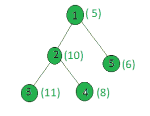

# 找到与 X 绝对差最大的节点

> 原文:[https://www . geesforgeks . org/find-the-node-with-x-的绝对差值给出最大值/](https://www.geeksforgeeks.org/find-the-node-whose-absolute-difference-with-x-gives-maximum-value/)

给定一棵树，所有节点的权重和一个整数 **x** ，任务是找到一个节点 **i** ，使得**|权重【I】–x |**最大。
**举例:**

> **输入:**
> 
> 
> 
> x = 15
> **输出:** 1
> 节点 1:| 5–15 | = 10
> 节点 2:| 10–15 | = 5
> 节点 3: |11 -15| = 4
> 节点 4:| 8–15 | = 7
> 节点 5: |6 -15| = 9

**方法:**在树上执行 [dfs](https://www.geeksforgeeks.org/depth-first-traversal-for-a-graph/) 并跟踪其与**的加权绝对差 x** 给出最大值的节点。
以下是上述方法的实现:

## C++

```
// C++ implementation of the approach
#include <bits/stdc++.h>
using namespace std;

int maximum = INT_MIN, x, ans;

vector<int> graph[100];
vector<int> weight(100);

// Function to perform dfs to find
// the maximum value
void dfs(int node, int parent)
{
    // If current value is more than
    // the current maximum
    if (maximum < abs(weight[node] - x)) {
        maximum = abs(weight[node] - x);
        ans = node;
    }
    for (int to : graph[node]) {
        if (to == parent)
            continue;
        dfs(to, node);
    }
}

// Driver code
int main()
{
    x = 15;

    // Weights of the node
    weight[1] = 5;
    weight[2] = 10;
    weight[3] = 11;
    weight[4] = 8;
    weight[5] = 6;

    // Edges of the tree
    graph[1].push_back(2);
    graph[2].push_back(3);
    graph[2].push_back(4);
    graph[1].push_back(5);

    dfs(1, 1);

    cout << ans;

    return 0;
}
```

## Java 语言(一种计算机语言，尤用于创建网站)

```
// Java implementation of the approach
import java.util.*;

class GFG
{

static int maximum = Integer.MIN_VALUE, x, ans;

static Vector<Vector<Integer>> graph=new Vector<Vector<Integer>>();
static Vector<Integer> weight=new Vector<Integer>();

// Function to perform dfs to find
// the maximum value
static void dfs(int node, int parent)
{
    // If current value is more than
    // the current maximum
    if (maximum < Math.abs(weight.get(node) - x))
    {
        maximum = Math.abs(weight.get(node) - x);
        ans = node;
    }
    for (int i = 0; i < graph.get(node).size(); i++)
    {
        if (graph.get(node).get(i) == parent)
            continue;
        dfs(graph.get(node).get(i), node);
    }
}

// Driver code
public static void main(String args[])
{
    x = 15;

    // Weights of the node
    weight.add(0);
    weight.add(5);
    weight.add(10);;
    weight.add(11);;
    weight.add(8);
    weight.add(6);

    for(int i = 0; i < 100; i++)
    graph.add(new Vector<Integer>());

    // Edges of the tree
    graph.get(1).add(2);
    graph.get(2).add(3);
    graph.get(2).add(4);
    graph.get(1).add(5);

    dfs(1, 1);

    System.out.println( ans);
}
}

// This code is contributed by Arnab Kundu
```

## 蟒蛇 3

```
# Python implementation of the approach
from sys import maxsize

# Function to perform dfs to find
# the minimum value
def dfs(node, parent):
    global minimum, graph, weight, x, ans

    # If current value is less than
    # the current minimum
    if minimum < abs(weight[node] - x):
        minimum = abs(weight[node] - x)
        ans = node

    for to in graph[node]:
        if to == parent:
            continue
        dfs(to, node)

# Driver Code
if __name__ == "__main__":
    minimum = -maxsize
    graph = [[] for i in range(100)]
    weight = [0] * 100
    x = 15
    ans = 0

    # Weights of the node
    weight[1] = 5
    weight[2] = 10
    weight[3] = 11
    weight[4] = 8
    weight[5] = 6

    # Edges of the tree
    graph[1].append(2)
    graph[2].append(3)
    graph[2].append(4)
    graph[1].append(5)

    dfs(1, 1)

    print(ans)

# This code is contributed by
# sanjeev2552
```

## C#

```
// C# implementation of the approach
using System;
using System.Collections.Generic;

class GFG
{

static int maximum = int.MinValue, x, ans;

static List<List<int>> graph = new List<List<int>>();
static List<int> weight = new List<int>();

// Function to perform dfs to find
// the maximum value
static void dfs(int node, int parent)
{
    // If current value is more than
    // the current maximum
    if (maximum < Math.Abs(weight[node] - x))
    {
        maximum = Math.Abs(weight[node] - x);
        ans = node;
    }
    for (int i = 0; i < graph[node].Count; i++)
    {
        if (graph[node][i] == parent)
            continue;
        dfs(graph[node][i], node);
    }
}

// Driver code
public static void Main(String []args)
{
    x = 15;

    // Weights of the node
    weight.Add(0);
    weight.Add(5);
    weight.Add(10);;
    weight.Add(11);;
    weight.Add(8);
    weight.Add(6);

    for(int i = 0; i < 100; i++)
    graph.Add(new List<int>());

    // Edges of the tree
    graph[1].Add(2);
    graph[2].Add(3);
    graph[2].Add(4);
    graph[1].Add(5);

    dfs(1, 1);

    Console.WriteLine( ans);
}
}

// This code is contributed by Princi Singh
```

## java 描述语言

```
<script>

// Javascript implementation of the approach   

    let  maximum = Number.MIN_VALUE, x, ans;
    let  graph= [];
    let  weight=[];

    // Function to perform dfs to find
    // the maximum value
    function dfs(node,parent)
    {
        // If current value is more than
        // the current maximum
        if (maximum < Math.abs(weight[node] - x))
        {
            maximum = Math.abs(weight[node] - x);
            ans = node;
        }
        for (let i = 0; i < graph[node].length; i++)
        {
            if (graph[node][i] == parent)
                continue;
            dfs(graph[node][i], node);
        }
    }

    // Driver code
    x = 15;

    // Weights of the node
    weight.push(0);
    weight.push(5);
    weight.push(10);;
    weight.push(11);;
    weight.push(8);
    weight.push(6);

    for(let i = 0; i < 100; i++)
        graph.push([]);

    // Edges of the tree
    graph[1].push(2);
    graph[2].push(3);
    graph[2].push(4);
    graph[1].push(5);

    dfs(1, 1);

    document.write( ans);

    // This code is contributed by unknown2108

</script>
```

**Output:** 

```
1
```

**<u>复杂度分析:</u>**

*   **时间复杂度:** O(N)。
    在 dfs 中，树的每个节点都被处理一次，因此如果树中总共有 N 个节点，由于 dfs 而导致的复杂性是 O(N)。因此，时间复杂度为 O(N)。
*   **辅助空间:** O(1)。
    不需要任何额外的空间，所以空间复杂度不变。