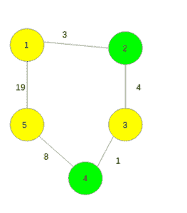
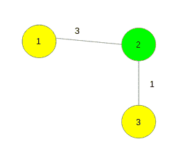

# 求任意一对两个不同的好节点之间的最短距离

> 原文:[https://www . geesforgeks . org/find-任意一对两个不同的好节点之间最短的距离/](https://www.geeksforgeeks.org/find-the-shortest-distance-between-any-pair-of-two-different-good-nodes/)

给定一个有 N 个节点和 M 条边的加权无向连通图。一些节点被标记为良好。任务是找到任意一对两个不同的好节点之间的最短距离。
**注**:以下示例中标记为黄色的节点被认为是*好节点*。

**示例:**

```
Input :
```



```
Output : 7
Explanation : 
Pairs of Good Nodes and distance between them are:
(1 to 3) -> distance: 7, 
(3 to 5) -> distance: 9, 
(1 to 5) -> distance: 16, 
out of which 7 is the minimum.

Input :
```



```
Output : 4
```

**逼近**:让我们从一个算法开始，来解决给定问题的一个更简单的版本，其中所有边的权重都是 1。

*   选择一个随机的好节点，并从这一点执行 BFS，并在第一级停止，说包含另一个好节点。
*   我们知道任意两个好节点之间的最小距离不能超过 **s** 。所以我们再次随机选取一个之前没有选取过的好节点，再次执行 BFS。如果我们在**的**距离内没有发现任何特殊节点，我们将终止搜索。如果我们这样做了，那么我们更新**的**的值，并且用随机获取的一些其他特殊节点重复该过程。

当权重为多个时，我们可以应用类似的算法。

下面是上述方法的实现:

## C++

```
// C++ program to find the shortest pairwise
// distance between any two different good nodes.
#include <bits/stdc++.h>
using namespace std;

#define N 100005
const int MAXI = 99999999;

// Function to add edges
void add_edge(vector<pair<int, int> > gr[], int x,
              int y, int weight)
{
    gr[x].push_back({ y, weight });
    gr[y].push_back({ x, weight });
}

// Function to find the shortest
// distance between any pair of
// two different good nodes
int minDistance(vector<pair<int, int> > gr[], int n,
                int dist[], int vis[], int a[], int k)
{
    // Keeps minimum element on top
    priority_queue<pair<int, int>, vector<pair<int, int> >,
                   greater<pair<int, int> > > q;

    // To keep required answer
    int ans = MAXI;

    for (int i = 1; i <= n; i++) {
        // If it is not good vertex
        if (!a[i])
            continue;

        // Keep all vertices not visited
        // and distance as MAXI
        for (int j = 1; j <= n; j++) {
            dist[j] = MAXI;
            vis[j] = 0;
        }

        // Distance from ith vertex to ith is zero
        dist[i] = 0;

        // Make queue empty
        while (!q.empty())
            q.pop();

        // Push the ith vertex
        q.push({ 0, i });

        // Count the good vertices
        int good = 0;

        while (!q.empty()) {
            // Take the top element
            int v = q.top().second;

            // Remove it
            q.pop();

            // If it is already visited
            if (vis[v])
                continue;
            vis[v] = 1;

            // Count good vertices
            good += a[v];

            // If distance from vth vertex
            // is greater than ans
            if (dist[v] > ans)
                break;

            // If two good vertices are found
            if (good == 2 and a[v]) {
                ans = min(ans, dist[v]);
                break;
            }

            // Go to all adjacent vertices
            for (int j = 0; j < gr[v].size(); j++) {
                int to = gr[v][j].first;
                int weight = gr[v][j].second;

                // if distance is less
                if (dist[v] + weight < dist[to]) {
                    dist[to] = dist[v] + weight;
                    q.push({ dist[to], to });
                }
            }
        }
    }

    // Return the required answer
    return ans;
}

// Driver code
int main()
{
    // Number of vertices and edges
    int n = 5, m = 5;

    vector<pair<int, int> > gr[N];

    // Function call to add edges
    add_edge(gr, 1, 2, 3);
    add_edge(gr, 1, 2, 3);
    add_edge(gr, 2, 3, 4);
    add_edge(gr, 3, 4, 1);
    add_edge(gr, 4, 5, 8);

    // Number of good nodes
    int k = 3;

    int a[N], vis[N], dist[N];

    // To keep good vertices
    a[1] = a[3] = a[5] = 1;

    cout << minDistance(gr, n, dist, vis, a, k);

    return 0;
}
```

## Java 语言(一种计算机语言，尤用于创建网站)

```
// Java program to find the shortest pairwise
// distance between any two different good nodes.
import java.util.ArrayList;
import java.util.Comparator;
import java.util.PriorityQueue;

class GFG{

static class Pair
{
    int first, second;

    public Pair(int first, int second)
    {
        this.first = first;
        this.second = second;
    }

    public Pair()
    {}
}

static final int N = 100005;
static final int MAXI = 99999999;

// Function to add edges
static void add_edge(ArrayList<Pair> gr[],
                     int x, int y, int weight)
{
    gr[x].add(new Pair(y, weight));
    gr[y].add(new Pair(x, weight));
}

// Function to find the shortest
// distance between any pair of
// two different good nodes
static int minDistance(ArrayList<Pair> gr[], int n,
                       int dist[], int vis[],
                       int a[], int k)
{

    // Keeps minimum element on top
    PriorityQueue<Pair> q = new PriorityQueue<>(
        new Comparator<Pair>()
    {
        public int compare(Pair p1, Pair p2)
        {
            if (p1.first == p2.first)
            {
                return p1.second - p2.second;
            }
            return p1.first - p2.first;
        }
    });

    // To keep required answer
    int ans = MAXI;

    for(int i = 1; i <= n; i++)
    {

        // If it is not good vertex
        if (a[i] == 0)
            continue;

        // Keep all vertices not visited
        // and distance as MAXI
        for(int j = 1; j <= n; j++)
        {
            dist[j] = MAXI;
            vis[j] = 0;
        }

        // Distance from ith vertex
        // to ith is zero
        dist[i] = 0;

        // Make queue empty
        while (!q.isEmpty())
            q.poll();

        // Push the ith vertex
        q.add(new Pair(0, i));

        // Count the good vertices
        int good = 0;

        while (!q.isEmpty())
        {

            // Take the top element
            int v = q.peek().second;

            // Remove it
            q.poll();

            // If it is already visited
            if (vis[v] != 0)
                continue;
            vis[v] = 1;

            // Count good vertices
            good += a[v];

            // If distance from vth vertex
            // is greater than ans
            if (dist[v] > ans)
                break;

            // If two good vertices are found
            if (good == 2 && a[v] != 0)
            {
                ans = Math.min(ans, dist[v]);
                break;
            }

            // Go to all adjacent vertices
            for(int j = 0; j < gr[v].size(); j++)
            {
                int to = gr[v].get(j).first;
                int weight = gr[v].get(j).second;

                // If distance is less
                if (dist[v] + weight < dist[to])
                {
                    dist[to] = dist[v] + weight;
                    q.add(new Pair(dist[to], to));
                }
            }
        }
    }

    // Return the required answer
    return ans;
}

// Driver code
public static void main(String[] args)
{

    // Number of vertices and edges
    int n = 5, m = 5;

    @SuppressWarnings("unchecked")
    ArrayList<Pair>[] gr = new ArrayList[N];

    for(int i = 0; i < N; i++)
    {
        gr[i] = new ArrayList<Pair>();
    }

    // Function call to add edges
    add_edge(gr, 1, 2, 3);
    add_edge(gr, 1, 2, 3);
    add_edge(gr, 2, 3, 4);
    add_edge(gr, 3, 4, 1);
    add_edge(gr, 4, 5, 8);

    // Number of good nodes
    int k = 3;

    int[] a = new int[N],
        vis = new int[N],
       dist = new int[N];

    // To keep good vertices
    a[1] = a[3] = a[5] = 1;

    System.out.println(minDistance(
        gr, n, dist, vis, a, k));
}
}

// This code is contributed by sanjeev2552
```

**Output:** 

```
7
```