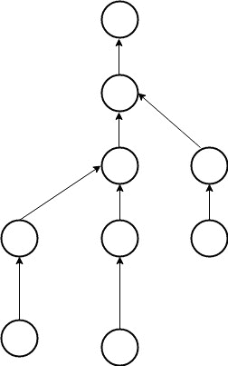

# 意大利面条堆

> 原文:[https://www.geeksforgeeks.org/g-fact-87/](https://www.geeksforgeeks.org/g-fact-87/)

**[意大利面堆栈](http://en.wikipedia.org/wiki/Spaghetti_stack)**
意大利面堆栈是一种 N 元树数据结构，其中子节点有指向父节点的指针(但不是相反)

意大利式堆栈结构用于这样的情况:随着执行的进行，记录被动态地推入并弹出到堆栈中，但对弹出记录的引用仍在使用中。以下是意大利面条堆栈的一些应用。

C 语言等语言的编译器在打开和关闭表示块范围的符号表时会创建一个意大利式堆栈。当一个新的块范围被打开时，一个符号表被推到一个堆栈上。遇到右花括号时，范围关闭，弹出符号表。但是那个符号表被记住了，而不是被销毁了。当然，它还记得它的高级“父”符号表等等。

意大利面条栈也用于实现[不相交集数据结构](http://en.wikipedia.org/wiki/Disjoint-set_data_structure)。

如果你发现任何不正确的地方，或者你想分享更多关于上面讨论的话题的信息，请写评论。

资料来源:[http://en . Wikipedia . org/wiki/spaghetti _ stack](http://en.wikipedia.org/wiki/Spaghetti_stack)