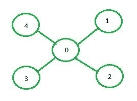

# 使用邻接矩阵实现 BFS

> 原文:[https://www . geeksforgeeks . org/implementation-of-bfs-use-邻接矩阵/](https://www.geeksforgeeks.org/implementation-of-bfs-using-adjacency-matrix/)

广度优先搜索(BFS)已经在[这篇](https://www.geeksforgeeks.org/breadth-first-search-or-bfs-for-a-graph/)文章中讨论过，它使用邻接表来表示图。在本文中，邻接矩阵将用于表示该图。

**邻接矩阵表示:**在图的邻接矩阵表示中，大小为 n*n(其中 n 是顶点数)的矩阵**mat【】【】】**将表示图的边，其中 **mat[i][j] = 1** 表示顶点之间有边 **i** 和 **j** 而 **mat[i][j] = 0** 表示顶点 **i** 之间没有边


下图是上图所示图形的邻接矩阵表示:

```
  0 1 2 3
0 0 1 1 0 
1 1 0 0 1 
2 1 0 0 0 
3 0 1 0 0
```

**示例:**

```
Input: source = 0
```


```
Output: 0 1 2 3

Input: source = 1
```



```
Output:1 0 2 3 4
```

**进场:**

*   创建一个大小为 n*n 的矩阵，其中每个元素都是 0，表示图中没有边。
*   现在，对于顶点 I 和 j 之间的图的每条边，集合 mat[i][j] = 1。
*   创建并填充邻接矩阵后，找到图的 BFS 遍历，如[这篇](https://www.geeksforgeeks.org/breadth-first-search-or-bfs-for-a-graph/)文章所述。

下面是上述方法的实现:

## C++

```
// C++ implementation of the approach
#include<bits/stdc++.h>
using namespace std;

vector<vector<int>> adj;

// function to add edge to the graph
void addEdge(int x,int y)
{
    adj[x][y] = 1;
    adj[y][x] = 1;
}

// Function to perform BFS on the graph
void bfs(int start)
{
    // Visited vector to so that
    // a vertex is not visited more than once
    // Initializing the vector to false as no
    // vertex is visited at the beginning
    vector<bool> visited(adj.size(), false);
    vector<int> q;
    q.push_back(start);

    // Set source as visited
    visited[start] = true;

    int vis;
    while (!q.empty()) {
        vis = q[0];

        // Print the current node
        cout << vis << " ";
        q.erase(q.begin());

        // For every adjacent vertex to the current vertex
        for (int i = 0; i < adj[vis].size(); i++) {
            if (adj[vis][i] == 1 && (!visited[i])) {

                // Push the adjacent node to the queue
                q.push_back(i);

                // Set
                visited[i] = true;
            }
        }
    }
}

// Driver code
int main()
{
  // number of vertices
  int v = 5;

  // adjacency matrix
  adj= vector<vector<int>>(v,vector<int>(v,0));

  addEdge(0,1);
  addEdge(0,2);
  addEdge(1,3);

  // perform bfs on the graph
  bfs(0);
}
```

## Java 语言(一种计算机语言，尤用于创建网站)

```
// Java implementation of the approach
import java.util.ArrayList;
import java.util.Arrays;
import java.util.List;

class GFG{

static class Graph
{

    // Number of vertex
    int v;

    // Number of edges
    int e;

    // Adjacency matrix
    int[][] adj;

    // Function to fill the empty
    // adjacency matrix
    Graph(int v, int e)
    {
        this.v = v;
        this.e = e;

        adj = new int[v][v];
        for(int row = 0; row < v; row++)
            Arrays.fill(adj[row], 0);
    }

    // Function to add an edge to the graph
    void addEdge(int start, int e)
    {

        // Considering a bidirectional edge
        adj[start][e] = 1;
        adj[e][start] = 1;
    }

    // Function to perform BFS on the graph
    void BFS(int start)
    {

        // Visited vector to so that
        // a vertex is not visited more than once
        // Initializing the vector to false as no
        // vertex is visited at the beginning
        boolean[] visited = new boolean[v];
        Arrays.fill(visited, false);
        List<Integer> q = new ArrayList<>();
        q.add(start);

        // Set source as visited
        visited[start] = true;

        int vis;
        while (!q.isEmpty())
        {
            vis = q.get(0);

            // Print the current node
            System.out.print(vis + " ");
            q.remove(q.get(0));

            // For every adjacent vertex to
            // the current vertex
            for(int i = 0; i < v; i++)
            {
                if (adj[vis][i] == 1 && (!visited[i]))
                {

                    // Push the adjacent node to
                    // the queue
                    q.add(i);

                    // Set
                    visited[i] = true;
                }
            }
        }
    }
}

// Driver code
public static void main(String[] args)
{

    int v = 5, e = 4;

    // Create the graph
    Graph G = new Graph(v, e);
    G.addEdge(0, 1);
    G.addEdge(0, 2);
    G.addEdge(1, 3);

    G.BFS(0);
}
}

// This code is contributed by sanjeev2552
```

## 蟒蛇 3

```
# Python3 implementation of the approach
class Graph:

    adj = []

    # Function to fill empty adjacency matrix
    def __init__(self, v, e):

        self.v = v
        self.e = e
        Graph.adj = [[0 for i in range(v)]
                        for j in range(v)]

    # Function to add an edge to the graph
    def addEdge(self, start, e):

        # Considering a bidirectional edge
        Graph.adj[start][e] = 1
        Graph.adj[e][start] = 1

    # Function to perform DFS on the graph
    def BFS(self, start):

        # Visited vector to so that a
        # vertex is not visited more than
        # once Initializing the vector to
        # false as no vertex is visited at
        # the beginning
        visited = [False] * self.v
        q = [start]

        # Set source as visited
        visited[start] = True

        while q:
            vis = q[0]

            # Print current node
            print(vis, end = ' ')
            q.pop(0)

            # For every adjacent vertex to
            # the current vertex
            for i in range(self.v):
                if (Graph.adj[vis][i] == 1 and
                      (not visited[i])):

                    # Push the adjacent node
                    # in the queue
                    q.append(i)

                    # set
                    visited[i] = True

# Driver code
v, e = 5, 4

# Create the graph
G = Graph(v, e)
G.addEdge(0, 1)
G.addEdge(0, 2)
G.addEdge(1, 3)

# Perform BFS
G.BFS(0)

# This code is contributed by ng24_7
```

**Output:** 

```
0 1 2 3
```

**时间复杂度:**O(N * N)
T3】辅助空间: O(N)