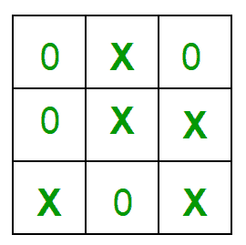
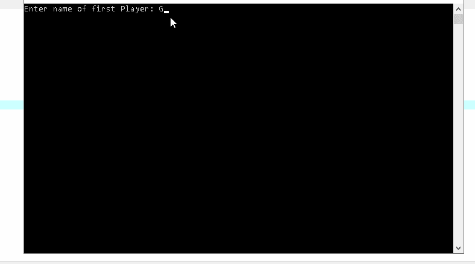

# 实现 2 人游戏井字游戏(用户对用户)

> 原文:[https://www . geesforgeks . org/implementation-of-TIC-tac-toe-for-person-game-user-vs-user/](https://www.geeksforgeeks.org/implementation-of-tic-tac-toe-for-2-person-game-user-vs-user/)

单人游戏(用户对 CPU)请参考井字游戏的[实现](https://www.geeksforgeeks.org/implementation-of-tic-tac-toe-game/)

**游戏规则**

*   游戏将在两个人之间进行(在这个程序中是人类对人类)。
*   首先，游戏将把两个玩家的名字作为输入。
*   其中一个玩家选择“O”，另一个选择“X”来标记他们各自的细胞。
*   将会有一个游戏抛硬币，决定哪个玩家先走。
*   游戏从其中一个玩家开始，当其中一个玩家有一整行/一列/一条对角线填充了他/她各自的角色(“O”或“X”)时，游戏结束。
*   如果游戏是平局，则显示消息“游戏是平局”。



**获胜策略——一个有趣的事实**
如果双方都打得很好，那么你注定永远不会输(“尽管比赛仍然可以平局”)。打第一还是第二不重要。换句话说——“两个高手总会打平”。
这不是很有意思吗？

下面是游戏的代码:

## C++

```
// C++ program to play Tic-Tac-Toe
#include <bits/stdc++.h>
using namespace std;

// Length of the board
#define SIDE 3

// Name fo the players
string PLAYER1, PLAYER2;

// Function to show the current
// board status
void showBoard(char board[][SIDE])
{
    printf("\n\n");

    printf("\t\t\t %c | %c | %c \n",
           board[0][0],
           board[0][1],
           board[0][2]);

    printf("\t\t\t------------\n");

    printf("\t\t\t %c | %c | %c \n",
           board[1][0],
           board[1][1],
           board[1][2]);

    printf("\t\t\t------------\n");
    printf("\t\t\t %c | %c | %c \n\n",
           board[2][0],
           board[2][1],
           board[2][2]);

    return;
}

// Function to show the instructions
void showInstructions()
{
    printf("\t\t\t Tic-Tac-Toe\n\n");

    printf("Choose a cell numbered "
           "from 1 to 9 as below"
           " and play\n\n");

    printf("\t\t\t 1 | 2 | 3 \n");
    printf("\t\t\t------------\n");
    printf("\t\t\t 4 | 5 | 6 \n");
    printf("\t\t\t------------\n");
    printf("\t\t\t 7 | 8 | 9 \n\n");

    printf("-\t-\t-\t-\t-\t"
           "-\t-\t-\t-\t-\n\n");

    return;
}

// Function to initialise the game
void initialise(char board[][SIDE],
                int moves[])
{
    // Initiate the random number
    // generator so that the same
    // configuration doesn't arises
    srand(time(NULL));

    // Initially the board is empty
    for (int i = 0; i < SIDE; i++) {
        for (int j = 0; j < SIDE; j++)
            board[i][j] = ' ';
    }

    // Fill the moves with numbers
    for (int i = 0; i < SIDE * SIDE; i++)
        moves[i] = i;

    // randomise the moves
    random_shuffle(moves,
                   moves + SIDE * SIDE);

    return;
}

// Function to declare winner of the game
void declareWinner(string whoseTurn)
{
    if (whoseTurn == PLAYER1)
        cout << PLAYER1 << " has won\n";
    else
        cout << PLAYER1 << " has won\n";
    return;
}

// Function that returns true if
// any of the row is crossed with
// the same player's move
bool rowCrossed(char board[][SIDE])
{
    for (int i = 0; i < SIDE; i++) {
        if (board[i][0] == board[i][1]
            && board[i][1] == board[i][2]
            && board[i][0] != ' ')
            return (true);
    }
    return (false);
}

// Function that returns true if any
// of the column is crossed with the
// same player's move
bool columnCrossed(char board[][SIDE])
{
    for (int i = 0; i < SIDE; i++) {
        if (board[0][i] == board[1][i]
            && board[1][i] == board[2][i]
            && board[0][i] != ' ')
            return (true);
    }
    return (false);
}

// Function that returns true if any
// of the diagonal is crossed with
// the same player's move
bool diagonalCrossed(char board[][SIDE])
{
    if (board[0][0] == board[1][1]
        && board[1][1] == board[2][2]
        && board[0][0] != ' ')
        return (true);

    if (board[0][2] == board[1][1]
        && board[1][1] == board[2][0]
        && board[0][2] != ' ')
        return (true);

    return (false);
}

// Function that returns true if the
// game is over else it returns a false
bool gameOver(char board[][SIDE])
{
    return (rowCrossed(board)
            || columnCrossed(board)
            || diagonalCrossed(board));
}

// Function to play Tic-Tac-Toe
void playTicTacToe(string whoseTurn)
{
    // A 3*3 Tic-Tac-Toe board for playing
    char board[SIDE][SIDE];

    int moves[SIDE * SIDE];

    // Initialise the game
    initialise(board, moves);

    // Show instructions before playing
    showInstructions();

    int moveIndex = 0, x, y;
    int r, c;

    // Keep playing till the game is
    // over or it is a draw
    while (gameOver(board) == false
           && moveIndex != SIDE * SIDE) {
        if (whoseTurn == PLAYER1) {

        // Label for player1 wrong choice
        // of row and column
        player1:

            // Input the desired row and
            // column by player 1 to
            // insert X
            cout << PLAYER1
                 << " Enter the respective"
                 << " row and column to "
                    "insert X :\n";
            cin >> r >> c;

            if (r <= 3 && c <= 3) {

                // To check desired row and
                // column should be empty
                if (board[r - 1] == ' ')
                    board[r - 1] = 'X';

                // If input is on already
                // filled position
                else {
                    cout << "You cannot Overlap"
                         << " on Already "
                            "filled position:\n";
                    goto player1;
                }
            }

            // Input is not valid
            else {
                cout << "\nInput is not "
                     << "valid please enter "
                     << "right one\n";

                goto player1;
            }

            showBoard(board);
            moveIndex++;
            whoseTurn = PLAYER2;
        }

        else if (whoseTurn == PLAYER2) {

        // Label for player2 wrong choice
        // of row and column
        player2:

            // Input the desired row and
            // column by player 1 to
            // insert X
            cout << PLAYER2
                 << " Enter the respective"
                 << " row and column to "
                    "insert O :";
            cin >> r >> c;
            if (r <= 3 && c <= 3) {

                // Input the desired row and
                // column by player 1 to
                // insert X
                if (board[r - 1] == ' ')
                    board[r - 1] = 'O';

                // If input is on already
                // filled position
                else {
                    cout << "You cannot Overlap"
                         << " on Already "
                         << "filled position:\n";
                    goto player2;
                }
            }

            // Input is not valid
            else {
                cout << "\nInput is not "
                     << "valid please enter "
                     << "right one :\n";
                goto player2;
            }

            showBoard(board);
            moveIndex++;
            whoseTurn = PLAYER1;
        }
    }

    // If the game has drawn
    if (gameOver(board) == false
        && moveIndex == SIDE * SIDE)
        printf("It's a draw\n");
    else {

        // Toggling the user to declare
        // the actual winner
        if (whoseTurn == PLAYER1)
            whoseTurn = PLAYER2;
        else if (whoseTurn == PLAYER2)
            whoseTurn = PLAYER1;

        // Declare the winner
        declareWinner(whoseTurn);
    }
    return;
}

// Driver Code
int main()
{
    // Take the name of players
    cout << "Enter name of first Player: ";
    cin >> PLAYER1;

    cout << "Enter name of Second Player: ";
    cin >> PLAYER2;

    // Use current time as seed for
    // random generator
    srand(time(0));

    // Lets do toss
    int toss = rand() % 2;

    // Let us play the game
    if (toss == 1) {
        cout << "Player "
             << PLAYER1
             << " win the toss"
             << endl;

        playTicTacToe(PLAYER1);
    }
    else {
        cout << "Player "
             << PLAYER2
             << " win the toss"
             << endl;
        playTicTacToe(PLAYER2);
    }

    return (0);
}
```

**输出:**
下面是上面代码的输出:

