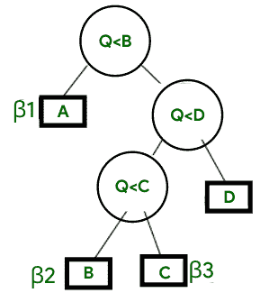

# Hu-Tucker 算法介绍

> 原文:[https://www . geesforgeks . org/introduction-of-Hu-tucker-algorithm/](https://www.geeksforgeeks.org/introduction-of-hu-tucker-algorithm/)

**Hu-Tucker 算法介绍:**
Hu-Tucker 算法有助于压缩一些顺序的块，假设你对下面的有一定的自然顺序，那么如果把字符串和音符都考虑进去，那么把它们考虑进去，它们是按数字排序的。
现在出现的问题是，我们如何构建顺序，使压缩完美匹配，同时仍然保持相同的代码，而不改变字符串的性质，即它们的顺序。
Eg–“极客的极客”仍然是**“极客的极客**”而不是“极客的极客”的“T9”。

因此，我们在压缩东西的时候也需要保持顺序，因此将字符串排序为数字是正确的方法。
为了解决所有这些问题，我们有一个简单的算法，叫做 Hu-Tuker，它有助于获得准确的结果，即使它已经很老了。

**理解 Hu-Tucker :**
该算法被分为 3 个不同的阶段，然后交替评估每个方法的时间复杂度。之后，进行审判，然后根据复杂性收费的数额进行辩护。在所有 3 个阶段中，有 2 个独立的方法，分别采用 O(n <sup>2</sup> )和 O(nlogn)复杂度。
因此，正如有些人可能会说的那样，分割线或区分线将是从它们导出的抽象关系。
然后在编号之后，解码和编码过程由算法本身负责，就在键入值之后！

> 胡-塔克码是字母搜索树的二进制代码。

让我们看一棵树来更好地学习它:



胡塔克树。

如上图所示，**通过 1，**我们从树中看到，某些字符串(分类为 Beta)以固定的长度存储某些值，这是我们在上面提到的。现在，在超时运行这些转换之后，它们对于算法来说变弱了，因此最终被压缩了。此外，当我们添加数字时，我们可以放心，订单将是完美的！

之后是**关 2，**取最常出现的字符，进行相应分组，然后压缩再解压缩，这样占用的存储空间就少了，因为现在频繁出现的字符都分组了！

虽然这种算法对于使用来说相当古老，但据说压缩的经典本质就是由此而来的。此外，与其他方法相比，使用这种方法仍有一定的优势，因为这种方法的延迟和压缩下降非常少。我们现在将看到一个简短清晰的 Hu-Tucker 算法示例，以更好地理解使用特定节点和字母符号的学习曲线。

**实现 Hu Tucker 的算法如下:**

```
1\. 'terminal' label node 0, ... n-1
2\. Repeat repetitions (n - 1):
    (a) find a pair I j) to be I I < j; 
    (ii) node I or j is not labelled "none" and
    (iii) no node (i+1, etc.)
    (iv) weight[i] + weight[j] is minimal, 
    (v) I is not unique after (iv) and (v) 
3\. j is minimal if not unique following the selection process. 
    (a) Mix node j and 
    (b)save node j as new node I 
    (c) Weight[i]+= Weight[j] Weight[i] Weight
    (d) Node I 'interior' 
    (e) Node I 'not' Label node
```

**Hu-Tucker 的应用:**
让我们来看看 Hu-Tucker 算法的两个应用，以便更好地理解。

1.  **实现搜索:**
    由于 Hu Tucker 是一种压缩和模式发现算法，它可以用于在数据库中搜索模式，因为它使用树结构，并且所有搜索技术都尽可能广泛地使用二分搜索法。
    **示例:**
    让我们将树的边数表示为“I”，它是另一组元素的子集，例如 I∞{ 1，2，...。。。，n}，然后使用 Hu-Tucker 算法，我们可以找到给定集合中的权重，并可以产生搜索结果。
2.  **最小化成本函数:**
    从上往下，Hu-Tucker 算法也是一种压缩技术，因此有助于找出最小成本函数计算。

用于最小化的**公式为:**

```
La(w,l) , loga∑
Xn
i=1
w(i)a
l(i)
```

**Hu-Tucker 的缺点:**
尽管 Hu-Tucker 算法是一个简洁而深刻的算法，但它仍然像所有其他算法一样，存在缺点和失败的地方。该算法有些奇怪，因为它依赖于许多其他信息，而这些信息有时是不提供的。像上面的**应用程序 2** 一样，对数函数需要太多的数据，这通常不是现代压缩算法的要求。此外，由于该算法已经老化，与此相比，更新的算法提出了更好且更少的时间复杂度，因此感觉有点过时和不如它们！

**结论:**
这是关于 Hu-塔克算法的简短介绍。希望这篇文章能帮助你理解这篇文章的简介，并帮助你铺平前进的道路！