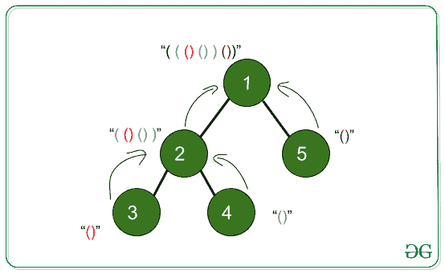

# N 元树中的

# 同构

> 原文： [https://www.geeksforgeeks.org/isomorphism-in-n-ary-trees/](https://www.geeksforgeeks.org/isomorphism-in-n-ary-trees/)

给定两个 [N 元树](https://www.geeksforgeeks.org/generic-treesn-array-trees/)，每个树`M`个节点。 同样，分别给定它们的边和根。 任务是检查它们是否为[同构树](https://www.geeksforgeeks.org/tree-isomorphism-problem/)。 如果两个树都是同构的，则打印**“是”** ，否则打印**“否”** 。

**示例**：

> **输入**：M = 9，树 1 的根节点：1，树 2 的根节点：3
> 树 1 的边：{（1、3），（3、4） ，（3，5），（1，8），（8，9），（1，2），（2，6），（2，7）}
> 树 2 的边：{（3， 1），（1、2），（1、5），（3、6），（6、7），（3、4），（4、8），（4、9）}
>  
> **输出**：`Yes`
> 
> **输入**：M = 9，树 1 的根节点：6，树 2 的根节点：7
> 树 1 的边：{（1、3），（1、2） ，（1，8），（3，4），（3，5），（8，9），（2，6），（2，7）}
> 树 2 的边：{（1， 2），（1、5），（3、1），（3、4），（4、8），（4、9），（6、3），（7、6）}
>  
> **输出**：`No`

**方法**：

这个想法是找出两棵树的规范形式并进行比较。 叶节点将**“（）”** 返回到其后续的更高级别。

以下是显示查找规范形式的过程的示例。



下面是上述方法的实现：

```

// C++ program for the above approach 
#include <bits/stdc++.h> 
using namespace std; 

// To create N-ary tree 
map<int, vector<int> > tree; 

// Function which will accept the root 
// of the tree and its parent (which 
// is initially "-1") and will return 
// the canonical form of the tree 
string ConvertCanonical(int vertex, 
                        int parent) 
{ 
    // In this string vector we will 
    // store canonical form of out 
    // current node and its subtree 
    vector<string> child; 

    // Loop to the neighbours of 
    // current vertex 
    for (auto neighbour : tree[vertex]) { 

        // This is to prevent us from 
        // visiting the parent again 
        if (neighbour == parent) 
            continue; 

        // DFS call neighbour of our 
        // current vertex & it will 
        // pushback the subtree-structure 
        // of this neighbour into our 
        // child vector. 
        child.push_back(ConvertCanonical( 
            neighbour, vertex)); 
    } 

    // These opening and closing 
    // brackets are for the 
    // current node 
    string str = "("; 

    // Sorting function will re-order 
    // the structure of subtree of 
    // the current vertex in a 
    // shortest-subtree-first manner. 
    // Hence we can 
    // now compare the two tree 
    // structures effectively 
    sort(child.begin(), child.end()); 

    for (auto j : child) 
        str += j; 

    // Append the subtree structure 
    // and enclose it with "(" <subtree> 
    // ")" the opening and closing 
    // brackets of current vertex 
    str += ")"; 

    // return the subtree-structure 
    // of our Current vertex 
    return str; 
} 

// Function to add edges 
void addedge(int a, int b) 
{ 
    tree[a].push_back(b); 
    tree[b].push_back(a); 
} 

// Driver code 
int main() 
{ 
    // Given N-ary Tree 1 
    addedge(1, 3); 
    addedge(1, 2); 
    addedge(1, 5); 
    addedge(3, 4); 
    addedge(4, 8); 
    addedge(4, 9); 
    addedge(3, 6); 
    addedge(6, 7); 

    // Function Call to convert Tree 1 
    // into canonical with 3 is the root 
    // and the parent of root be "-1" 
    string tree1 = ConvertCanonical(3, -1); 

    // Clearing our current tree 
    // before taking input of 
    // next tree 
    tree.clear(); 

    // Given N-ary Tree 2 
    addedge(1, 3); 
    addedge(3, 4); 
    addedge(3, 5); 
    addedge(1, 8); 
    addedge(8, 9); 
    addedge(1, 2); 
    addedge(2, 6); 
    addedge(2, 7); 

    // Function Call to convert Tree 2 
    // into canonical 
    string tree2 = ConvertCanonical(1, -1); 

    // Check if canonical form of both 
    // tree are equal or not 
    if (tree1 == tree2) 
        cout << "YES" << endl; 
    else
        cout << "NO" << endl; 

    return 0; 
} 

```

**Output:**

```
YES
```

**时间复杂度**：*O（E * log（E））*，其中 E 是边数。


* * *

* * *

如果您喜欢 GeeksforGeeks 并希望做出贡献，则还可以使用 [tribution.geeksforgeeks.org](https://contribute.geeksforgeeks.org/) 撰写文章，或将您的文章邮寄至 tribution@geeksforgeeks.org。 查看您的文章出现在 GeeksforGeeks 主页上，并帮助其他 Geeks。

如果您发现任何不正确的地方，请单击下面的“改进文章”按钮，以改进本文。