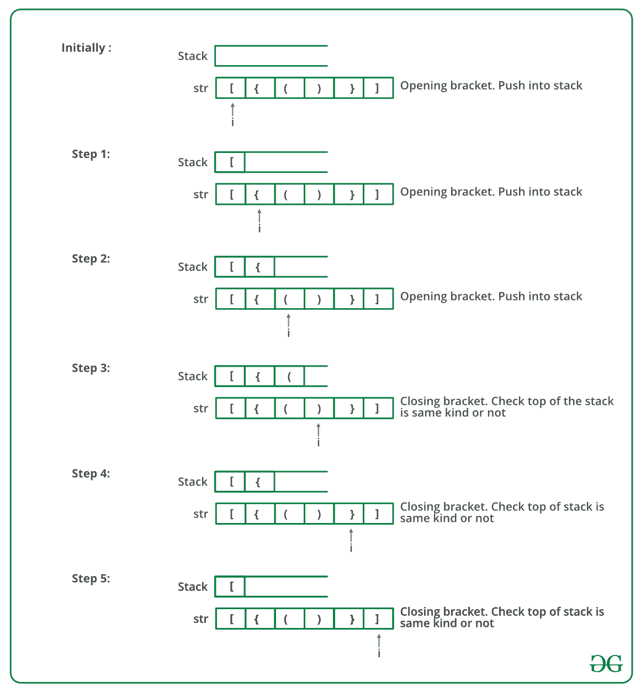

# 使用堆栈检查表达式中平衡括号的 Java 程序(良好形式)

> 原文:[https://www . geeksforgeeks . org/Java-程序-检查表达式中的平衡括号-良好格式-使用堆栈/](https://www.geeksforgeeks.org/java-program-to-check-for-balanced-brackets-in-an-expression-well-formedness-using-stack/)

给定一个表达式字符串 exp，编写一个程序来检查“{”、“}”、“(”、“”、“[”、“]”的对和顺序在 exp 中是否正确。

**例**:

> **输入**:exp = "[()]{ } {[()]()} "
> T3】输出:平衡
> 
> **输入** : exp = "[(])"
> **输出**:不平衡


**算法:**

*   声明一个字符[栈](https://www.geeksforgeeks.org/stack-data-structure/) S。
*   现在遍历表达式字符串 exp。
    1.  如果当前字符是一个起始括号(**)(“或”“”或“[”**)，那么将其推入堆栈。
    2.  如果当前字符是结束括号(**')'或' } '或']'** )，则从堆栈中弹出，如果弹出的字符是匹配的开始括号，则精细否则括号不平衡。
*   完成遍历后，如果堆栈中还有一些起始括号，那么“不平衡”

下图是上述方法的模拟运行:



下面是上述方法的实现:

## Java 语言(一种计算机语言，尤用于创建网站)

```
// Java program for checking
// balanced brackets
import java.util.*;

public class BalancedBrackets {

    // function to check if brackets are balanced
    static boolean areBracketsBalanced(String expr)
    {
        // Using ArrayDeque is faster than using Stack class
        Deque<Character> stack
            = new ArrayDeque<Character>();

        // Traversing the Expression
        for (int i = 0; i < expr.length(); i++) 
        {
            char x = expr.charAt(i);

            if (x == '(' || x == '[' || x == '{') 
            {
                // Push the element in the stack
                stack.push(x);
                continue;
            }

            // If current character is not opening
            // bracket, then it must be closing. So stack
            // cannot be empty at this point.
            if (stack.isEmpty())
                return false;
            char check;
            switch (x) {
            case ')':
                check = stack.pop();
                if (check == '{' || check == '[')
                    return false;
                break;

            case '}':
                check = stack.pop();
                if (check == '(' || check == '[')
                    return false;
                break;

            case ']':
                check = stack.pop();
                if (check == '(' || check == '{')
                    return false;
                break;
            }
        }

        // Check Empty Stack
        return (stack.isEmpty());
    }

    // Driver code
    public static void main(String[] args)
    {
        String expr = "([{}])";

        // Function call
        if (areBracketsBalanced(expr))
            System.out.println("Balanced ");
        else
            System.out.println("Not Balanced ");
    }
}
```

**Output**

```
Balanced
```

**时间复杂度:**O(n)
T3】辅助空间: O(n)为叠加。

更多详细信息，请参考完整文章[使用堆栈](https://www.geeksforgeeks.org/check-for-balanced-parentheses-in-an-expression/)检查表达式中的平衡括号(格式是否正确)！