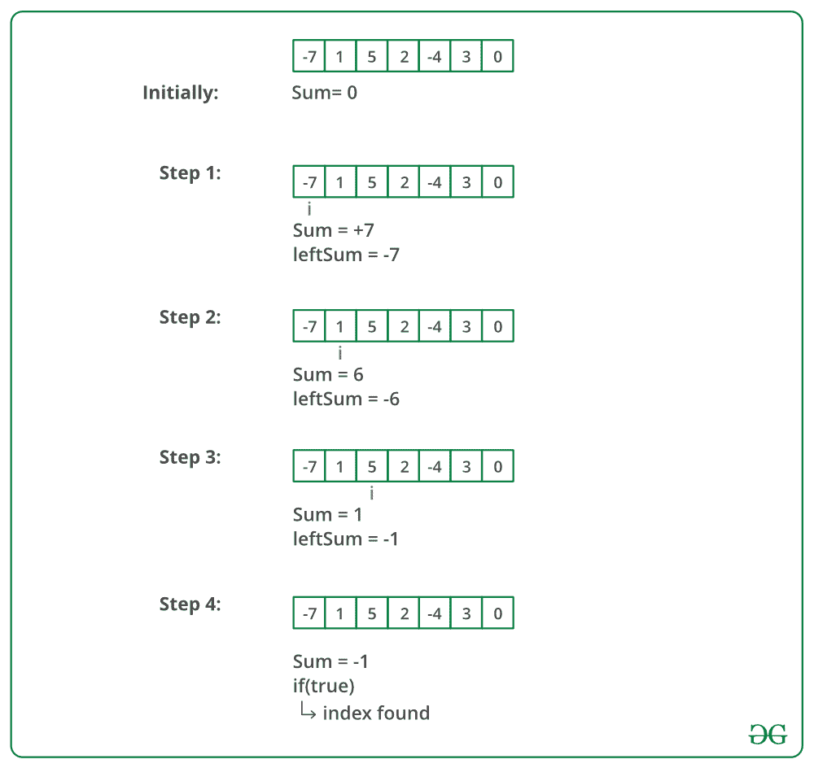

# 数组平衡索引的 Javascript 程序

> 原文:[https://www . geeksforgeeks . org/JavaScript-平衡程序-数组索引/](https://www.geeksforgeeks.org/javascript-program-for-equilibrium-index-of-an-array/)

数组的平衡索引是这样一种索引，即较低索引处的元素之和等于较高索引处的元素之和。例如，在数组 A 中:

**示例:**

> **输入** : A[] = {-7，1，5，2，-4，3，0}
> 输出 : 3
> 3 是均衡指标，因为:
> A[0]+A[1]+A[2]= A[4]+A[5]+A[6]
> 
> **输入** : A[] = {1，2，3}
> **输出** : -1

写一个函数*int balance(int[]arr，int n)*；给定大小为 n 的序列 arr[,返回一个平衡指数(如果有的话),如果不存在平衡指数，则返回-1。

**方法 1(简单但低效)**
使用两个循环。外循环遍历所有元素，内循环找出外循环选择的当前索引是否为平衡索引。这个解决方案的时间复杂度是 O(n^2).

## java 描述语言

```
<script>
// JavaScript Program to find equilibrium
// index of an array
function equilibrium(arr, n)
{
         var i, j;
         var leftsum, rightsum;

         /*Check for indexes one by one until 
         an equilibrium index is found*/
         for(i = 0; i < n; ++i)
         {

             /*get left sum*/
             leftsum = 0;
              for(let j = 0; j < i; j++)
              leftsum += arr[j];

              /*get right sum*/
              rightsum = 0;
              for(let j = i + 1; j < n; j++)
              rightsum += arr[j];

              /*if leftsum and rightsum are same,
              then we are done*/
              if(leftsum == rightsum)
                 return i;
         }

         /* return -1 if no equilibrium index is found*/
            return -1;
}
     // Driver code

     var arr = new Array(-7,1,5,2,-4,3,0);
     n = arr.length;
      document.write(equilibrium(arr,n));

// This code is contributed by simranarora5sos  
</script>
```

**Output**

```
3
```

**时间复杂度:** O(n^2)

**方法二(刁钻高效)**
思路是先得到阵的总和。然后迭代数组并不断更新初始化为零的左和。在循环中，我们可以通过逐个减去元素得到正确的和。感谢 Sambasiva 提出了这个解决方案，并为此提供了代码。

```
1) Initialize leftsum  as 0
2) Get the total sum of the array as *sum*
3) Iterate through the array and for each index i, do following.
    a)  Update *sum* to get the right sum.  
           *sum* = *sum* - arr[i] 
       // *sum* is now right sum
    b) If leftsum is equal to *sum*, then return current index. 
       // update leftsum for next iteration.
    c) leftsum = leftsum + arr[i]
4) return -1 
// If we come out of loop without returning then
// there is no equilibrium index
```

下图显示了上述方法的试运行:



下面是上述方法的实现:

## java 描述语言

```
<script>
// program to find equilibrium
// index of an array
 function equilibrium(arr, n)
{
    sum = 0; // initialize sum of whole array
    leftsum = 0; // initialize leftsum

    /* Find sum of the whole array */
    for (let i = 0; i < n; ++i)
        sum += arr[i];

    for (let i = 0; i < n; ++i)
    {
        sum -= arr[i]; // sum is now right sum for index i

        if (leftsum == sum)
            return i;

        leftsum += arr[i];
    }

    /* If no equilibrium index found, then return 0 */
    return -1;
}

// Driver code

arr =new Array(-7, 1, 5, 2, -4, 3, 0);
n=arr.length;
document.write("First equilibrium index is " + equilibrium(arr, n));

// This code is contributed by simranarora5sos
</script>
```

**Output**

```
First equilibrium index is 3
```

**产量:**
第一均衡指数为 3

**时间复杂度:** O(n)

**方法 3 :**

这是一个非常简单直接的方法。想法是取数组的前缀和两次。一个来自阵列前端，另一个来自阵列后端。

在获取两个前缀和之后，运行一个循环并检查一些 I，如果一个数组的两个前缀和等于第二个数组的前缀和，那么该点可以被认为是平衡点。

## java 描述语言

```
<script>
// Program to find equilibrium index of an array
 function equilibrium(a, n)
{
    if (n == 1)
        return (0);
    var forward = new Array(0);
    var rev = new Array(0);

    // Taking the prefixsum from front end array
    for (let i = 0; i < n; i++) {
        if (i) {
            forward[i] = forward[i - 1] + a[i];
        }
        else {
            forward[i] = a[i];
        }
    }

    // Taking the prefixsum from back end of array
    for (let i = n - 1; i > 0; i--) {
        if (i <= n - 2) {
            rev[i] = rev[i + 1] + a[i];
        }
        else {
            rev[i] = a[i];
        }
    }

    // Checking if forward prefix sum
    // is equal to rev prefix
    // sum
    for (let i = 0; i < n; i++) {
        if (forward[i] == rev[i]) {
            return i;
        }
    }
    return -1;

    // If You want all the points
    // of equilibrium create
    // vector and push all equilibrium
    // points in it and
    // return the vector
}

// Driver code
    arr = new Array(-7, 1, 5, 2, -4, 3, 0);
    n = arr.length;
    document.write("First Point of equilibrium is at index "
         + equilibrium(arr, n) + "
");

// This code is contributed by simranarora5sos
</script>
```

**Output**

```
First Point of equilibrium is at index 3
```

**时间复杂度:** O(N)

**空间复杂度:** O(N)

更多详情请参考完整文章[数组平衡指数](https://www.geeksforgeeks.org/equilibrium-index-of-an-array/)！