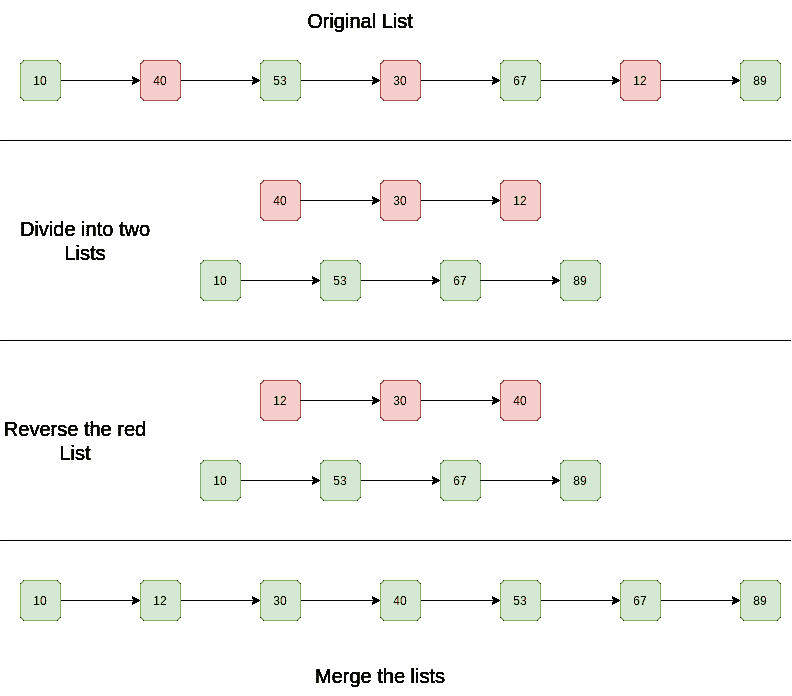

# 用于对以交替升序和降序排序的链表进行排序的 Javascript 程序

> 原文:[https://www . geesforgeks . org/JavaScript-排序程序-链接列表-排序-交替-升序和降序/](https://www.geeksforgeeks.org/javascript-program-for-sorting-a-linked-list-that-is-sorted-alternating-ascending-and-descending-orders/)

给定一个链表。链表是以交替的升序和降序排列的。高效地对列表进行排序。

**示例:**

```
Input List: 10 -> 40 -> 53 -> 30 -> 67 -> 12 -> 89 -> NULL
Output List: 10 -> 12 -> 30 -> 40 -> 53 -> 67 -> 89 -> NULL

Input List: 1 -> 4 -> 3 -> 2 -> 5 -> NULL
Output List: 1 -> 2 -> 3 -> 4 -> 5 -> NULL
```

**简单解决方案:**

**方法:**基本思路是应用于链表上的合并排序。
本文讨论实现:[链表合并排序](https://www.geeksforgeeks.org/merge-sort-for-linked-list/)。

**复杂度分析:**

*   **时间复杂度:**链表的合并排序需要 O(n log n)时间。在合并排序树中，高度是 log n。对每个级别进行排序将花费 O(n)个时间。所以时间复杂度为 O(n ^ log n)。
*   **辅助空间:** O(n log n)，在合并排序树中高度为 log n，存储每一级将占用 O(n)空间。所以空间复杂度为 O(n ^ log n)。

**高效解决方案:**
**进场:**

1.  分开两个列表。
2.  以降序颠倒顺序
3.  合并两个列表。

**图示:**



以下是上述算法的实现:

## java 描述语言

```
<script>
// Javascript program to sort a
// linked list that is alternatively
// sorted in increasing and decreasing order

// head of list
var head;

// Linked list Node
class Node
{
    constructor(val)
    {
        this.data = val;
        this.next = null;
    }
}

function newNode(key)
{
    return new Node(key);
}

/* This is the main function that
   sorts the linked list. */
function sort()
{
    /* Create 2 dummy nodes and initialise
       as heads of linked lists */
    var Ahead = new Node(0),
        Dhead = new Node(0);

    // Split the list into lists
    splitList(Ahead, Dhead);

    Ahead = Ahead.next;
    Dhead = Dhead.next;

    // Reverse the descending list
    Dhead = reverseList(Dhead);

    // Merge the 2 linked lists
    head = mergeList(Ahead, Dhead);
}

// Function to reverse the linked list
function reverseList(Dhead)
{
    var current = Dhead;
    var prev = null;
    var next;
    while (current != null)
    {
        next = current.next;
        current.next = prev;
        prev = current;
        current = next;
    }
    Dhead = prev;
    return Dhead;
}

// Function to print linked list
function printList()
{
    var temp = head;
    while (temp != null)
    {
        document.write(temp.data + " ");
        temp = temp.next;
    }
    document.write();
}

// A utility function to merge
// two sorted linked lists
function mergeList(head1, head2)
{
    // Base cases
    if (head1 == null)
        return head2;
    if (head2 == null)
        return head1;

    var temp = null;
    if (head1.data < head2.data)
    {
        temp = head1;
        head1.next = mergeList(head1.next, head2);
    }
    else
    {
        temp = head2;
        head2.next = mergeList(head1, head2.next);
    }
    return temp;
}

// This function alternatively splits
// a linked list with head as head into two:
// For example, 10->20->30->15->40->7 is
// splitted into 10->30->40 and 20->15->7
// "Ahead" is reference to head of ascending
// linked list
// "Dhead" is reference to head of descending
// linked list
function splitList(Ahead, Dhead)
{
    var ascn = Ahead;
    var dscn = Dhead;
    var curr = head;

    // Link alternate nodes
    while (curr != null)
    {
        // Link alternate nodes in
        // ascending order
        ascn.next = curr;
        ascn = ascn.next;
        curr = curr.next;

        if (curr != null)
        {
            dscn.next = curr;
            dscn = dscn.next;
            curr = curr.next;
        }
    }
    ascn.next = null;
    dscn.next = null;
}

// Driver code
head = newNode(10);
head.next = newNode(40);
head.next.next = newNode(53);
head.next.next.next =
newNode(30);
head.next.next.next.next =
newNode(67);
head.next.next.next.next.next =
newNode(12);
head.next.next.next.next.next.next =
newNode(89);
document.write("Given linked list<br/>");
printList();

sort();

document.write("<br/>Sorted linked list<br/>");
printList();
// This code contributed by aashish1995
</script>
```

**输出:**

```
Given Linked List is
10 40 53 30 67 12 89
Sorted Linked List is
10 12 30 40 53 67 89
```

**复杂度分析:**

*   **时间复杂度:** O(n)。
    需要一次遍历来分离列表并反转它们。排序列表的合并需要 O(n)个时间。
*   **辅助空间:** O(1)。
    不需要额外空间。

请参考[整篇文章，排序一个升序和降序交替排序的链表？](https://www.geeksforgeeks.org/how-to-sort-a-linked-list-that-is-sorted-alternating-ascending-and-descending-orders/)了解更多详情！