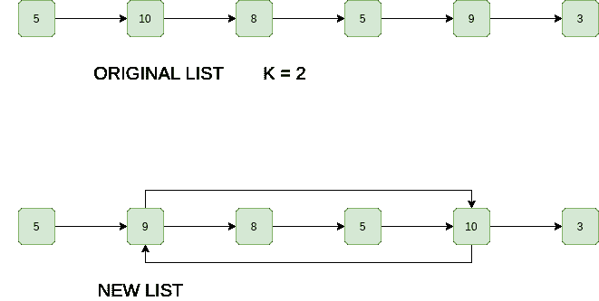

# 用于在链表中从开始到结束交换第 k 个节点的 Javascript 程序

> 原文:[https://www . geesforgeks . org/JavaScript-program-for-swapping-kth-node-from-from-kth-node-from-end-in-a-link-list/](https://www.geeksforgeeks.org/javascript-program-for-swapping-kth-node-from-beginning-with-kth-node-from-end-in-a-linked-list/)

给定一个单链表，从开始交换第 k 个节点，从结束交换第 k 个节点。**不允许数据交换，只应更改指针。**在链表数据部分很大的许多情况下，这个要求可能是合乎逻辑的(例如，学生详细信息行名称、行号、地址，..等等)。指针总是固定的(大多数编译器为 4 字节)。
T3】例:

```
Input: 1 -> 2 -> 3 -> 4 -> 5, K = 2
Output: 1 -> 4 -> 3 -> 2 -> 5 
Explanation: The 2nd node from 1st is 2 and 
2nd node from last is 4, so swap them.

Input: 1 -> 2 -> 3 -> 4 -> 5, K = 5
Output: 5 -> 2 -> 3 -> 4 -> 1 
Explanation: The 5th node from 1st is 5 and 
5th node from last is 1, so swap them.
```

插图:



**方法:**思路很简单，从开始找第 k 个节点，最后第 k 个节点从开始就是第 n-k+1 个节点。交换两个节点。
*不过也有一些角落案例，必须要处理*

1.  y 紧挨着 X
2.  x 紧挨着 Y
3.  x 和 Y 是一样的
4.  x 和 Y 不存在(k 大于链表中的节点数)

下面是上述方法的实现。

## java 描述语言

```
<script>
// A javascript program to swap kth
// node from the beginning with
// kth node from the end
class Node 
{
    constructor(val) 
    {
        this.data = val;
        this.next = null;
    }
}

var head;

/* Utility function to insert a node 
   at the beginning */
function push(new_data) 
{
    new_node = new Node(new_data);
    new_node.next = head;
    head = new_node;
}

/* Utility function for displaying 
   linked list */
function printList()
{
    node = head;
    while (node != null) 
    {
         document.write(node.data + " ");
         node = node.next;
    }
    document.write("");
}

/* Utility function for calculating length 
   of linked list */
function countNodes() 
{
    var count = 0;
    s = head;
    while (s != null)
    {
        count++;
        s = s.next;
    }
    return count;
}

/* Function for swapping kth nodes from 
   both ends of linked list */
function swapKth(k)
{
    // Count nodes in linked list
    var n = countNodes();

    // Check if k is valid
    if (n < k)
        return;

    // If x (kth node from start) and
    // y(kth node from end) are same
    if (2 * k - 1 == n)
        return;

    // Find the kth node from beginning 
    // of linked list. We also find previous 
    // of kth node because we need to update 
    // next pointer of the previous.
    x = head;
    x_prev = null;
    for (i = 1; i < k; i++)
    {
        x_prev = x;
        x = x.next;
    }

    // Similarly, find the kth node from end 
    // and its previous. kth node from end 
    // is (n-k+1)th node from beginning
    y = head;
    y_prev = null;
    for (i = 1; i < n - k + 1; i++)
    {
        y_prev = y;
        y = y.next;
     }

     // If x_prev exists, then new next of it 
     // will be y. Consider the case when y->next 
     // is x, in this case, x_prev and y are same. 
     // So the statement "x_prev->next = y" creates 
     // a self loop. This self loop will be broken 
     // when we change y->next.
     if (x_prev != null)
         x_prev.next = y;

      // Same thing applies to y_prev
      if (y_prev != null)
          y_prev.next = x;

      // Swap next pointers of x and y. These 
      // statements also break self loop if 
      // x->next is y or y->next is x
      temp = x.next;
      x.next = y.next;
      y.next = temp;

      // Change head pointers when k is 1 or n
      if (k == 1)
          head = y;

      if (k == n)
          head = x;
}

// Driver code
for (let i = 8; i >= 1; i--)
    push(i);

document.write(
"Original linked list: <br/>");
printList();
document.write("<br/>");

for (let i = 1; i < 9; i++)
{
    swapKth(i);
    document.write(
    "Modified List for k = " + i + "<br/>");
    printList();
    document.write("<br/>");
}
// This code is contributed by gauravrajput1 
</script>
```

**输出:**

```
Original Linked List: 1 2 3 4 5 6 7 8
Modified List for k = 1
8 2 3 4 5 6 7 1

Modified List for k = 2
8 7 3 4 5 6 2 1

Modified List for k = 3
8 7 6 4 5 3 2 1

Modified List for k = 4
8 7 6 5 4 3 2 1

Modified List for k = 5
8 7 6 4 5 3 2 1

Modified List for k = 6
8 7 3 4 5 6 2 1

Modified List for k = 7
8 2 3 4 5 6 7 1

Modified List for k = 8
1 2 3 4 5 6 7 8
```

**复杂度分析:**

*   **时间复杂度:** O(n)，其中 n 为列表长度。
    需要遍历列表一次。
*   **辅助空间:** O(1)。
    不需要额外空间。

更多详情请参考完整文章[在链表](https://www.geeksforgeeks.org/swap-kth-node-from-beginning-with-kth-node-from-end-in-a-linked-list/)中从开始到结束交换第 k 个节点！