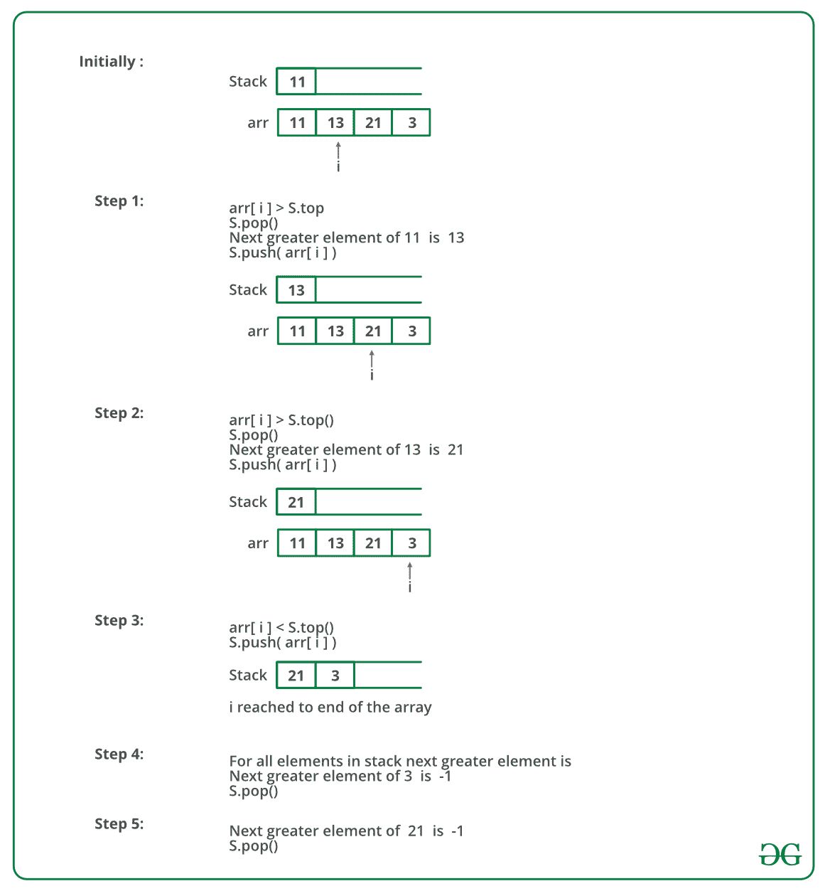

# 寻找下一个更大元素的 Javascript 程序

> 原文:[https://www . geesforgeks . org/JavaScript-program-to-find-next-greater-element/](https://www.geeksforgeeks.org/javascript-program-to-find-next-greater-element/)

给定一个数组，为每个元素打印下一个更大的元素(NGE)。元素 x 的下一个较大元素是数组中 x 右侧的第一个较大元素。不存在更大元素的元素，将下一个更大的元素视为-1。

**示例:**

1.  对于数组，最右边的元素总是将下一个较大的元素作为-1。
2.  对于按降序排序的数组，所有元素的下一个较大元素为-1。
3.  对于输入数组[4，5，2，25]，每个元素的下一个较大元素如下。

```
Element       NGE
   4      -->   5
   5      -->   25
   2      -->   25
   25     -->   -1
```

**d)** 对于输入数组[13，7，6，12]，每个元素的下一个较大元素如下。

```
  Element        NGE
   13      -->    -1
   7       -->     12
   6       -->     12
   12      -->     -1
```

**方法 1(简单)**
使用两个循环:外循环逐个拾取所有元素。内环为外环拾取的元素寻找第一个较大的元素。如果找到更大的元素，则该元素被打印为下一个，否则，打印-1。

下面是上述方法的实现:

## java 描述语言

```
<script>
      // Simple JavaScript program to print
      // next greater elements in a
      // given array

      /* prints element and NGE pair
      for all elements of arr[] of size n */
      function printNGE(arr, n)
      {
        var next, i, j;
        for (i = 0; i < n; i++) 
        {
          next = -1;
          for (j = i + 1; j < n; j++)
          {
            if (arr[i] < arr[j]) 
            {
              next = arr[j];
              break;
            }
          }
          document.write(arr[i] + " -- " + next);
          document.write("<br>");
        }
      }

      // Driver Code
      var arr = [11, 13, 21, 3];
      var n = arr.length;
      printNGE(arr, n);

      // This code is contributed by rdtank.
    </script>
```

**Output**

```
11 -- 13
13 -- 21
21 -- -1
3 -- -1
```

***时间复杂度:**O(N<sup>2</sup>)*
***辅助空间:** O(1)*

**方法 2(使用堆栈)**

*   将第一个元素推入堆栈。
*   一个接一个地拾取剩余的元素，并按照以下步骤循环。
    1.  将当前元素标记为*下一个*。
    2.  如果堆栈不为空，将堆栈的顶部元素与下一个*进行比较。*
    3.  *如果 next 大于 top 元素，则从堆栈中弹出元素。*下一个*是弹出元素的下一个更大的元素。*
    4.  *当弹出的元素小于下一个时，继续从堆栈中弹出。*下一个*成为所有这些弹出元素的下一个更大的元素。*
*   *最后，推送堆栈中的下一个。*
*   *步骤 2 中的循环结束后，从堆栈中弹出所有元素，并打印-1 作为它们的下一个元素。*

*下图是上述方法的模拟运行:*

**

*下面是上述方法的实现:*

## *java 描述语言*

```
*<script>

// A Stack based Javascript program to find next
// greater element for all array elements.

/* prints element and NGE pair for all
elements of arr[] of size n */
function printNGE(arr, n)
{
    var s = [];

    /* push the first element to stack */
    s.push(arr[0]);

    // iterate for rest of the elements
    for (var i = 1; i < n; i++) 
    {

        if (s.length == 0) {
            s.push(arr[i]);
            continue;
        }

        /* if stack is not empty, then
           pop an element from stack.
           If the popped element is smaller
           than next, then
        a) print the pair
        b) keep popping while elements are
        smaller and stack is not empty */
        while (s.length ==0 == false 
               && s[s.length-1] < arr[i]) 
        {
            document.write( s[s.length-1] 
                 + " --> " + arr[i]+"<br>");
            s.pop();
        }

        /* push next to stack so that we can find
        next greater for it */
        s.push(arr[i]);
    }

    /* After iterating over the loop, the remaining
    elements in stack do not have the next greater
    element, so print -1 for them */
    while (s.length !=0) {
        document.write( s[s.length-1] + " --> " + -1+ "<br>" );
        s.pop();
    }
}

/* Driver code */
var arr = [11, 13, 21, 3];
var n = arr.length;
printNGE(arr, n);

</script>*
```

***Output***

```
*11 --> 13
13 --> 21
3 --> -1
21 --> -1*
```