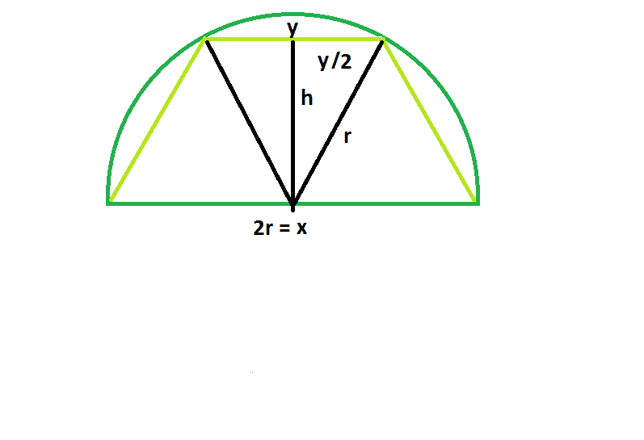

# 可内接半圆的最大梯形

> 原文:[https://www . geesforgeks . org/可内接半圆的最大梯形/](https://www.geeksforgeeks.org/largest-trapezoid-that-can-be-inscribed-in-a-semicircle/)

给定一个半径为 **r** 的半圆，任务是找到半圆内可内接的最大梯形，其基位于直径上。
**例:**

```
Input: r = 5
Output: 32.476

Input: r = 8
Output: 83.1384
```



**逼近**:设 **r** 为半圆半径， **x** 为梯形下缘， **y** 为上缘，&T8】h 为梯形高度。
现在从图中，

> r^2 = h^2 + (y/2)^2
> 或，4r^2 = 4h^2+y^2
> y^2 = 4r^2–4h 2
> y = 2√(R2–H2)
> 我们知道，梯形的面积，A = (x + y)*h/2
> 所以，a = HR+h√(R2–H2)
> 取这个面积函数相对于 h 的导数， (注意 r 是一个常数，因为我们从半径 r 的半圆开始)
> da/DH = r+√(r^2–h^2)–h^2/√(r^2–h^2)
> 为了找到临界点，我们将导数设置为零并求解 h，我们得到
> h = √3/2 * r
> So，x = 2 * r & y = r
> So，**a =(3 *√3 * r^2)/4**t13】

**以下是上述方式的实施** :

## C++

```
// C++ Program to find the biggest trapezoid
// which can be inscribed within the semicircle
#include <bits/stdc++.h>
using namespace std;

// Function to find the area
// of the biggest trapezoid
float trapezoidarea(float r)
{

    // the radius cannot be negative
    if (r < 0)
        return -1;

    // area of the trapezoid
    float a = (3 * sqrt(3) * pow(r, 2)) / 4;

    return a;
}

// Driver code
int main()
{
    float r = 5;
    cout << trapezoidarea(r) << endl;
    return 0;
}
```

## Java 语言(一种计算机语言，尤用于创建网站)

```
// Java Program to find the biggest trapezoid
// which can be inscribed within the semicircle

import java.util.*;
import java.lang.*;
import java.io.*;

class GFG{
// Function to find the area
// of the biggest trapezoid
static float trapezoidarea(float r)
{

    // the radius cannot be negative
    if (r < 0)
        return -1;

    // area of the trapezoid
    float a = (3 * (float)Math.sqrt(3)
            * (float)Math.pow(r, 2)) / 4;

    return a;
}

// Driver code
public static void main(String args[])
{
    float r = 5;
    System.out.printf("%.3f",trapezoidarea(r));
}
}
```

## 蟒蛇 3

```
# Python 3 Program to find the biggest trapezoid
# which can be inscribed within the semicircle

# from math import everything
from math import *

# Function to find the area
# of the biggest trapezoid
def trapezoidarea(r) :

    # the radius cannot be negative
    if r < 0 :
        return -1

    # area of the trapezoid
    a = (3 * sqrt(3) * pow(r,2)) / 4

    return a

# Driver code    
if __name__ == "__main__" :

    r = 5

    print(round(trapezoidarea(r),3))

# This code is contributed by ANKITRAI1
```

## C#

```
// C# Program to find the biggest
// trapezoid which can be inscribed
// within the semicircle
using System;

class GFG
{
// Function to find the area
// of the biggest trapezoid
static float trapezoidarea(float r)
{

    // the radius cannot be negative
    if (r < 0)
        return -1;

    // area of the trapezoid
    float a = (3 * (float)Math.Sqrt(3) *
                   (float)Math.Pow(r, 2)) / 4;

    return a;
}

// Driver code
public static void Main()
{
    float r = 5;
    Console.WriteLine("" + trapezoidarea(r));
}
}

// This code is contributed
// by inder_verma
```

## 服务器端编程语言（Professional Hypertext Preprocessor 的缩写）

```
<?php
// PHP Program to find the biggest
// trapezoid which can be inscribed
// within the semicircle

// Function to find the area
// of the biggest trapezoid
function trapezoidarea($r)
{

    // the radius cannot be negative
    if ($r < 0)
        return -1;

    // area of the trapezoid
    $a = (3 * sqrt(3) * pow($r, 2)) / 4;

    return $a;
}

// Driver code
$r = 5;
echo trapezoidarea($r)."\n";

// This code is contributed
// by ChitraNayal
?>
```

## java 描述语言

```
<script>

// javascript Program to find the biggest trapezoid
// which can be inscribed within the semicircle

// Function to find the area
// of the biggest trapezoid
function trapezoidarea(r)
{

    // the radius cannot be negative
    if (r < 0)
        return -1;

    // area of the trapezoid
    var a = (3 * Math.sqrt(3)
            * Math.pow(r, 2)) / 4;

    return a;
}

// Driver code

var r = 5;
document.write(trapezoidarea(r).toFixed(3));

// This code contributed by Princi Singh

</script>
```

**Output:** 

```
32.476
```