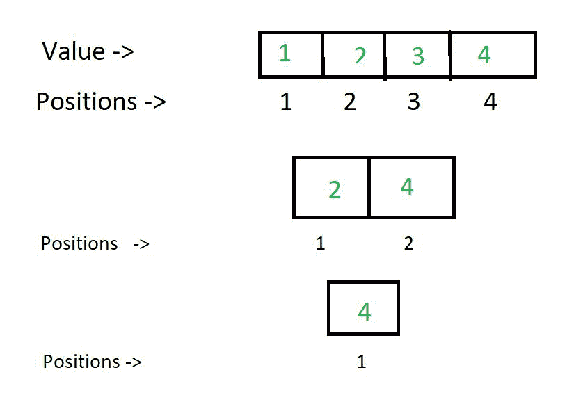

# 重复移除奇数索引元素后的最后一个剩余元素

> 原文:[https://www . geeksforgeeks . org/重复移除奇数索引元素后的最后剩余元素/](https://www.geeksforgeeks.org/last-remaining-element-after-repeated-removal-of-odd-indexed-elements/)

给定一个正整数 **N** ，任务是在从序列中重复删除所有**奇数索引**元素后，打印序列**【1，N】**中最后剩余的元素。

**示例:**

> **输入:**N**=**4
> T5】输出:4
> T8】说明:
> 
> 
> 
> **输入:**N =**T3】9
> T5】输出:** 8

**幼稚方法:**解决上述问题的幼稚方法是存储序列。迭代序列并从中移除奇数索引元素。重复以上步骤，直到只剩下一个元素。

时间复杂度:O(N logN)
辅助空间:O(1)

**有效方法:**考虑以下观察:

*   在第一步中，所有奇数元素将被移除，差异为 **2**
*   在第二步中，所有偶数元素将被删除，从 2 开始，区别 **4**
*   在第二步中，所有偶数元素将被移除，从 4 开始，区别为 **8**
*   同样，在下一步中，所有有差异的元素 **16** 将被移除，以此类推。
*   因此，在每一步中，你可以看到有差异的元素 **2 <sup>X</sup>** 将被移除。
*   这样做，最终除了序列中出现的 2 的**最大功率外，所有元素都将被移除。**

从以上观察，可以推断出:

> 最后剩余元素(L) =对数 <sub>2</sub> N

*以下是上述办法的实施情况。*

## C++

```
#include <iostream>
#include<math.h>
using namespace std;
int lastBlock(int N)
{

    // finding power of 2 less than or equal N
    int largestPower = log2(N);

    // returning the last remaining number
    return pow(2,largestPower);
}

// Driver code
int main()
{

    int N = 10;

    cout << lastBlock(N);
    return 0;
}

// This code is contributed by maddler.
```

## Java 语言(一种计算机语言，尤用于创建网站)

```
// Java program for the above approach
import java.io.*;

class GFG {

  // Function to find last remaining element
  public static int lastBlock(int N) {

    // finding power of 2 less than or equal N
    int largestPower = (int)(Math.log(N) / Math.log(2));

    // returning the last remaining number
    return (int)(Math.pow(2, largestPower));

  }

  // Driver code
  public static void main(String[] args)
  {
    int N = 10;

    // Function Call
    System.out.println(lastBlock(N));
  }
}

// This code is contributed by code_hunt.
```

## 蟒蛇 3

```
# Python program for above approach.
import math

# Function to find last remaining element
def lastBlock(N):

    # finding power of 2 less than or equal N
    largestPower = (int)(math.log(N, 2))

    # returning the last remaining number
    return (int)(math.pow(2, largestPower))

# Driver Code
N = 10

# Function Call
print(lastBlock(N))
```

## C#

```
// C# program for the above approach
using System;

class GFG {

  // Function to find last remaining element
  public static int lastBlock(int N) {

    // finding power of 2 less than or equal N
    int largestPower = (int)(Math.Log(N) / Math.Log(2));

    // returning the last remaining number
    return (int)(Math.Pow(2, largestPower));

  }

  // Driver code
  public static void Main(String[] args)
  {
    int N = 10;

    // Function Call
    Console.Write(lastBlock(N));
  }
}

// This code is contributed by shivanisinghss2110
```

## java 描述语言

```
<script>

        // JavaScript program for the above approach;

        // Function to find last remaining element
        function lastBlock(N) {

            // finding power of 2 less than or equal N
            largestPower = Math.floor(Math.log2(N))

            // returning the last remaining number
            return Math.floor(Math.pow(2, largestPower))

        }
        // Driver Code
        let N = 10

        // Function Call
        document.write(lastBlock(N));

   // This code is contributed by Potta Lokesh
    </script>
```

**Output**

```
8
```

***时间复杂度:*** O(1)
***辅助空间:*** O(1)