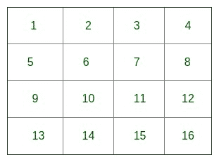
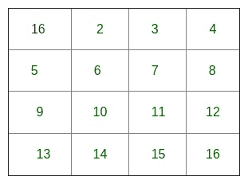
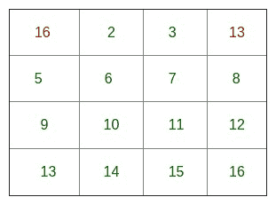
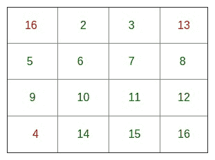
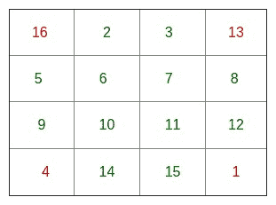
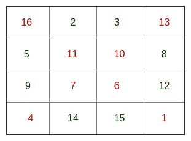

# 幻方 | 偶数阶

> 原文： [https://www.geeksforgeeks.org/magic-square-even-order/](https://www.geeksforgeeks.org/magic-square-even-order/)

阶数为`n`的**幻方**是正方形中`n ^ 2`个数字（通常是不同的整数）的排列，以使所有行，所有列和两个对角线中的`n`个数字求和为相同的常数。 幻方包含从 1 到`n ^ 2`的整数。

每行，每一列和对角线中的常数之和称为魔术常数或魔术之和`M`。正常魔术方阵的魔术常数仅取决于`n`，并且具有以下值：`M = n (n ^ 2 + 1) / 2`。

**示例**：

```
Magic Square of order 3:
-----------------------
 2   7   6
 9   5   1
 4   3   8

Magic Square of order 4:
-----------------------
16 2 3 13 
5 11 10 8 
9  7 6 12 
4 14 15 1 

Magic Square of order 8:
-----------------------
64 63  3  4  5  6 58 57 
56 55 11 12 13 14 50 49 
17 18 46 45 44 43 23 24 
25 26 38 37 36 35 31 32 
33 34 30 29 28 27 39 40 
41 42 22 21 20 19 47 48 
16 15 51 52 53 54 10 9 
8  7  59 60 61 62 2  1 

```

**一些理论**：

魔术方块根据方块的顺序分为三大类。

1.  [奇数阶幻方](https://www.geeksforgeeks.org/magic-square/)。示例：`3, 5, 7, … (2 * n + 1)`

2.  双偶数阶幻方。 示例：`4, 8, 12, 16, .. (4 * n)`

3.  单偶数阶幻方。 例子：`6, 10, 14, 18, .. (4 * n + 2)`


**双偶幻方的算法**：

```
    define an 2-D array of order n*n
    // fill array with their index-counting 
    // starting from 1
    for ( i = 0; i<n; i++)
    {
        for ( j = 0; j<n; j++)
            // filling array with its count value 
            // starting from 1;
            arr[i][j] = (n*i) + j + 1;        
    }

    // change value of Array elements 
    // at fix location as per rule 
    // (n*n+1)-arr[i][j]
    // Top Left corner of Matrix 
   // (order (n/4)*(n/4))
    for ( i = 0; i<n/4; i++)
    {
        for ( j = 0; j<n/4; j++)
            arr[i][j] = (n*n + 1) - arr[i][j];
    }

    // Top Right corner of Matrix 
    // (order (n/4)*(n/4))
    for ( i = 0; i< n/4; i++)
    {
        for ( j = 3* (n/4); j<n; j++)
            arr[i][j] = (n*n + 1) - arr[i][j];
    }

    // Bottom Left corner of Matrix 
    // (order (n/4)*(n/4))
    for ( i = 3* n/4; i<n; i++)
    {
        for ( j = 0; j<n/4; j++)
            arr[i][j] = (n*n + 1) - arr[i][j];
    }

    // Bottom Right corner of Matrix 
   // (order (n/4)*(n/4))
    for ( i = 3* n/4; i<n; i++)
    {
        for ( j = 3* n/4; j<n; j++)
            arr[i][j] = (n*n + 1) - arr[i][j];
    }

    // Centre of Matrix (order (n/2)*(n/2))
    for ( i = n/4; i<3* n/4; i++)
    {
        for ( j = n/4; j<3* n/4; j++)
            arr[i][j] = (n*n + 1) - arr[i][j];
    } 

```

**举例说明（4 阶）**：

1.  定义`4 * 4`阶数组，并将其计数值填充为：



2.  更改顺序（`1 * 1`）的左上角矩阵的值：



3.  更改顺序（`1 * 1`）的右上角矩阵的值：



4.  更改顺序（`1 * 1`）的左下角矩阵的值：



5.  更改顺序（`1 * 1`）的右下角矩阵的值：



6.  阶数（`2 * 2`）的中心矩阵的更改值：



**双偶幻方的实现**：

## C/C++ 

```

// C++ Program to print Magic square 
// of Doubly even order 
#include<iostream> 
using namespace std; 

// Function for calculating Magic square  
void doublyEven( int n ) 
{  
    int arr[n][n], i, j; 

    // filling matrix with its count value  
    // starting from 1; 
    for ( i = 0; i < n; i++) 
        for ( j = 0; j < n; j++) 
            arr[i][j] = (n*i) + j + 1; 

    // change value of Array elements 
    // at fix location as per rule  
    // (n*n+1)-arr[i][j] 
    // Top Left corner of Matrix  
    // (order (n/4)*(n/4)) 
    for ( i = 0; i < n/4; i++) 
        for ( j = 0; j < n/4; j++) 
            arr[i][j] = (n*n + 1) - arr[i][j]; 

    // Top Right corner of Matrix  
    // (order (n/4)*(n/4)) 
    for ( i = 0; i < n/4; i++) 
        for ( j = 3 * (n/4); j < n; j++) 
            arr[i][j] = (n*n + 1) - arr[i][j]; 

     // Bottom Left corner of Matrix 
    // (order (n/4)*(n/4)) 
    for ( i = 3 * n/4; i < n; i++) 
        for ( j = 0; j < n/4; j++) 
            arr[i][j] = (n*n+1) - arr[i][j]; 

    // Bottom Right corner of Matrix  
    // (order (n/4)*(n/4)) 
    for ( i = 3 * n/4; i < n; i++) 
        for ( j = 3 * n/4; j < n; j++) 
            arr[i][j] = (n*n + 1) - arr[i][j]; 

    // Centre of Matrix (order (n/2)*(n/2)) 
    for ( i = n/4; i < 3 * n/4; i++) 
        for ( j = n/4; j < 3 * n/4; j++) 
            arr[i][j] = (n*n + 1) - arr[i][j]; 

    // Printing the magic-square 
    for (i = 0; i < n; i++) 
    { 
        for ( j = 0; j < n; j++) 
            cout << arr[i][j] << " "; 
        cout << "\n"; 
    } 
} 

// driver program 
int main() 
{ 
    int n=8; 
    doublyEven(n); //Function call 
    return 0; 
}  

```

## Java

```java
// Java program to print Magic square 
// of Doubly even order 
import java.io.*; 
  
class GFG  
{ 
    // Function for calculating Magic square 
    static void doublyEven(int n) 
    { 
        int[][] arr = new int[n][n]; 
        int i, j; 
   
        // filling matrix with its count value  
        // starting from 1; 
        for ( i = 0; i < n; i++) 
            for ( j = 0; j < n; j++) 
                arr[i][j] = (n*i) + j + 1; 
        
        // change value of Array elements 
        // at fix location as per rule  
        // (n*n+1)-arr[i][j] 
        // Top Left corner of Matrix  
        // (order (n/4)*(n/4)) 
        for ( i = 0; i < n/4; i++) 
            for ( j = 0; j < n/4; j++) 
                arr[i][j] = (n*n + 1) - arr[i][j]; 
      
        // Top Right corner of Matrix  
        // (order (n/4)*(n/4)) 
        for ( i = 0; i < n/4; i++) 
            for ( j = 3 * (n/4); j < n; j++) 
                arr[i][j] = (n*n + 1) - arr[i][j]; 
       
        // Bottom Left corner of Matrix 
        // (order (n/4)*(n/4)) 
        for ( i = 3 * n/4; i < n; i++) 
            for ( j = 0; j < n/4; j++) 
                arr[i][j] = (n*n+1) - arr[i][j]; 
      
        // Bottom Right corner of Matrix  
        // (order (n/4)*(n/4)) 
        for ( i = 3 * n/4; i < n; i++) 
            for ( j = 3 * n/4; j < n; j++) 
                arr[i][j] = (n*n + 1) - arr[i][j]; 
     
        // Centre of Matrix (order (n/2)*(n/2)) 
        for ( i = n/4; i < 3 * n/4; i++) 
            for ( j = n/4; j < 3 * n/4; j++) 
                arr[i][j] = (n*n + 1) - arr[i][j]; 
   
        // Printing the magic-square 
        for (i = 0; i < n; i++) 
        { 
            for ( j = 0; j < n; j++) 
                System.out.print(arr[i][j]+" "); 
            System.out.println(); 
        } 
    } 
      
    // driver program 
    public static void main (String[] args)  
    { 
        int n = 8; 
        // Function call 
        doublyEven(n); 
    } 
} 
  
// Contributed by Pramod Kumar
```

## Python

```py
# Python program to print magic square of double order 
  
def DoublyEven(n): 
      
    # 2-D matrix with all entries as 0 
    arr = [[(n*y)+x+1 for x in range(n)]for y in range(n)] 
  
    # Change value of array elements at fix location  
    # as per the rule (n*n+1)-arr[i][[j] 
      
    # Corners of order (n/4)*(n/4) 
    # Top left corner 
    for i in range(0,n/4): 
        for j in range(0,n/4): 
            arr[i][j] = (n*n + 1) - arr[i][j]; 
      
    # Top right corner 
    for i in range(0,n/4): 
        for j in range(3 * (n/4),n): 
            arr[i][j] = (n*n + 1) - arr[i][j]; 
  
    # Bottom Left corner 
    for i in range(3 * (n/4),n): 
        for j in range(0,n/4): 
            arr[i][j] = (n*n + 1) - arr[i][j]; 
      
    # Bottom Right corner 
    for i in range(3 * (n/4),n): 
        for j in range(3 * (n/4),n): 
            arr[i][j] = (n*n + 1) - arr[i][j]; 
              
    # Centre of matrix,order (n/2)*(n/2) 
    for i in range(n/4,3 * (n/4)): 
        for j in range(n/4,3 * (n/4)): 
            arr[i][j] = (n*n + 1) - arr[i][j]; 
      
    # Printing the square 
    for i in range(n): 
        for j in range(n): 
            print '%2d ' %(arr[i][j]), 
        print
          
# Driver Program 
n = 8
DoublyEven(n) 
  
# Contributed by Harshit Agrawal
```

## C#

```cs
// C# program to print Magic square  
// of Doubly even order  
using System; 
  
class GFG 
{ 
// Function for calculating Magic square  
public static void doublyEven(int n) 
{ 
  
    int[,] arr = new int[n,n]; 
    int i, j; 
  
    // filling matrix with its count  
    // value starting from 1;  
    for (i = 0; i < n; i++) 
    { 
        for (j = 0; j < n; j++) 
        { 
            arr[i, j] = (n * i) + j + 1; 
        } 
    } 
  
    // change value of Array elements  
    // at fix location as per rule  
    // (n*n+1)-arr[i][j]  
    // Top Left corner of Matrix  
    // (order (n/4)*(n/4))  
    for (i = 0; i < n / 4; i++) 
    { 
        for (j = 0; j < n / 4; j++) 
        { 
            arr[i, j] = (n * n + 1) - arr[i, j]; 
        } 
    } 
  
    // Top Right corner of Matrix  
    // (order (n/4)*(n/4))  
    for (i = 0; i < n / 4; i++) 
    { 
        for (j = 3 * (n / 4); j < n; j++) 
        { 
            arr[i, j] = (n * n + 1) - arr[i, j]; 
        } 
    } 
  
    // Bottom Left corner of Matrix  
    // (order (n/4)*(n/4))  
    for (i = 3 * n / 4; i < n; i++) 
    { 
        for (j = 0; j < n / 4; j++) 
        { 
            arr[i, j] = (n * n + 1) - arr[i, j]; 
        } 
    } 
  
    // Bottom Right corner of Matrix  
    // (order (n/4)*(n/4))  
    for (i = 3 * n / 4; i < n; i++) 
    { 
        for (j = 3 * n / 4; j < n; j++) 
        { 
            arr[i, j] = (n * n + 1) - arr[i, j]; 
        } 
    } 
  
    // Centre of Matrix (order (n/2)*(n/2))  
    for (i = n / 4; i < 3 * n / 4; i++) 
    { 
        for (j = n / 4; j < 3 * n / 4; j++) 
        { 
            arr[i, j] = (n * n + 1) - arr[i, j]; 
        } 
    } 
  
    // Printing the magic-square  
    for (i = 0; i < n; i++) 
    { 
        for (j = 0; j < n; j++) 
        { 
            Console.Write(arr[i, j] + " " + " "); 
        } 
        Console.WriteLine(); 
    } 
} 
  
// Driver Code  
public static void Main(string[] args) 
{ 
    int n = 8; 
      
    // Function call  
    doublyEven(n); 
} 
} 
  
// This code is contributed by Shrikant13
```

## PHP

```php
<?php 
// PHP Program to print Magic square 
// of Doubly even order 
  
// Function for calculating Magic square  
function doublyEven($n) 
{  
    $arr = array_fill(0, $n, 
           array_fill(0, $n, 0)); 
  
    // filling matrix with its count  
    // value starting from 1; 
    for ( $i = 0; $i < $n; $i++) 
        for ( $j = 0; $j < $n; $j++) 
            $arr[$i][$j] = ($n * $i) + $j + 1; 
      
    // change value of Array elements at fix  
    // location as per rule (n*n+1)-arr[i][j] 
    // Top Left corner of Matrix  
    // (order (n/4)*(n/4)) 
    for ($i = 0; $i < $n / 4; $i++) 
        for ($j = 0; $j < $n / 4; $j++) 
            $arr[$i][$j] = ($n * $n + 1) -  
                            $arr[$i][$j]; 
      
    // Top Right corner of Matrix  
    // (order (n/4)*(n/4)) 
    for ($i = 0; $i < $n / 4; $i++) 
        for ($j = 3 * ($n / 4); $j < $n; $j++) 
            $arr[$i][$j] = ($n * $n + 1) -  
                            $arr[$i][$j]; 
      
    // Bottom Left corner of Matrix 
    // (order (n/4)*(n/4)) 
    for ($i = 3 * $n / 4; $i < $n; $i++) 
        for ($j = 0; $j < $n / 4; $j++) 
            $arr[$i][$j] = ($n * $n + 1) -  
                            $arr[$i][$j]; 
      
    // Bottom Right corner of Matrix  
    // (order (n/4)*(n/4)) 
    for ($i = 3 * $n / 4; $i < $n; $i++) 
        for ($j = 3 * $n / 4; $j < $n; $j++) 
            $arr[$i][$j] = ($n * $n + 1) -  
                            $arr[$i][$j]; 
  
    // Centre of Matrix (order (n/2)*(n/2)) 
    for ($i = $n / 4; $i < 3 * $n / 4; $i++) 
        for ($j = $n / 4; $j < 3 * $n / 4; $j++) 
            $arr[$i][$j] = ($n * $n + 1) -  
                            $arr[$i][$j]; 
  
    // Printing the magic-square 
    for ($i = 0; $i < $n; $i++) 
    { 
        for ($j = 0; $j < $n; $j++) 
            echo $arr[$i][$j] . " "; 
        echo "\n"; 
    } 
} 
  
// Driver Code 
$n = 8; 
doublyEven($n); //Function call 
  
// This code is contributed by mits  
?>
```

输出：

```
64   63   3    4    5    6    58   57   
56   55   11   12   13   14   50   49   
17   18   46   45   44   43   23   24   
25   26   38   37   36   35   31   32   
33   34   30   29   28   27   39   40   
41   42   22   21   20   19   47   48   
16   15   51   52   53   54   10   9   
8    7    59   60   61   62   2   1 
```

时间复杂度：`O(n^2)`。

参考：

<http://www.1728.org/magicsq2.html>