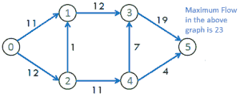
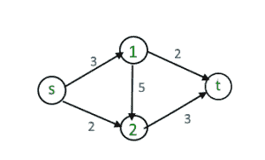
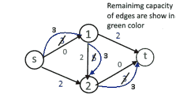
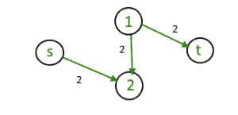

# 最大流量问题简介

> 原文： [https://www.geeksforgeeks.org/max-flow-problem-introduction/](https://www.geeksforgeeks.org/max-flow-problem-introduction/)

最大流量问题涉及通过最大单源单汇流网络找到可行流量。

让我们拍张照片来解释以上定义要说的话。


每个边都标有容量，即可以携带的最大物品数量。 目的是弄清楚可以从顶点 s（源）推送到顶点 t（sink）多少东西。

。  

可能的最大流量为： **23**

以下是解决问题的不同方法：

**1.朴素的贪婪算法方法（可能不会产生最佳或正确的结果）**

对最大流量问题的贪婪方法是从全零流量开始，贪婪地产生具有更高价值的流量 。 从一个到另一个的自然方法是在从 s 到 t 的某个路径上发送更多流量

贪婪方法如何找到最大流量：

```
E number of edge 
f(e) flow of edge 
C(e) capacity of edge 

1) Initialize : max_flow = 0  
                f(e) = 0 for every edge 'e' in E 

2) Repeat search for an s-t path P while it exists.   
   a) Find if there is a path from s to t using BFS
      or DFS. A path exists if f(e) < C(e) for 
      every edge e on the path.
   b) If no path found, return max_flow.
   c) Else find minimum edge value for path P

      // Our flow is limited by least remaining
      // capacity edge on path P.
      (i) flow = min(C(e)- f(e)) for path P ]
             max_flow += flow
      (ii) For all edge e of path increment flow 
             f(e) += flow

3) Return max_flow 

```

注意，路径搜索只需要确定在边 e 的子图中 f（e）

 

从源（s）到接收器（t）[s-> 1-> 2-> t]的路径为最大流量 3 单位（ 路径以蓝色显示）

 

 

从图形中删除所有无用的边后，看起来像

[[ ](http://media.geeksforgeeks.org/wp-content/uploads/maximum.png) 

对于上图，没有从源到接收器的路径，因此最大流量为 3 单位，但最大流量为 5 单位。 为了解决这个问题，我们使用残差图。

**2.残差图**

这个想法是通过允许“撤消”操作来扩展幼稚贪婪算法。 例如，从该算法卡在上方图像的角度出发，我们想沿着边（s，2）路由另外两个流动单元，然后沿着边（1、2）向后路由，撤消两个 我们路由了 3 个单元，进行了先前的迭代，最后沿着边（1，t）

 

后边：（f（e））和前边：（C（e ）– f（e））

我们需要一种正式指定允许的“撤消”操作的方法。 这激发了以下简单但重要的残差网络定义。 这个想法是，给定一个图 G 和其中的流 f，我们形成一个新的流网络 G <sub>f</sub> ，它具有相同的 G 顶点集，并且每个 G 边都有两个边。 边 e =（1,2）的 G 携带流量 f（e）且具有容量 C（e）（对于上图）产生容量为 C（e）的 G <sub>f</sub> 的“前缘” -f（e）（剩余的房间）和 G <sub>f</sub> 的“后边”（2,1），容量为 f（e）（可以撤消的先前路由的流量）。 通过纯朴素的贪婪算法搜索的所有边具有 f（e）< C（e）的源（s）-下沉（t）路径，对应于 G <sub>f [</sub> 仅包含前边。

使用了残差图的概念 [Ford-Fulkerson](https://www.geeksforgeeks.org/dinics-algorithm-maximum-flow/) 和 Dinic 的算法

**来源**：

[http://theory.stanford.edu/~tim/w16/l/l1.pdf](http://theory.stanford.edu/~tim/w16/l/l1.pdf)

本文由 [**Nishant Singh**](https://practice.geeksforgeeks.org/user-profile.php?user=_code) 提供。 如果您喜欢 GeeksforGeeks 并希望做出贡献，则还可以使用 [tribution.geeksforgeeks.org](http://www.contribute.geeksforgeeks.org) 撰写文章，或将您的文章邮寄至 tribution@geeksforgeeks.org。 查看您的文章出现在 GeeksforGeeks 主页上，并帮助其他 Geeks。

如果发现任何不正确的地方，或者想分享有关上述主题的更多信息，请写评论。

