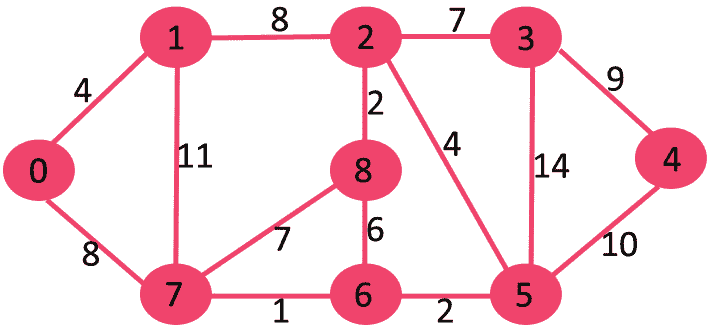

# 使用优先级队列和数组列表的最小生成树

> 原文： [https://www.geeksforgeeks.org/minimum-spanning-tree-using-priority-queue-and-array-list/](https://www.geeksforgeeks.org/minimum-spanning-tree-using-priority-queue-and-array-list/)

给定没有自环的双向加权（正）图，任务是生成图的[最小生成树](https://www.geeksforgeeks.org/kruskals-minimum-spanning-tree-algorithm-greedy-algo-2/)。

**示例**：

> **输入**：N = 9，E = 14，边= {{0，1，4}，{0，7，8}，{1,2,8}，{1，7，11} ，{2、3、7}，{2、8、2}，{2、5、4}，{3、4、9}，{3、5、14}，{4、5、10}，{ 5，6，2}，{6，7，1}，{6，8，6}，{7，8，7}}
> **输出**：
> （（A，B ），费用）
> （（6，7），1）
> （（6，5），2）
> （（1，0），4）
> （（2，3）， 7）
> （（5，2），4）
> （（3，4），9）
> （（2，1），8）
> （（2，8），2）
> 
> 生成了由所有顶点 V 和（V-1）边组成的无向图
> 
> **输入**：N = 6，E = 14，边沿= {{0，2，103}，{0，1，158}，{0，2，2}，{0，5，17} ，{1、3、42}，{2、4、187}，{3、0、14}，{3、2、158}，{3、5、106}，{3、4、95}，{ 5，1，144}，{5，2，194}，{5，3，118}，{5，3，58}}
> **输出**：
> （（A，B ），费用）
> （（0，2），2）
> （（0，3），14）
> （（0，5），17）
> （（3，1）， 42）
> （（3，4），95）

**方法**

*   首先，在给定图中找到具有最小成本/重量的边。

*   将两个初始顶点（最小成本边的顶点 A，B）添加到已访问/添加的集合中。

*   现在，所有具有新添加的顶点的连接边都添加到优先级队列中。

*   从优先级队列中弹出开销最小的顶点（将流行顶点的所有连接边添加到优先级队列中），并重复进行直到边数等于顶点 1 为止。

*   通过使用优先级队列，时间复杂度将降低为**（O（E log V））**其中 E 是边的数量，V 是顶点的数量。

*   配对类也用于存储权重。

下面是上述方法的实现：

```

// Java implementation of the approach 
import java.io.*; 
import java.util.*; 
import java.lang.Comparable; 
public class MST { 

    // Pair class with implemented comparable 
    static class Pair<U extends Comparable<U>, 
                                V extends Comparable<V> > 
        implements Comparable<Pair<U, V> > { 

        public final U a; 
        public final V b; 

        private Pair(U a, V b) 
        { 
            this.a = a; 
            this.b = b; 
        } 

        @Override
        public boolean equals(Object o) 
        { 
            if (this == o) 
                return true; 
            if (o == null || getClass() != o.getClass()) 
                return false; 

            Pair<?, ?> pair = (Pair<?, ?>)o; 
            if (!a.equals(pair.a)) 
                return false; 
            return b.equals(pair.b); 
        } 

        // Overriding so that objects in map 
        // could find the object key 
        @Override
        public int hashCode() 
        { 
            return 31 * a.hashCode() + b.hashCode(); 
        } 

        @Override
        public String toString() 
        { 
            return "(" + a + ", " + b + ")"; 
        } 

        @Override
        public int compareTo(Pair<U, V> o) 
        { 
            return getV().compareTo(o.getV()); 
        } 
        private U getU() 
        { 
            return a; 
        } 
        private V getV() 
        { 
            return b; 
        } 
    } 

    static class Graph { 

        int vertices; 
        ArrayList[] edges; 

        // This variable keeps the least cost edge 
        static Pair<Pair<Integer, Integer>, 
                    Integer> 
            minCostEdge; 

        Graph(int vertices) 
        { 
            minCostEdge = new Pair<>(new Pair<>(1, 1), 
                                     Integer.MAX_VALUE); 
            this.vertices = vertices; 
            edges = new ArrayList[vertices + 1]; 
            for (int i = 0; i <= vertices; i++) { 
                edges[i] 
                    = new ArrayList<Pair<Integer, Integer> >(); 
            } 
        } 

        void addEdge(int a, int b, int weight) 
        { 
            edges[a].add(new Pair<>(b, weight)); 

            // Since its undirected, adding the 
            // edges to both the vertices 
            edges[b].add(new Pair<>(a, weight)); 
            if (weight < minCostEdge.b) { 
                minCostEdge 
                    = new Pair<>(new Pair<>(a, b), weight); 
            } 
        } 

        void MST() 
        { 

            // Priority queue for applying heap 
            PriorityQueue<Pair<Pair<Integer, Integer>, 
                               Integer> > 
                priorityQueue 
                = new PriorityQueue<>(); 

            // Adding all the connected vertices 
            // of MinCostEdge vertex A to PQ 
            Iterator<Pair<Integer, Integer> > iterator 
                = edges[minCostEdge.a.a].listIterator(); 
            while (iterator.hasNext()) { 
                Pair<Integer, Integer> pair 
                    = iterator.next(); 
                priorityQueue.add( 
                    new Pair<>( 
                        new Pair<>(minCostEdge.a.a, pair.a), 
                        pair.b)); 
            } 

            // Adding all the connected vertices 
            // of MinCostEdge vertex B to PQ 
            iterator = edges[minCostEdge.a.b].listIterator(); 
            while (iterator.hasNext()) { 
                Pair<Integer, Integer> pair = iterator.next(); 
                priorityQueue.add( 
                    new Pair<>( 
                        new Pair<>(minCostEdge.a.b, pair.a), 
                        pair.b)); 
            } 

            // Set to check vertex is added or not 
            Set<Integer> addedVertices = new HashSet<>(); 

            // Set contains all the added edges and cost from source 
            Set<Pair<Pair<Integer, Integer>, Integer> > addedEdges 
                = new HashSet<>(); 

            // Using the greedy approach to find 
            // the least costing edge to the GRAPH 
            while (addedEdges.size() < vertices - 1) { 

                // Polling from priority queue 
                Pair<Pair<Integer, Integer>, Integer> pair 
                    = priorityQueue.poll(); 

                // Checking wether the vertex A is added or not 
                if (!addedVertices.contains(pair.a.a)) { 
                    addedVertices.add(pair.a.a); 
                    addedEdges.add(pair); 

                    // Adding all the connected vertices with vertex A 
                    iterator = edges[pair.a.a].listIterator(); 
                    while (iterator.hasNext()) { 
                        Pair<Integer, Integer> pair1 
                            = iterator.next(); 
                        priorityQueue.add( 
                            new Pair<>( 
                                new Pair<>(pair.a.a, pair1.a), 
                                pair1.b)); 
                    } 
                } 

                // Checking wether the vertex B is added or not 
                if (!addedVertices.contains(pair.a.b)) { 
                    addedVertices.add(pair.a.b); 
                    addedEdges.add(pair); 

                    // Adding all the connected vertices with vertex B 
                    iterator = edges[pair.a.b].listIterator(); 
                    while (iterator.hasNext()) { 
                        Pair<Integer, Integer> pair1 
                            = iterator.next(); 
                        priorityQueue 
                            .add( 
                                new Pair<>( 
                                    new Pair<>(pair.a.b, pair1.a), 
                                    pair1.b)); 
                    } 
                } 
            } 

            // Printing the MST 
            Iterator<Pair<Pair<Integer, Integer>, Integer> > iterator1 
                = addedEdges.iterator(); 
            System.out.println("((A"
                               + ", "
                               + "B)"
                               + ", "
                               + "Cost)"); 
            while (iterator1.hasNext()) { 
                System.out.println(iterator1.next()); 
            } 
        } 
    } 

    // Driver code 
    public static void main(String[] args) throws IOException 
    { 
        // Initializing the graph 
        Graph g = new Graph(9); 
        g.addEdge(0, 1, 4); 
        g.addEdge(0, 7, 8); 
        g.addEdge(1, 2, 8); 
        g.addEdge(1, 7, 11); 
        g.addEdge(2, 3, 7); 
        g.addEdge(2, 8, 2); 
        g.addEdge(2, 5, 4); 
        g.addEdge(3, 4, 9); 
        g.addEdge(3, 5, 14); 
        g.addEdge(4, 5, 10); 
        g.addEdge(5, 6, 2); 
        g.addEdge(6, 7, 1); 
        g.addEdge(6, 8, 6); 
        g.addEdge(7, 8, 7); 

        // Appling MST 
        g.MST(); 
    } 
} 

```

**Output:**

```
((A, B), Cost)
((6, 7), 1)
((6, 5), 2)
((1, 0), 4)
((2, 3), 7)
((5, 2), 4)
((3, 4), 9)
((2, 1), 8)
((2, 8), 2)

```


* * *

* * *

如果您喜欢 GeeksforGeeks 并希望做出贡献，则还可以使用 [tribution.geeksforgeeks.org](https://contribute.geeksforgeeks.org/) 撰写文章，或将您的文章邮寄至 tribution@geeksforgeeks.org。 查看您的文章出现在 GeeksforGeeks 主页上，并帮助其他 Geeks。

如果您发现任何不正确的地方，请单击下面的“改进文章”按钮，以改进本文。