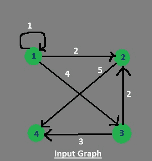
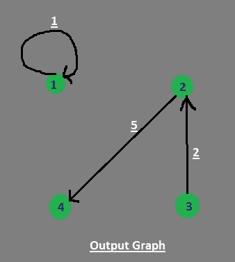

# 除去重量最小的边以外的所有外出边

> 原文： [https://www.geeksforgeeks.org/minimum-weighted-graph/](https://www.geeksforgeeks.org/minimum-weighted-graph/)

给定一个有 n 个节点的有向图。 对于每个节点，删除具有最小权重的除输出边外的所有输出边。 对每个节点应用此删除操作，然后打印最终图形，该图形保留在图形的每个节点最多具有一个输出边的位置，并且权重最小。

**注意**：为方便起见，此处的图形存储为邻接矩阵。

**范例**：

```
Input : Adjacency Matrix of input graph :
  | 1  2  3  4
---------------
1 | 0  3  2  5
2 | 0  2  4  7  
3 | 1  2  0  3
4 | 5  2  1  3

Output : Adjacency Matrix of output graph :
  | 1  2  3  4
---------------
1 | 0  0  2  0
2 | 0  2  0  0  
3 | 1  0  0  0
4 | 0  0  1  0

```

对于图的邻接矩阵的每一行，保留最小元素（零除外），其余全部为零。 对输入矩阵的每一行都执行此操作。 最后，打印结果矩阵。

**示例**：



## C++

```cpp

// CPP program for minimizing graph 
#include <bits/stdc++.h> 

using namespace std; 

// Utility function for 
// finding min of a row 
int minFn(int arr[]) 
{ 
    int min = INT_MAX; 

    for (int i = 0; i < 4; i++) 
        if (min > arr[i]) 
            min = arr[i]; 
    return min; 
} 

// Utility function for minimizing graph 
void minimizeGraph(int arr[][4]) 
{ 
    int min; 

    // Set empty edges to INT_MAX 
    for (int i = 0; i < 4; i++) 
        for (int j = 0; j < 4; j++) 
            if (arr[i][j] == 0) 
                arr[i][j] = INT_MAX; 

    // Finding minimum of each row 
    // and deleting rest of edges 
    for (int i = 0; i < 4; i++) { 

        // Find minimum element of row 
        min = minFn(arr[i]); 

        for (int j = 0; j < 4; j++) { 
            // If edge value is not min 
            // set it to zero, also 
            // edge value INT_MAX denotes that 
            // initially edge value was zero 
            if (!(arr[i][j] == min) || (arr[i][j] == INT_MAX)) 
                arr[i][j] = 0; 
            else
                min = 0; 
        } 
    } 

    // Print result; 
    for (int i = 0; i < 4; i++) { 
        for (int j = 0; j < 4; j++) 
            cout << arr[i][j] << " "; 
        cout << "\n"; 
    } 
} 

// Driver Program 
int main() 
{ 
    // Input Graph 
    int arr[4][4] = { 1, 2, 4, 0, 
                      0, 0, 0, 5, 
                      0, 2, 0, 3, 
                      0, 0, 0, 0 }; 

    minimizeGraph(arr); 

    return 0; 
} 

```

## Java

```java

// Java program for 
// minimizing graph 
import java.io.*; 
import java.util.*; 
import java.lang.*; 

class GFG { 

    // Utility function for 
    // finding min of a row 
    static int minFn(int arr[]) 
    { 
        int min = Integer.MAX_VALUE; 

        for (int i = 0; 
             i < arr.length; i++) 
            if (min > arr[i]) 
                min = arr[i]; 
        return min; 
    } 

    // Utility function 
    // for minimizing graph 
    static void minimizeGraph(int arr[][]) 
    { 
        int min; 

        // Set empty edges 
        // to INT_MAX 
        for (int i = 0; 
             i < arr.length; i++) 
            for (int j = 0; 
                 j < arr.length; j++) 
                if (arr[i][j] == 0) 
                    arr[i][j] = Integer.MAX_VALUE; 

        // Finding minimum of each 
        // row and deleting rest 
        // of edges 
        for (int i = 0; 
             i < arr.length; i++) { 

            // Find minimum 
            // element of row 
            min = minFn(arr[i]); 

            for (int j = 0; 
                 j < arr.length; j++) { 
                // If edge value is not 
                // min set it to zero, 
                // also edge value INT_MAX 
                // denotes that initially 
                // edge value was zero 
                if ((arr[i][j] != min) || (arr[i][j] == Integer.MAX_VALUE)) 
                    arr[i][j] = 0; 
                else
                    min = 0; 
            } 
        } 

        // Print result; 
        for (int i = 0; 
             i < arr.length; i++) { 
            for (int j = 0; 
                 j < arr.length; j++) 
                System.out.print(arr[i][j] + " "); 
            System.out.print("\n"); 
        } 
    } 

    // Driver Code 
    public static void main(String[] args) 
    { 
        // Input Graph 
        int arr[][] = { { 1, 2, 4, 0 }, 
                        { 0, 0, 0, 5 }, 
                        { 0, 2, 0, 3 }, 
                        { 0, 0, 0, 0 } }; 

        minimizeGraph(arr); 
    } 
} 

```

## Python

```py

# Python3 program for minimizing graph  

# Utility function for finding min of a row  
def minFn(arr):  

    minimum = float('inf')  

    for i in range(0, 4):  
        if minimum > arr[i]:  
            minimum = arr[i]  
    return minimum 

# Utility function for minimizing graph  
def minimizeGraph(arr):  

    # Set empty edges to INT_MAX  
    for i in range(0, 4):  
        for j in range(0, 4):  
            if arr[i][j] == 0:  
                arr[i][j] = float('inf')  

    # Finding minimum of each row  
    # and deleting rest of edges  
    for i in range(0, 4):  

        # Find minimum element of row  
        minimum = minFn(arr[i])  

        for j in range(0, 4): 

            # If edge value is not min  
            # set it to zero, also  
            # edge value INT_MAX denotes that  
            # initially edge value was zero  
            if ((not(arr[i][j] == minimum)) or 
                    (arr[i][j] == float('inf'))):  
                arr[i][j] = 0
            else: 
                minimum = 0

    # Print result  
    for i in range(0, 4):  
        for j in range(0, 4):  
            print(arr[i][j], end = " ")  
        print()  

# Driver Code  
if __name__ == "__main__":  

    # Input Graph  
    arr = [[1, 2, 4, 0],  
           [0, 0, 0, 5],  
           [0, 2, 0, 3],  
           [0, 0, 0, 0]]  

    minimizeGraph(arr)  

# This code is contributed by  
# Rituraj Jain 

```

## C#

```cs

// C# program for 
// minimizing graph 
using System; 

class GFG { 

    // Utility function for 
    // finding min of a row 
    static int minFn(int[] arr) 
    { 
        int min = int.MaxValue; 

        for (int i = 0; 
             i < arr.Length; i++) 
            if (min > arr[i]) 
                min = arr[i]; 
        return min; 
    } 

    // Utility function 
    // for minimizing graph 
    static void minimizeGraph(int[, ] arr) 
    { 
        int min; 

        // Set empty edges 
        // to INT_MAX 
        for (int i = 0; 
             i < arr.GetLength(0); i++) 
            for (int j = 0; 
                 j < arr.GetLength(1); j++) 
                if (arr[i, j] == 0) 
                    arr[i, j] = int.MaxValue; 

        // Finding minimum of each 
        // row and deleting rest 
        // of edges 
        for (int i = 0; i < arr.GetLength(0); i++) { 

            // Find minimum 
            // element of row 
            min = minFn(GetRow(arr, i)); 

            for (int j = 0; 
                 j < arr.GetLength(1); j++) { 
                // If edge value is not 
                // min set it to zero, 
                // also edge value INT_MAX 
                // denotes that initially 
                // edge value was zero 
                if ((arr[i, j] != min) || (arr[i, j] == int.MaxValue)) 
                    arr[i, j] = 0; 
                else
                    min = 0; 
            } 
        } 

        // Print result; 
        for (int i = 0; 
             i < arr.GetLength(0); i++) { 
            for (int j = 0; 
                 j < arr.GetLength(1); j++) 
                Console.Write(arr[i, j] + " "); 
            Console.Write("\n"); 
        } 
    } 

    public static int[] GetRow(int[, ] matrix, int row) 
    { 
        var rowLength = matrix.GetLength(1); 
        var rowVector = new int[rowLength]; 

        for (var i = 0; i < rowLength; i++) 
            rowVector[i] = matrix[row, i]; 

        return rowVector; 
    } 

    // Driver Code 
    public static void Main(String[] args) 
    { 
        // Input Graph 
        int[, ] arr = { { 1, 2, 4, 0 }, 
                        { 0, 0, 0, 5 }, 
                        { 0, 2, 0, 3 }, 
                        { 0, 0, 0, 0 } }; 

        minimizeGraph(arr); 
    } 
} 

// This code contributed by Rajput-Ji 

```

## PHP

```php

<?php 
// PHP program for minimizing graph 

// Utility function for finding  
// min of a row  
function minFn($arr)  
{  
    $min = PHP_INT_MAX;  

    for ($i = 0; $i < 4; $i++)  
        if ($min > $arr[$i])  
            $min = $arr[$i];  
    return $min;  
}  

// Utility function for minimizing graph  
function minimizeGraph($arr)  
{  
    $min;  

    // Set empty edges to INT_MAX  
    for ($i = 0; $i < 4; $i++)  
        for ($j = 0; $j < 4; $j++)  
            if ($arr[$i][$j] == 0)  
                $arr[$i][$j] = PHP_INT_MAX;  

    // Finding minimum of each row  
    // and deleting rest of edges  
    for ($i = 0; $i < 4; $i++) 
    {  

        // Find minimum element of row  
        $min = minFn($arr[$i]);  

        for ($j = 0; $j < 4; $j++)  
        {  
            // If edge value is not min  
            // set it to zero, also  
            // edge value INT_MAX denotes that  
            // initially edge value was zero  
            if (!($arr[$i][$j] == $min) ||  
                 ($arr[$i][$j] == PHP_INT_MAX))  
                $arr[$i][$j] = 0;  
            else
                $min = 0;  
        }  
    }  

    // Print result;  
    for ($i = 0; $i < 4; $i++) 
    {  
        for ($j = 0; $j < 4; $j++)  
            echo $arr[$i][$j], " ";  
        echo "\n";  
    }  
}  

// Driver Code 

// Input Graph  
$arr = array(array(1, 2, 4, 0),  
             array(0, 0, 0, 5),  
             array(0, 2, 0, 3),  
             array(0, 0, 0, 0));  

minimizeGraph($arr);  

// This code is contributed by ajit. 
?> 

```

**Output:**

```
1 0 0 0 
0 0 0 5 
0 2 0 0 
0 0 0 0

```

**时间复杂度**：`O(N^2)`


* * *

* * *

如果您喜欢 GeeksforGeeks 并希望做出贡献，则还可以使用 [tribution.geeksforgeeks.org](https://contribute.geeksforgeeks.org/) 撰写文章，或将您的文章邮寄至 tribution@geeksforgeeks.org。 查看您的文章出现在 GeeksforGeeks 主页上，并帮助其他 Geeks。

如果您发现任何不正确的地方，请单击下面的“改进文章”按钮，以改进本文。