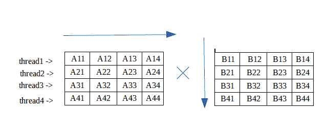

# 使用线程进行矩阵乘法

> 原文:[https://www . geeksforgeeks . org/矩阵乘法使用线程/](https://www.geeksforgeeks.org/multiplication-of-matrix-using-threads/)

**矩阵的乘法**确实需要时间。矩阵乘法的时间复杂度是 O(n^3)使用标准矩阵乘法。而 **Strassen 算法**对其进行了改进，其时间复杂度为 O(n^(2.8074)).
但是，有没有办法用正规的方法来提高矩阵乘法的性能。
**可以做多线程**来改善。在多线程中，我们不是利用处理器的单个内核，而是利用所有或更多的内核来解决问题。
我们创建不同的线程，每个线程评估矩阵乘法的某个部分。
根据处理器的内核数量，您可以创建所需的线程数量。虽然您可以根据需要创建任意多的线程，但更好的方法是为一个内核创建每个线程。
在第二种方法中，我们为结果矩阵中的每个元素创建一个单独的线程。使用 **pthread_exit()** 我们返回由 **pthread_join()** 收集的每个线程的计算值。这种方法不使用任何全局变量。



示例:

```
Input : 
Matrix A
 1 0 0
 0 1 0
 0 0 1

Matrix B
 2 3 2
 4 5 1
 7 8 6

Output : Multiplication of A and B
2 3 2
4 5 1
7 8 6
```

**注意*建议在基于 linux 的系统中执行程序**
使用以下代码在 linux 中编译:

```
g++ -pthread program_name.cpp
```

## 卡片打印处理机（Card Print Processor 的缩写）

```
// CPP Program to multiply two matrix using pthreads
#include <bits/stdc++.h>
using namespace std;

// maximum size of matrix
#define MAX 4

// maximum number of threads
#define MAX_THREAD 4

int matA[MAX][MAX];
int matB[MAX][MAX];
int matC[MAX][MAX];
int step_i = 0;

void* multi(void* arg)
{
    int i = step_i++; //i denotes row number of resultant matC

    for (int j = 0; j < MAX; j++)
      for (int k = 0; k < MAX; k++)
        matC[i][j] += matA[i][k] * matB[k][j];
}

// Driver Code
int main()
{
    // Generating random values in matA and matB
    for (int i = 0; i < MAX; i++) {
        for (int j = 0; j < MAX; j++) {
            matA[i][j] = rand() % 10;
            matB[i][j] = rand() % 10;
        }
    }

    // Displaying matA
    cout << endl
         << "Matrix A" << endl;
    for (int i = 0; i < MAX; i++) {
        for (int j = 0; j < MAX; j++)
            cout << matA[i][j] << " ";
        cout << endl;
    }

    // Displaying matB
    cout << endl
         << "Matrix B" << endl;
    for (int i = 0; i < MAX; i++) {
        for (int j = 0; j < MAX; j++)
            cout << matB[i][j] << " ";       
        cout << endl;
    }

    // declaring four threads
    pthread_t threads[MAX_THREAD];

    // Creating four threads, each evaluating its own part
    for (int i = 0; i < MAX_THREAD; i++) {
        int* p;
        pthread_create(&threads[i], NULL, multi, (void*)(p));
    }

    // joining and waiting for all threads to complete
    for (int i = 0; i < MAX_THREAD; i++)
        pthread_join(threads[i], NULL);   

    // Displaying the result matrix
    cout << endl
         << "Multiplication of A and B" << endl;
    for (int i = 0; i < MAX; i++) {
        for (int j = 0; j < MAX; j++)
            cout << matC[i][j] << " ";       
        cout << endl;
    }
    return 0;
}
```

**输出:**

```
Matrix A
3 7 3 6 
9 2 0 3 
0 2 1 7 
2 2 7 9 

Matrix B
6 5 5 2 
1 7 9 6 
6 6 8 9 
0 3 5 2 

Multiplication of A and B
43 100 132 87 
56 68 78 36 
8 41 61 35 
56 93 129 97 
```

**不使用全局变量的方法:**
**注*建议在基于 linux 的系统中执行程序**
使用以下代码在 linux 中编译:

```
g++ -pthread program_name.cpp
```

## C

```
// C Program to multiply two matrix using pthreads without
// use of global variables
#include<stdio.h>
#include<pthread.h>
#include<unistd.h>
#include<stdlib.h>
#define MAX 4

//Each thread computes single element in the resultant matrix
void *mult(void* arg)
{
    int *data = (int *)arg;
    int k = 0, i = 0;

    int x = data[0];
    for (i = 1; i <= x; i++)
           k += data[i]*data[i+x];

    int *p = (int*)malloc(sizeof(int));
         *p = k;

//Used to terminate a thread and the return value is passed as a pointer
    pthread_exit(p);
}

//Driver code
int main()
{

    int matA[MAX][MAX];
    int matB[MAX][MAX];

    int r1=MAX,c1=MAX,r2=MAX,c2=MAX,i,j,k;

    // Generating random values in matA
    for (i = 0; i < r1; i++)
            for (j = 0; j < c1; j++)
                   matA[i][j] = rand() % 10;

        // Generating random values in matB
    for (i = 0; i < r1; i++)
            for (j = 0; j < c1; j++)
                   matB[i][j] = rand() % 10;

    // Displaying matA        
    for (i = 0; i < r1; i++){
        for(j = 0; j < c1; j++)
            printf("%d ",matA[i][j]);
        printf("\n");
    }

    // Displaying matB               
    for (i = 0; i < r2; i++){
        for(j = 0; j < c2; j++)
            printf("%d ",matB[i][j]);
        printf("\n");   
    }

    int max = r1*c2;

    //declaring array of threads of size r1*c2       
    pthread_t *threads;
    threads = (pthread_t*)malloc(max*sizeof(pthread_t));

    int count = 0;
    int* data = NULL;
    for (i = 0; i < r1; i++)
        for (j = 0; j < c2; j++)
               {

               //storing row and column elements in data
            data = (int *)malloc((20)*sizeof(int));
            data[0] = c1;

            for (k = 0; k < c1; k++)
                data[k+1] = matA[i][k];

            for (k = 0; k < r2; k++)
                data[k+c1+1] = matB[k][j];

             //creating threads
                pthread_create(&threads[count++], NULL,
                               mult, (void*)(data));

                    }

    printf("RESULTANT MATRIX IS :- \n");
    for (i = 0; i < max; i++)
    {
      void *k;

      //Joining all threads and collecting return value
      pthread_join(threads[i], &k);

          int *p = (int *)k;
      printf("%d ",*p);
      if ((i + 1) % c2 == 0)
          printf("\n");
    }

  return 0;
}
```

输出:

```
Matrix A
3 7 3 6 
9 2 0 3 
0 2 1 7 
2 2 7 9

Matrix B
6 5 5 2 
1 7 9 6 
6 6 8 9 
0 3 5 2 

Multiplication of A and B
43 100 132 87 
56 68 78 36 
8 41 61 35 
56 93 129 97 
```