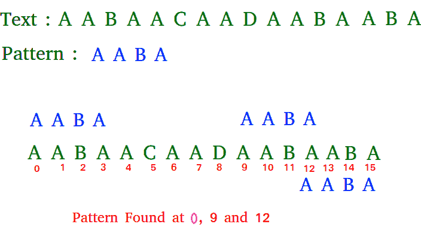

# 模式搜索的朴素算法

> 原文:[https://www . geesforgeks . org/朴素算法模式搜索/](https://www.geeksforgeeks.org/naive-algorithm-for-pattern-searching/)

给定一个文本*txt【0..n-1]* 和模式*帕特【0..m-1]* ，编写一个函数*搜索(char pat[]，char txt[])* ，打印 *txt[]* 中所有出现的 *pat[]* 。你可以假设 *n > m* 。
**示例:**

```
Input:  txt[] = "THIS IS A TEST TEXT"
        pat[] = "TEST"
Output: Pattern found at index 10

Input:  txt[] =  "AABAACAADAABAABA"
        pat[] =  "AABA"
Output: Pattern found at index 0
        Pattern found at index 9
        Pattern found at index 12
```



模式搜索是计算机科学中的一个重要问题。当我们在记事本/word 文件或浏览器或数据库中搜索字符串时，会使用模式搜索算法来显示搜索结果。

**天真模式搜索:**
将模式在文本上逐个滑动，并检查是否匹配。如果找到匹配，则再次滑动 1 以检查后续匹配。

## C

```
// C program for Naive Pattern Searching algorithm
#include <stdio.h>
#include <string.h>

void search(char* pat, char* txt)
{
    int M = strlen(pat);
    int N = strlen(txt);

    /* A loop to slide pat[] one by one */
    for (int i = 0; i <= N - M; i++) {
        int j;

        /* For current index i, check for pattern match */
        for (j = 0; j < M; j++)
            if (txt[i + j] != pat[j])
                break;

        if (j == M) // if pat[0...M-1] = txt[i, i+1, ...i+M-1]
            printf("Pattern found at index %d \n", i);
    }
}

/* Driver program to test above function */
int main()
{
    char txt[] = "AABAACAADAABAAABAA";
    char pat[] = "AABA";
    search(pat, txt);
    return 0;
}
```

## C++

```
// C++ program for Naive Pattern
// Searching algorithm
#include <bits/stdc++.h>
using namespace std;

void search(char* pat, char* txt)
{
    int M = strlen(pat);
    int N = strlen(txt);

    /* A loop to slide pat[] one by one */
    for (int i = 0; i <= N - M; i++) {
        int j;

        /* For current index i, check for pattern match */
        for (j = 0; j < M; j++)
            if (txt[i + j] != pat[j])
                break;

        if (j == M) // if pat[0...M-1] = txt[i, i+1, ...i+M-1]
            cout << "Pattern found at index "
                 << i << endl;
    }
}

// Driver Code
int main()
{
    char txt[] = "AABAACAADAABAAABAA";
    char pat[] = "AABA";
    search(pat, txt);
    return 0;
}

// This code is contributed
// by Akanksha Rai
```

## Java 语言(一种计算机语言，尤用于创建网站)

```
// Java program for Naive Pattern Searching
public class NaiveSearch {

    public static void search(String txt, String pat)
    {
        int M = pat.length();
        int N = txt.length();

        /* A loop to slide pat one by one */
        for (int i = 0; i <= N - M; i++) {

            int j;

            /* For current index i, check for pattern
              match */
            for (j = 0; j < M; j++)
                if (txt.charAt(i + j) != pat.charAt(j))
                    break;

            if (j == M) // if pat[0...M-1] = txt[i, i+1, ...i+M-1]
                System.out.println("Pattern found at index " + i);
        }
    }

    public static void main(String[] args)
    {
        String txt = "AABAACAADAABAAABAA";
        String pat = "AABA";
        search(txt, pat);
    }
}
// This code is contributed by Harikishore
```

## 蟒蛇 3

```
# Python3 program for Naive Pattern
# Searching algorithm
def search(pat, txt):
    M = len(pat)
    N = len(txt)

    # A loop to slide pat[] one by one */
    for i in range(N - M + 1):
        j = 0

        # For current index i, check
        # for pattern match */
        while(j < M):
            if (txt[i + j] != pat[j]):
                break
            j += 1

        if (j == M):
            print("Pattern found at index ", i)

# Driver Code
if __name__ == '__main__':
    txt = "AABAACAADAABAAABAA"
    pat = "AABA"
    search(pat, txt)

# This code is contributed
# by PrinciRaj1992
```

## C#

```
// C# program for Naive Pattern Searching
using System;

class GFG {

    public static void search(String txt, String pat)
    {
        int M = pat.Length;
        int N = txt.Length;

        /* A loop to slide pat one by one */
        for (int i = 0; i <= N - M; i++) {
            int j;

            /* For current index i, check for pattern
            match */
            for (j = 0; j < M; j++)
                if (txt[i + j] != pat[j])
                    break;

            // if pat[0...M-1] = txt[i, i+1, ...i+M-1]
            if (j == M)
                Console.WriteLine("Pattern found at index " + i);
        }
    }

    // Driver code
    public static void Main()
    {
        String txt = "AABAACAADAABAAABAA";
        String pat = "AABA";
        search(txt, pat);
    }
}
// This code is Contributed by Sam007
```

## 服务器端编程语言（Professional Hypertext Preprocessor 的缩写）

```
<?php
// PHP program for Naive Pattern
// Searching algorithm

function search($pat, $txt)
{
    $M = strlen($pat);
    $N = strlen($txt);

    // A loop to slide pat[]
    // one by one
    for ($i = 0; $i <= $N - $M; $i++)
    {

        // For current index i,
        // check for pattern match
        for ($j = 0; $j < $M; $j++)
            if ($txt[$i + $j] != $pat[$j])
                break;

        // if pat[0...M-1] =
        // txt[i, i+1, ...i+M-1]
        if ($j == $M)
            echo "Pattern found at index ", $i."\n";
    }
}

    // Driver Code
    $txt = "AABAACAADAABAAABAA";
    $pat = "AABA";
    search($pat, $txt);

// This code is contributed by Sam007
?>
```

## java 描述语言

```
<script>
    // Javascript program for Naive Pattern Searching

    function search(txt, pat)
    {
        let M = pat.length;
        let N = txt.length;

        /* A loop to slide pat one by one */
        for (let i = 0; i <= N - M; i++) {
            let j;

            /* For current index i, check for pattern
            match */
            for (j = 0; j < M; j++)
                if (txt[i + j] != pat[j])
                    break;

            // if pat[0...M-1] = txt[i, i+1, ...i+M-1]
            if (j == M)
                document.write("Pattern found at index " + i + "</br>");
        }
    }

    let txt = "AABAACAADAABAAABAA";
    let pat = "AABA";
    search(txt, pat);

</script>
```

**输出:**

```
Pattern found at index 0 
Pattern found at index 9 
Pattern found at index 13 
```

**最好的情况是什么？**
最好的情况发生在模式的第一个字符根本不在文本中的时候。

## C

```
txt[] = "AABCCAADDEE";
pat[] = "FAA";
```

最佳情况下的比较次数为 0(n)。
**最坏的情况是什么？**
天真模式搜索最糟糕的情况发生在以下场景中。
1)当文字和图案的所有字符都相同时。

## C

```
txt[] = "AAAAAAAAAAAAAAAAAA";
pat[] = "AAAAA";
```

2)当只有最后一个字符不同时，也会出现最坏的情况。

## C

```
txt[] = "AAAAAAAAAAAAAAAAAB";
pat[] = "AAAAB";
```

最坏情况下的比较次数为 O(m*(n-m+1))。尽管具有重复字符的字符串不太可能出现在英文文本中，但它们很可能出现在其他应用程序中(例如，二进制文本)。KMP 匹配算法将最坏情况改进为 O(n)。我们将在下一篇文章中报道 KMP。此外，我们将写更多的文章来涵盖所有的模式搜索算法和数据结构。

如果你发现任何不正确的地方，或者你想分享更多关于上面讨论的话题的信息，请写评论。