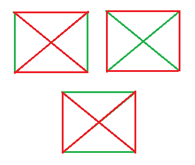

# 哈密顿圈的个数

> 原文:[https://www.geeksforgeeks.org/number-of-hamiltonian-cycle/](https://www.geeksforgeeks.org/number-of-hamiltonian-cycle/)

给定一个由 N 个顶点组成的**无向图**，其中 N > 2。任务是找出图中不同的**哈密顿圈**的个数。
**完全图**:如果每一个可能的顶点都通过一条边相连，那么这个图就是完全的。
**哈密顿圈:**这是一个封闭行走，除了初始顶点之外，每个顶点最多被访问一次。并且没有必要访问所有的边。
**公式:**


**例:**

```
Input : N = 6
Output : Hamiltonian cycles = 60

Input : N = 4
Output : Hamiltonian cycles = 3
```

**说明:**
我们以 N = 4 的完全无向图为例，这 3 个不同的哈密顿圈如下所示:



以下是上述方法的实现:

## C++

```
// C++ program for implementation of the
// above program

#include <bits/stdc++.h>
using namespace std;

// Function that calculates
// number of Hamiltonian cycle
int Cycles(int N)
{

    int fact = 1, result = 0;

    result = N - 1;

    // Calculating factorial
    int i = result;
    while (i > 0) {
        fact = fact * i;
        i--;
    }

    return fact / 2;
}

// Driver code
int main()
{
    int N = 5;

    int Number = Cycles(N);

    cout << "Hamiltonian cycles = " << Number;
    return 0;
}
```

## Java 语言(一种计算机语言，尤用于创建网站)

```
// Java program for implementation
// of the above program
class GFG
{

// Function that calculates
// number of Hamiltonian cycle
static int Cycles(int N)
{
    int fact = 1, result = 0;

    result = N - 1;

    // Calculating factorial
    int i = result;
    while (i > 0)
    {
        fact = fact * i;
        i--;
    }

    return fact / 2;
}

// Driver code
public static void main(String[] args)
{
    int N = 5;

    int Number = Cycles(N);

    System.out.println("Hamiltonian cycles = " +
                                        Number);
}
}

// This code is contributed
// by Code_Mech.
```

## 蟒蛇 3

```
# Python3 program for implementation
# of the above program
import math as mt

# Function that calculates
# number of Hamiltonian cycle
def Cycles(N):

    fact = 1

    result = N - 1

    # Calculating factorial
    i = result
    while (i > 0):
        fact = fact * i
        i -= 1

    return fact // 2

# Driver code
N = 5

Number = Cycles(N)

print("Hamiltonian cycles = ",
                       Number)

# This code is contributed
# by Mohit Kumar
```

## C#

```
// C# program for implementation of
// the above program
using System;

class GFG
{

// Function that calculates
// number of Hamiltonian cycle
static int Cycles(int N)
{
    int fact = 1, result = 0;

    result = N - 1;

    // Calculating factorial
    int i = result;
    while (i > 0)
    {
        fact = fact * i;
        i--;
    }

    return fact / 2;
}

// Driver code
public static void Main()
{
    int N = 5;

    int Number = Cycles(N);

    Console.Write("Hamiltonian cycles = " +
                                   Number);
}
}

// This code is contributed
// by Akanksha Rai
```

## 服务器端编程语言（Professional Hypertext Preprocessor 的缩写）

```
<?php
// PHP program for implementation
// of the above program

// Function that calculates
// number of Hamiltonian cycle
function Cycles($N)
{
    $fact = 1 ;
    $result = 0;

    $result = $N - 1;

    // Calculating factorial
    $i = $result;
    while ($i > 0)
    {
        $fact = $fact * $i;
        $i--;
    }

    return floor($fact / 2);
}

// Driver code
$N = 5;

$Number = Cycles($N);

echo "Hamiltonian cycles = ",
                     $Number;

// This code is contributed by Ryuga
?>
```

## java 描述语言

```
<script>

// Javascript program for implementation of the
// above program

// Function that calculates
// number of Hamiltonian cycle
function Cycles(N)
{

    var fact = 1, result = 0;

    result = N - 1;

    // Calculating factorial
    var i = result;
    while (i > 0) {
        fact = fact * i;
        i--;
    }

    return fact / 2;
}

// Driver code
var N = 5;
var Number = Cycles(N);
document.write( "Hamiltonian cycles = " + Number);

// This code is contributed by rutvik_56.
</script>
```

**Output:** 

```
Hamiltonian cycles = 12
```