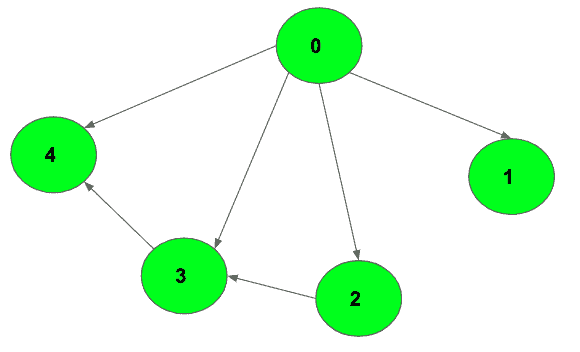

# 有向无环图中从源到目的地的路径数

> 原文:[https://www . geesforgeks . org/有向无环图中从源到目标的路径数/](https://www.geeksforgeeks.org/number-of-paths-from-source-to-destination-in-a-directed-acyclic-graph/)

给定一个有 n 个顶点和 m 条边的有向无环图。任务是找出从源顶点到目标顶点存在的不同路径的数量。



示例:

> **输入:**源= 0，目的地= 4
> **输出:** 3
> **解释:**
> 0->2->3->4
> 0->3->4
> 0->4
> 
> **输入:**源= 0，目的地= 1
> **输出:** 1
> **说明:**只有一条路径 0- > 1

**方法:**设 *f(u)为从节点 u 到目的顶点*的路径数。因此，f(来源)是必需的答案。因为 **f(目的地)= 1** 在这里，所以从目的地到它自己只有一条路。人们可以观察到，f(u)只取决于从 u 可能行进的所有节点的 f 值。这是有意义的，因为从 u 到目的地的不同路径的数量是从 **v1、v2、v3… v-n** 到目的地顶点的所有不同路径的总和，其中 v1 到 v-n 是从顶点 u 具有直接路径的所有顶点。然而，这种方法太慢而没有用。每个函数调用分支成更多的调用，然后再分支成更多的调用，直到每条路径都被探索一次。

这种方法的问题是每次用参数 u 调用函数时都要反复计算 f(u)。由于这个问题既有[重叠子问题，又有最优子结构](https://www.geeksforgeeks.org/optimal-substructure-property-in-dynamic-programming-dp-2/)，[动态规划](https://www.geeksforgeeks.org/dynamic-programming/)在这里适用。为了对每个 u 只评估一次 f(u)，在评估 f(u)之前，对所有可以从 u 访问的 v 评估 f(v)。这个条件通过颠倒图的节点的[拓扑排序](https://www.geeksforgeeks.org/topological-sorting-indegree-based-solution/)顺序来满足。

下面是上述方法的实现:

## C++

```
// C++ program for Number of paths
// from one vertex to another vertex
//  in a Directed Acyclic Graph
#include <bits/stdc++.h>
using namespace std;
#define MAXN 1000005

// to make graph
vector<int> v[MAXN];

// function to add edge in graph
void add_edge(int a, int b, int fre[])
{
    // there is path from a to b.
    v[a].push_back(b);
    fre[b]++;
}

// function to make topological sorting
vector<int> topological_sorting(int fre[], int n)
{
    queue<int> q;

    // insert all vertices which
    // don't have any parent.
    for (int i = 0; i < n; i++)
        if (!fre[i])
            q.push(i);

    vector<int> l;

    // using kahn's algorithm
    // for topological sorting
    while (!q.empty()) {
        int u = q.front();
        q.pop();

        // insert front element of queue to vector
        l.push_back(u);

        // go through all it's childs
        for (int i = 0; i < v[u].size(); i++) {
            fre[v[u][i]]--;

            // whenever the frequency is zero then add
            // this vertex to queue.
            if (!fre[v[u][i]])
                q.push(v[u][i]);
        }
    }
    return l;
}

// Function that returns the number of paths
int numberofPaths(int source, int destination, int n, int fre[])
{

// make topological sorting
    vector<int> s = topological_sorting(fre, n);

    // to store required answer.
    int dp[n] = { 0 };

    // answer from destination
    // to destination is 1.
    dp[destination] = 1;

    // traverse in reverse order
    for (int i = s.size() - 1; i >= 0; i--) {
        for (int j = 0; j < v[s[i]].size(); j++) {
            dp[s[i]] += dp[v[s[i]][j]];
        }
    }

    return dp;
}

// Driver code
int main()
{

    // here vertices are numbered from 0 to n-1.
    int n = 5;
    int source = 0, destination = 4;

    // to count number of vertex which don't
    // have any parents.
    int fre[n] = { 0 };

    // to add all edges of graph
    add_edge(0, 1, fre);
    add_edge(0, 2, fre);
    add_edge(0, 3, fre);
    add_edge(0, 4, fre);
    add_edge(2, 3, fre);
    add_edge(3, 4, fre);

    // Function that returns the number of paths
    cout << numberofPaths(source, destination, n, fre);
}
```

## 蟒蛇 3

```
# Python3 program for Number of paths
# from one vertex to another vertex
# in a Directed Acyclic Graph
from collections import deque
MAXN = 1000005

# to make graph
v = [[] for i in range(MAXN)]

# function to add edge in graph
def add_edge(a, b, fre):

    # there is path from a to b.
    v[a].append(b)
    fre[b] += 1

# function to make topological sorting
def topological_sorting(fre, n):
    q = deque()

    # insert all vertices which
    # don't have any parent.
    for i in range(n):
        if (not fre[i]):
            q.append(i)

    l = []

    # using kahn's algorithm
    # for topological sorting
    while (len(q) > 0):
        u = q.popleft()
        #q.pop()

        # insert front element of queue to vector
        l.append(u)

        # go through all it's childs
        for i in range(len(v[u])):
            fre[v[u][i]] -= 1

            # whenever the frequency is zero then add
            # this vertex to queue.
            if (not fre[v[u][i]]):
                q.append(v[u][i])
    return l

# Function that returns the number of paths
def numberofPaths(source, destination, n, fre):

# make topological sorting
    s = topological_sorting(fre, n)

    # to store required answer.
    dp = [0]*n

    # answer from destination
    # to destination is 1.
    dp[destination] = 1

    # traverse in reverse order
    for i in range(len(s) - 1,-1,-1):
        for j in range(len(v[s[i]])):
            dp[s[i]] += dp[v[s[i]][j]]
    return dp

# Driver code
if __name__ == '__main__':

    # here vertices are numbered from 0 to n-1.
    n = 5
    source, destination = 0, 4

    # to count number of vertex which don't
    # have any parents.
    fre = [0]*n

    # to add all edges of graph
    add_edge(0, 1, fre)
    add_edge(0, 2, fre)
    add_edge(0, 3, fre)
    add_edge(0, 4, fre)
    add_edge(2, 3, fre)
    add_edge(3, 4, fre)

    # Function that returns the number of paths
    print (numberofPaths(source, destination, n, fre))

# This code is contributed by mohit kumar 29.
```

**Output:** 

```
3
```