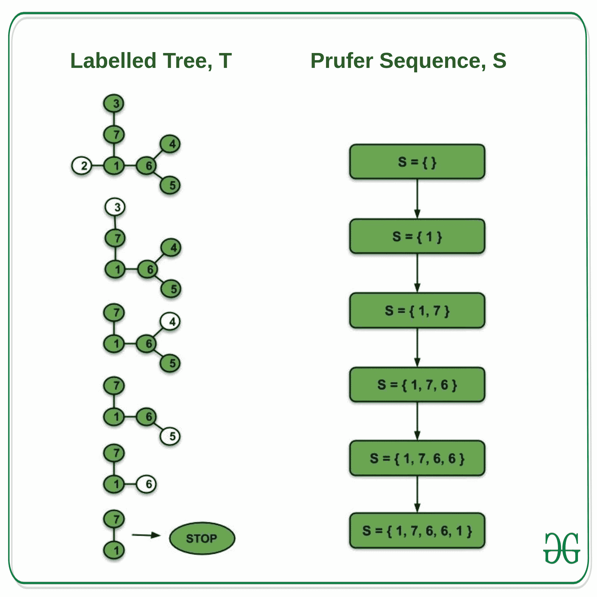
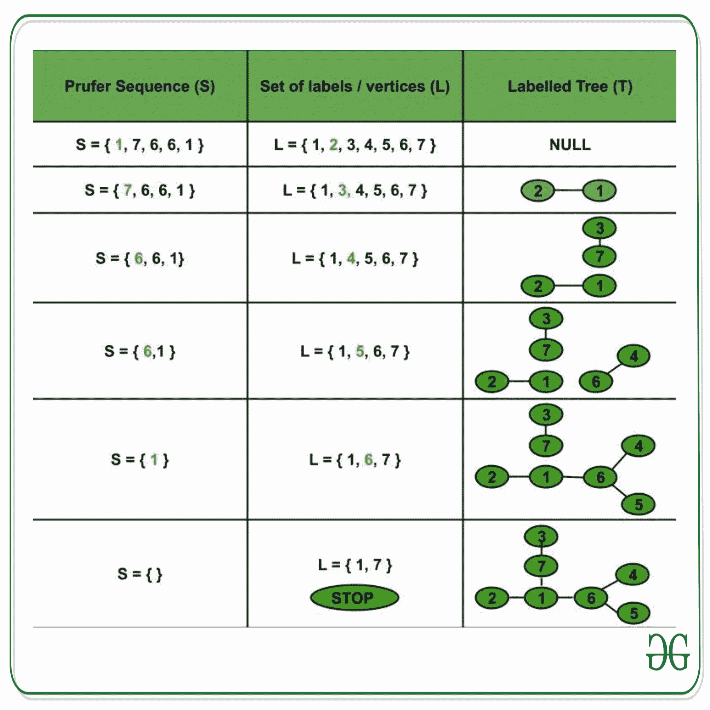

# 加权完全图的生成树数量

> 原文:[https://www . geesforgeks . org/加权完全图的生成树数/](https://www.geeksforgeeks.org/number-of-spanning-trees-of-a-weighted-complete-graph/)

**先决条件:** [图论基础](https://www.geeksforgeeks.org/mathematics-graph-theory-basics-set-1/)[生成树。](https://en.wikipedia.org/wiki/Spanning_tree)

**完全加权图:**其中一条边连接每对图顶点，并且每条边都有与之关联的权重的图称为完全加权图。

具有 n 个顶点的完全加权图的生成树的数量是 **n (n-2)** 。

**证明:**生成树是图 G 的包含图的所有顶点的子图。因此，完全加权图的生成树的数量与具有 n 个顶点的标记树(不必是二进制的)的数量相同。

由 n 个顶点组成的标记树的 Prüfer 序列是与树相关联的唯一长度序列(n-2)。此外，对于标签 1 至 n 上的给定长度(n-2)的普吕弗序列，存在具有给定普吕弗序列的唯一标记树。因此，我们在标签 1 到 n 上具有 n 个顶点的**标记树的集合 A**和大小为 n-2 的 **Prüfer 序列的集合 B 之间有一个**双射**。这可以证明如下–**

设 T 是顶点为 1，2，…，n 和 S 的标记树，作为大小为(n-2)的概率序列。因此，T 和 S 分别是集合 A 和 B 的元素。

**(i)标记树(T)–>普鲁弗序列(S)**

<u>构建标记树的 Prüfer 序列</u>–

最初，假设 S =空。

**程序–**

*   求标签最小的 T 的叶节点(L)。
*   把 L 的邻居加到 s 上。
*   删除叶节点，l。
*   重复上述步骤，直到树中只剩下两个节点(只能有一个生成树)。
*   我们构建了与标记树 t 相关的序列 S

**观察–**

*   没有叶节点附加到 s。
*   树 T 的每一个顶点 V 都加到 S 上，共加度(V)-1 次。
*   树 T 有 n 个顶点，因此有(n-1)条边。
*   S 中的项数=属于树 T 的所有顶点 V 的(度(V)–1)之和=树 T 的所有顶点的度之和–( 1+1+…+1..n 次)= 2(边数)–n = 2 *(n-1)–n = n-2。(因为树的所有顶点的度之和= 2 *树的边数)。
*   因此，T 类似于长度为(n-2)的普吕弗序列 S。

**(ii)普鲁弗序列–>标记树(T)**

<u>从标记树的 Pr</u> ü <u>fer 序列</u>构建标记树-

**程序-**

*   设 L = {1，2，…，n}为标签集(T 的顶点)。
*   让 S = {a 1 、a 2 、…、a (n-2) }成为大小为(n-2)的 Prüfer 序列，其中每个 a i 属于 l。
*   求属于 L 但不在 s 中的最小元素 x。
*   通过一条边连接 x 和 S 的第一个元素(a 1 )。
*   从 S 中删除 a 1 ，从 L 中删除 x(因此，S:=S-{a 1 }和，L:=L-{x})。
*   同样，求 y，属于 L 而不在 s 的最小元素。
*   连接 y 和 S 的第一个元素(a 2 )。
*   从 L 中移除 y，从 S 中移除 a 2 (因此，S:=S-{a 2 }和，L:=L-{y})。
*   继续上述过程，直到 l 中剩下两个项目
*   在目前形成的树中连接这两个项目。

从 S 得到的树与 T 相同，因此大小为(n-2)的 Prüfer 序列 S 类似于 T ( S T)。因此，在具有 n 个顶点的标记树集合和标签 1 到 n 上的大小为(n-2)的普吕弗序列集合之间存在一个**双射**

因此，n 个顶点的完全加权图的**生成树的数量** =具有 n 个顶点的标记树的数量=大小为(n-2) = **n (n-2)** 的 Prüfer 序列的数量。