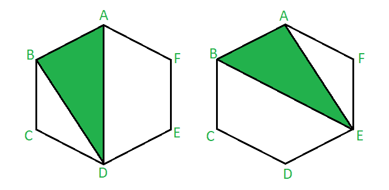

# n 边多边形顶点与一条公共边连接形成的三角形数量

> 原文:[https://www . geeksforgeeks . org/由 n 边多边形的顶点连接而成的三角形数量-单侧-公共/](https://www.geeksforgeeks.org/number-of-triangles-formed-by-joining-vertices-of-n-sided-polygon-with-one-side-common/)

给定 **N** 条边的多边形，我们需要找到给定多边形的顶点连接而成的三角形的数量，其中恰好有一条边是公共的。
**例:**

> **输入:** 6
> **输出:** 12
> 下图是一个三角形，通过连接顶点形成六边形，如上图所示。形成的两个三角形有一条边与多边形的边相同。它描述了用一个六边形的一条边，我们可以使两个三角形的一边是公共的。我们不能把 C 或 F 作为我们的第三个顶点，因为它会使 2 条边与六边形相同。
> 
> 
> 
> 一边为六边形的三角形
> 
> 三角形的数目等于 12，因为一个六边形有 6 条边。
> **输入:** 5
> **输出:** 5

**进场:**

*   要使一边与多边形公共的三角形，与所选公共顶点相邻的两个顶点不能被视为三角形的第三个顶点。
*   首先从多边形中选择任意一条边。将此边视为公共边。在多边形中选择边的方法数等于 n。
*   现在，要形成一个三角形，选择左边的任意(n-4)个顶点。不能考虑公共边的两个顶点和与公共边相邻的两个顶点。
*   通过将一个 n 边多边形的顶点与一个公共边连接而形成的三角形的数量等于 n *(n–4)。

以下是上述方法的实现:

## C++

```
// C++ program to implement
// the above problem
#include <bits/stdc++.h>
using namespace std;

// Function to find the number of triangles
void findTriangles(int n)
{
    int num;
    num = n * (n - 4);

    // print the number of triangles
    cout << num;
}

// Driver code
int main()
{
    // initialize the number of sides of a polygon
    int n;
    n = 6;

    findTriangles(n);

    return 0;
}
```

## Java 语言(一种计算机语言，尤用于创建网站)

```
// Java program to implement
// the above problem
class GFG
{

// Function to find the number of triangles
static void findTriangles(int n)
{
    int num;
    num = n * (n - 4);

    // print the number of triangles
    System.out.println(num);
}

// Driver code
public static void main(String [] args)
{
    // initialize the number of sides of a polygon
    int n;
    n = 6;

    findTriangles(n);

}
}

// This code is contributed by ihritik
```

## 蟒蛇 3

```
# Python3 program to implement
# the above problem

# Function to find the number of triangles
def findTriangles(n):
    num = n * (n - 4)

    # print the number of triangles
    print(num)

# Driver code
# initialize the number of sides of a polygon
n = 6

findTriangles(n)

# This code is contributed by mohit kumar 29
```

## C#

```
// C# program to implement
// the above problem
using System;

class GFG
{

// Function to find the number of triangles
static void findTriangles(int n)
{
    int num;
    num = n * (n - 4);

    // print the number of triangles
    Console.WriteLine(num);
}

// Driver code
public static void Main()
{
    // initialize the number of sides of a polygon
    int n;
    n = 6;

    findTriangles(n);

}
}

// This code is contributed by ihritik
```

## java 描述语言

```
<script>

// JavaScript program to implement
// the above problem

// Function to find the number of triangles
function findTriangles(n)
{
    var num;
    num = n * (n - 4);

    // print the number of triangles
    document.write(num);
}

// Driver code

// initialize the number of sides of a polygon
var n;
n = 6;

findTriangles(n);

// This code contributed by shikhasingrajput

</script>
```

**Output:** 

```
12
```

**时间复杂度:** O(1)