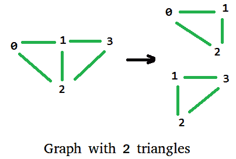

# 无向图

中的三角形数量

> 原文： [https://www.geeksforgeeks.org/number-of-triangles-in-a-undirected-graph/](https://www.geeksforgeeks.org/number-of-triangles-in-a-undirected-graph/)

给定一个无向的简单图，我们需要找到它可以有多少个三角形。 例如下面的图表中有 2 个三角形。



令 A [] []为图的邻接矩阵表示。 如果我们计算 A <sup>3</sup> ，则无向图中的三角形数等于 trace（A <sup>3</sup> ）/6。其中 trace（A）是元素上的元素之和。 矩阵 A 的主对角线。

```
Trace of a graph represented as adjacency matrix A[V][V] is,
trace(A[V][V]) = A[0][0] + A[1][1] + .... + A[V-1][V-1]

Count of triangles = trace(A3) / 6

```

下面是上述公式的实现。

## C++

```cpp

// A C++ program for finding 
// number of triangles in an 
// Undirected Graph. The program 
// is for adjacency matrix 
// representation of the graph 
#include <bits/stdc++.h> 
using namespace std; 

// Number of vertices in the graph 
#define V 4 

//  Utility function for matrix 
// multiplication 
void multiply(int A[][V], int B[][V], int C[][V]) 
{ 
    for (int i = 0; i < V; i++) 
    { 
        for (int j = 0; j < V; j++) 
        { 
            C[i][j] = 0; 
            for (int k = 0; k < V; k++) 
                C[i][j] += A[i][k]*B[k][j]; 
        } 
    } 
} 

// Utility function to calculate 
// trace of a matrix (sum of 
// diagnonal elements) 
int getTrace(int graph[][V]) 
{ 
    int trace = 0; 
    for (int i = 0; i < V; i++) 
        trace += graph[i][i]; 
    return trace; 
} 

//  Utility function for calculating 
// number of triangles in graph 
int triangleInGraph(int graph[][V]) 
{ 
    // To Store graph^2 
    int aux2[V][V]; 

    // To Store graph^3 
    int aux3[V][V]; 

    //  Initialising aux 
    // matrices with 0 
    for (int i = 0; i < V; ++i) 
        for (int j = 0; j < V; ++j) 
            aux2[i][j] = aux3[i][j] = 0; 

    // aux2 is graph^2 now  printMatrix(aux2); 
    multiply(graph, graph, aux2); 

    // after this multiplication aux3 is 
    // graph^3 printMatrix(aux3); 
    multiply(graph, aux2, aux3); 

    int trace = getTrace(aux3); 
    return trace / 6; 
} 

// driver code 
int main() 
{ 

    int graph[V][V] = {{0, 1, 1, 0}, 
                       {1, 0, 1, 1}, 
                       {1, 1, 0, 1}, 
                       {0, 1, 1, 0} 
                      }; 

    printf("Total number of Triangle in Graph : %d\n", 
            triangleInGraph(graph)); 
    return 0; 
} 

```