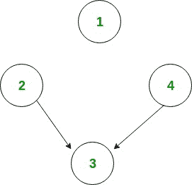

# 图中汇聚节点的数量

> 原文:[https://www.geeksforgeeks.org/number-sink-nodes-graph/](https://www.geeksforgeeks.org/number-sink-nodes-graph/)

给定一个由 **n 个**节点(从 1 到 n 编号)和 **m 个**边组成的有向无环图。任务是找到接收器节点的数量。汇聚节点是这样一个节点，它没有边缘出现。

**示例:**

```
Input : n = 4, m = 2
        Edges[] = {{2, 3}, {4, 3}} 
Output : 2
```



```
Only node 1 and node 3 are sink nodes.

Input : n = 4, m = 2
        Edges[] = {{3, 2}, {3, 4}} 
Output : 3
```

这个想法是迭代所有的边。对于每个边，标记该边出现的源节点。现在，对于每个节点，检查它是否被标记。并计算未标记的节点。

算法:

```

1\. Make any array A[] of size equal to the
    number of nodes and initialize to 1.
2\. Traverse all the edges one by one, say, 
   u -> v.
     (i) Mark A[u] as 1.
3\. Now traverse whole array A[] and count 
   number of unmarked nodes.
```

下面是这种方法的实现:

## C++

```
// C++ program to count number if sink nodes
#include<bits/stdc++.h>
using namespace std;

// Return the number of Sink NOdes.
int countSink(int n, int m, int edgeFrom[],
                        int edgeTo[])
{
    // Array for marking the non-sink node.
    int mark[n];
    memset(mark, 0, sizeof mark);

    // Marking the non-sink node.
    for (int i = 0; i < m; i++)
        mark[edgeFrom[i]] = 1;

    // Counting the sink nodes.
    int count = 0;
    for (int i = 1; i <= n ; i++)
        if (!mark[i])
            count++;

    return count;
}

// Driven Program
int main()
{
    int n = 4, m = 2;
    int edgeFrom[] = { 2, 4 };
    int edgeTo[] = { 3, 3 };

    cout << countSink(n, m, edgeFrom, edgeTo) << endl;

    return 0;
}
```

## Java 语言(一种计算机语言，尤用于创建网站)

```
// Java program to count number if sink nodes
import java.util.*;

class GFG
{

// Return the number of Sink NOdes.
static int countSink(int n, int m, 
                     int edgeFrom[], int edgeTo[])
{
    // Array for marking the non-sink node.
    int []mark = new int[n + 1];

    // Marking the non-sink node.
    for (int i = 0; i < m; i++)
        mark[edgeFrom[i]] = 1;

    // Counting the sink nodes.
    int count = 0;
    for (int i = 1; i <= n ; i++)
        if (mark[i] == 0)
            count++;

    return count;
}

// Driver Code
public static void main(String[] args)
{
    int n = 4, m = 2;
    int edgeFrom[] = { 2, 4 };
    int edgeTo[] = { 3, 3 };

    System.out.println(countSink(n, m, 
                       edgeFrom, edgeTo));
}
}

// This code is contributed by 29AjayKumar
```

## 蟒蛇 3

```
# Python3 program to count number if sink nodes

# Return the number of Sink NOdes. 
def countSink(n, m, edgeFrom, edgeTo):

    # Array for marking the non-sink node. 
    mark = [0] * (n + 1)

    # Marking the non-sink node.
    for i in range(m):
        mark[edgeFrom[i]] = 1

    # Counting the sink nodes. 
    count = 0
    for i in range(1, n + 1):
        if (not mark[i]): 
            count += 1

    return count

# Driver Code
if __name__ == '__main__': 

    n = 4
    m = 2
    edgeFrom = [2, 4] 
    edgeTo = [3, 3]

    print(countSink(n, m, edgeFrom, edgeTo))

# This code is contributed by PranchalK
```

## C#

```
// C# program to count number if sink nodes
using System;

class GFG
{

// Return the number of Sink NOdes.
static int countSink(int n, int m, 
                     int []edgeFrom,
                     int []edgeTo)
{
    // Array for marking the non-sink node.
    int []mark = new int[n + 1];

    // Marking the non-sink node.
    for (int i = 0; i < m; i++)
        mark[edgeFrom[i]] = 1;

    // Counting the sink nodes.
    int count = 0;
    for (int i = 1; i <= n ; i++)
        if (mark[i] == 0)
            count++;

    return count;
}

// Driver Code
public static void Main(String[] args)
{
    int n = 4, m = 2;
    int []edgeFrom = { 2, 4 };
    int []edgeTo = { 3, 3 };

    Console.WriteLine(countSink(n, m, 
                      edgeFrom, edgeTo));
}
}

// This code is contributed by PrinciRaj1992
```

## java 描述语言

```
<script>

// Javascript program to count number if sink nodes

// Return the number of Sink NOdes.
function countSink(n, m, edgeFrom, edgeTo)
{

    // Array for marking the non-sink node.
    let mark = new Array(n + 1);
    for(let i = 0; i < n + 1; i++)
    {
        mark[i] = 0;
    }

    // Marking the non-sink node.
    for(let i = 0; i < m; i++)
        mark[edgeFrom[i]] = 1;

    // Counting the sink nodes.
    let count = 0;
    for(let i = 1; i <= n; i++)
        if (mark[i] == 0)
            count++;

    return count;
}

// Driver Code
let n = 4, m = 2;
let edgeFrom = [ 2, 4 ];
let edgeTo = [ 3, 3 ];

document.write(countSink(n, m, 
                         edgeFrom, edgeTo));

// This code is contributed by rag2127

</script>
```

**输出:**

```
2
```

**时间复杂度:** O(m + n)，其中 n 为节点数，m 为边数。

**相关文章:**
[名人问题](https://www.geeksforgeeks.org/the-celebrity-problem/)

本文由 **Anuj Chauhan** 供稿。如果你喜欢 GeeksforGeeks 并想投稿，你也可以使用[write.geeksforgeeks.org](http://www.write.geeksforgeeks.org)写一篇文章或者把你的文章邮寄到 review-team@geeksforgeeks.org。看到你的文章出现在极客博客主页上，帮助其他极客。
如果你发现任何不正确的地方，或者你想分享更多关于上面讨论的话题的信息，请写评论。