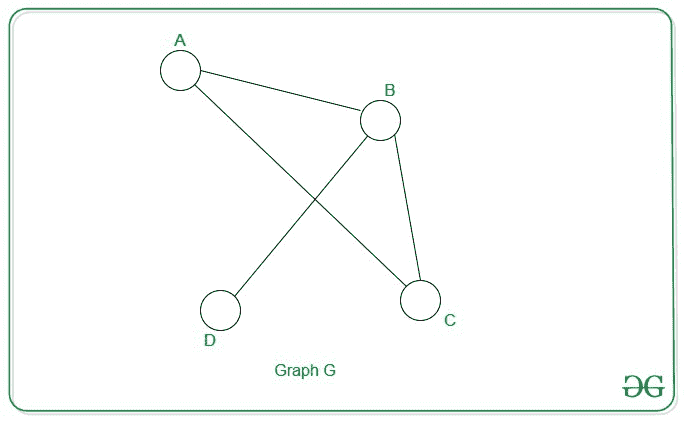

# 优化最长路径为 NP 完全

> 原文:[https://www . geesforgeks . org/optimized-最长路径-is-np-complete/](https://www.geeksforgeeks.org/optimized-longest-path-is-np-complete/)

**<u>优化最长路径问题</u> :** 优化最长路径问题指出，给定一组顶点 **V** 和边 **E** 的图 **G** ，任务是证明在一组节点 **V s 和 V e** 之间存在长度至少为 K**的路径。**

**<u>问题陈述</u> :** 给定一个图 **G(V，E，K)** 和一组节点 **V s 和 V e** 以及节点序列，长度 **≥ K** 。

**<u>解释</u> :**
问题的一个实例是指定给问题的输入。优化最长路径问题的一个例子是 **G(V，E，V s ，V e ，K)** 。由于 [NP-complete 问题](https://www.geeksforgeeks.org/np-completeness-set-1/)是同时存在于 [**NP** 和 **NP-Hard**](https://www.geeksforgeeks.org/difference-between-np-hard-and-np-complete-problem/) 中的问题，因此证明问题是 NP-complete 的陈述由两部分组成:

> 1.  The problem itself lies in NP class.
> 2.  All other problems in NP class can be reduced to that by polynomial time.
>     (b can be reduced to c by polynomial time and expressed as b ≤ p c )

如果仅满足第二个条件，则问题称为 **NP-Hard** 。

但是不可能把每一个 NP 问题都化为另一个 NP 问题来一直展示它的 NP 完全性。这就是为什么如果我们想证明一个问题是 NP-Complete，我们只需要证明这个问题是在 NP 中，并且任何 NP-Complete 问题都可以简化为这个问题，那么我们就完成了，即如果 B 是 NP-Complete 并且 B ≤ P C 对于 NP 中的 C，那么 C 就是 NP-Complete。因此，我们可以使用以下两个命题来验证**优化最长路径问题**是 NP 完全的:

*   **<u>优化-最长路径问题在 NP 中</u> :**
    如果有任何问题在 NP 中，给定一个‘证书’，这是问题的解决方案和问题的实例，那么可以在多项式时间内验证(检查给定的解决方案是否正确)该证书。这可以通过路径 **P** 来完成，路径由一组顶点< V 1 、V 2 、V 3 、…。V n >。验证路径是否完全连接 V 1 ，V n ，路径长度最多为**K**。

*   **优化-最长路径问题是 NP-Hard:**
    为了证明最长路径是 NP-Hard，推导出从一个已知的 NP-Hard 到问题的约简。进行一个约简，其中无向[哈密顿路径问题](https://www.geeksforgeeks.org/proof-hamiltonian-path-np-complete/)可以被约简为最长路径问题。无向哈密顿路径使用输入 a 图 **G(V 1 、V n )** ，其中图 G 有节点 V 1 和 V n 。无向哈密尔顿路径是沿着图的无向路径，从一个顶点开始，到另一个顶点结束，遍历所有节点。

    现在，让 **K** 成为 **G** 中的节点数。无向哈密顿路径的每个实例都可以通过以下方式转换为最长路径:
    对于输入 G(V 1 ，V n ，输出 G(V 1 ，V n ，k)。通过简单地计算 g 中的顶点数，这种约简需要多项式时间。约简可以通过以下两个命题来证明:

    1.  假设原图 **G(V，E)** 有节点 **V 1 和 V n** 有一条无向哈密顿路径，该路径遍历所有顶点，因此 **G(V，E，K)** 为真，因为 **G** 中的任意两个节点将由一条长度与其节点相等的路径连接，即 **K** 因此最长路径问题成立。
    2.  Let us assume the graph **G'(V, E, Vs, Ve, K)** has a Lpath of length **K** from Vs to Ve, which implies **G’** contains a simple path of length **K** from Vs to Ve.
        But, G contains K vertices, hence traverses all vertices starting at Vs and ending at Ve forming a hamiltonian path, **G'(Vs, Ve)**.

        

        让 V1B 和 VnD
        现在， **G** 有一个 **K = 4** 的无向哈密顿路径≡ BCAD。
        因此，G 包含 B 和 d 之间长度= 4 的优化路径。